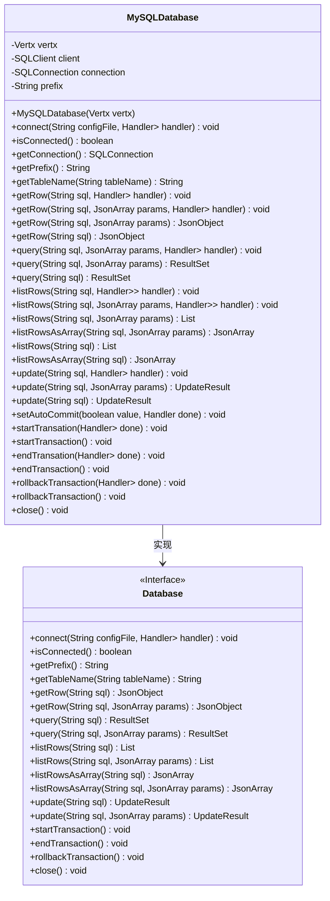

# 基础信息

|      |      |
|------|------|
| 名称 | MySQLDatabase |
| 编码语言 | .java |
| 代码路径 | erp-backend/erp-library/src/main/java/com.jukusoft/erp/lib/database/MySQLDatabase.java |
| 包名 | com.jukusoft.erp.lib.database |
| 依赖项 | ['com.jukusoft.erp.lib.utils.FileUtils', 'io.vertx.core.AsyncResult', 'io.vertx.core.Future', 'io.vertx.core.Handler', 'io.vertx.core.Vertx', 'io.vertx.core.json.JsonArray', 'io.vertx.core.json.JsonObject', 'io.vertx.ext.jdbc.JDBCClient', 'io.vertx.ext.sql.ResultSet', 'io.vertx.ext.sql.SQLClient', 'io.vertx.ext.sql.SQLConnection', 'io.vertx.ext.sql.UpdateResult', 'org.json.JSONObject', 'java.io.File', 'java.io.FileNotFoundException', 'java.io.IOException', 'java.nio.charset.StandardCharsets', 'java.util.List', 'io.vertx.ext.sync.Sync.awaitResult'] |
| 概述说明 | MySQL连接操作类，支持查询、更新和事务管理。 |

# 说明

MySQL数据库连接与操作实现类是一个功能全面的工具，专门用于处理与MySQL数据库的交互。它支持多种数据库操作，包括查询数据、更新记录以及管理事务。通过该实现类，用户可以高效地执行SQL查询，修改数据库中的信息，并确保在复杂操作中保持数据的一致性和完整性。此外，事务管理功能使得用户能够在需要时回滚或提交多个操作，从而保证数据库的稳定性和可靠性。该实现类为开发者提供了便捷的接口，简化了数据库操作的流程，提升了开发效率。

# 类列表 Class Summary

| 名称   | 类型  | 说明 |
|-------|------|-------------|
| MySQLDatabase | class | MySQL数据库连接与操作实现类，支持查询、更新、事务管理等功能。 |

## 类 MySQLDatabase

|      |      |
|------|------|
| 访问范围 | public |
| 类型 | class |
| 名称 | MySQLDatabase |
| 说明 | MySQL数据库连接与操作实现类，支持查询、更新、事务管理等功能。 |

### UML类图

这段代码定义了一个 `MySQLDatabase` 类，它实现了 `Database` 接口。`MySQLDatabase` 类负责管理与 MySQL 数据库的连接，并提供了多种数据库操作方法，如查询、更新、事务管理等。类图展示了 `MySQLDatabase` 类的成员变量和方法，以及它与 `Database` 接口的继承关系。通过该类，开发者可以方便地执行 SQL 查询、管理事务，并处理数据库连接的生命周期。

### 内部方法调用关系图

```mermaid
graph TD
    A["类MySQLDatabase"]
    B["属性: Vertx vertx"]
    C["属性: SQLClient client"]
    D["属性: SQLConnection connection"]
    E["属性: String prefix"]
    F["构造方法: MySQLDatabase(Vertx vertx)"]
    G["方法: connect(String configFile, Handler<Future<Void>> handler)"]
    H["方法: isConnected()"]
    I["方法: getConnection()"]
    J["方法: getPrefix()"]
    K["方法: getTableName(String tableName)"]
    L["方法: getRow(String sql, Handler<AsyncResult<JsonObject>> handler)"]
    M["方法: getRow(String sql, JsonArray params, Handler<AsyncResult<JsonObject>> handler)"]
    N["方法: getRow(String sql, JsonArray params)"]
    O["方法: getRow(String sql)"]
    P["方法: query(String sql, JsonArray params, Handler<AsyncResult<ResultSet>> handler)"]
    Q["方法: query(String sql, JsonArray params)"]
    R["方法: query(String sql)"]
    S["方法: listRows(String sql, Handler<AsyncResult<List<JsonObject>>> handler)"]
    T["方法: listRows(String sql, JsonArray params, Handler<AsyncResult<List<JsonObject>>> handler)"]
    U["方法: listRows(String sql, JsonArray params)"]
    V["方法: listRowsAsArray(String sql, JsonArray params)"]
    W["方法: listRows(String sql)"]
    X["方法: listRowsAsArray(String sql)"]
    Y["方法: update(String sql, Handler<AsyncResult<UpdateResult>> handler)"]
    Z["方法: update(String sql, JsonArray params)"]
    AA["方法: update(String sql)"]
    AB["方法: setAutoCommit(boolean value, Handler<Void> done)"]
    AC["方法: startTransation(Handler<AsyncResult<Void>> done)"]
    AD["方法: startTransaction()"]
    AE["方法: endTransation(Handler<AsyncResult<Void>> done)"]
    AF["方法: endTransaction()"]
    AG["方法: rollbackTransaction(Handler<AsyncResult<Void>> done)"]
    AH["方法: rollbackTransaction()"]
    AI["方法: close()"]

    A --> B
    A --> C
    A --> D
    A --> E
    A --> F
    A --> G
    A --> H
    A --> I
    A --> J
    A --> K
    A --> L
    A --> M
    A --> N
    A --> O
    A --> P
    A --> Q
    A --> R
    A --> S
    A --> T
    A --> U
    A --> V
    A --> W
    A --> X
    A --> Y
    A --> Z
    A --> AA
    A --> AB
    A --> AC
    A --> AD
    A --> AE
    A --> AF
    A --> AG
    A --> AH
    A --> AI
```

这段代码定义了一个`MySQLDatabase`类，该类实现了`Database`接口，用于管理与MySQL数据库的连接和操作。类中包含多个方法，用于连接数据库、执行查询、更新数据、管理事务等操作。代码通过`Vertx`框架实现异步操作，确保在非阻塞的情况下执行数据库操作。每个方法都有明确的职责，如`connect`方法用于建立数据库连接，`getRow`方法用于获取单行数据，`update`方法用于执行更新操作等。整体设计旨在提供灵活且高效的数据库操作接口。

### 字段列表 Field List

| 名称  | 类型  | 说明 |
|-------|-------|------|
| connection = null | SQLConnection | 声明并初始化受保护的SQL连接对象。 |
| vertx = null | Vertx | Vertx实例被声明为受保护的静态变量，初始值为null。 |
| client = null | SQLClient | 声明并初始化受保护的SQLClient对象为null。 |
| prefix = "" | String | 定义了一个受保护的字符串变量prefix，初始值为空。 |

### 方法列表 Method List

| 名称  | 类型  | 说明 |
|-------|-------|------|
| update | UpdateResult | 该方法更新SQL语句，替换前缀并执行带参数的更新操作。 |
| update | void | 更新SQL语句并执行异步更新操作。 |
| getConnection | SQLConnection | 获取当前SQL连接的公共方法。 |
| isConnected | boolean | 方法判断连接是否为空，返回布尔值。 |
| update | UpdateResult | 重写update方法，异步执行SQL更新操作。 |
| rollbackTransaction | void | 重写rollbackTransaction方法，异步回滚事务。 |
| close | void | 重写close方法，关闭当前连接。 |
| getRow | void | 该方法通过SQL查询获取首行数据，处理成功或失败情况。 |
| query | ResultSet | 重写query方法，异步执行SQL查询并返回结果集。 |
| query | void | 该方法执行带参数的SQL查询，并将结果异步返回。 |
| getTableName | String | 重写getTableName方法，返回带前缀的表名。 |
| connect | void | 连接MySQL数据库，读取配置文件，设置连接参数并处理连接结果。 |
| query | ResultSet | 重写query方法，调用带参数的query方法并返回结果集。 |
| listRows | void | 该方法执行SQL查询并返回结果集，处理失败时抛出异常。 |
| getRow | void | 该方法执行SQL查询，处理结果并返回第一行数据或错误信息。 |
| getRow | JsonObject | 方法替换SQL前缀，查询数据库，若无结果返回null，否则返回首行数据。 |
| getRow | JsonObject | 重写getRow方法，调用带参数的getRow并返回JsonObject。 |
| startTransation | void | 方法startTransation关闭自动提交，处理成功或失败结果。 |
| startTransaction | void | 重写startTransaction方法，异步调用startTransation并等待结果。 |
| listRowsAsArray | JsonArray | 重写方法listRowsAsArray，替换SQL前缀并查询数据库返回结果集。 |
| listRows | List<JsonObject> | 方法`listRows`执行SQL查询，替换表前缀，返回结果集的首行。 |
| listRows | List<JsonObject> | 重写方法listRows，替换SQL前缀，查询数据库并返回结果行列表。 |
| endTransation | void | 方法结束事务，提交连接，处理成功或失败结果。 |
| listRows | void | 方法listRows执行SQL查询，替换前缀，处理结果并返回JSON对象列表。 |
| rollbackTransaction | void | 该方法用于回滚事务，处理异步结果并抛出异常。 |
| setAutoCommit | void | 设置数据库自动提交，失败时抛出异常，成功后调用回调函数。 |
| listRowsAsArray | JsonArray | 方法重写，执行SQL查询并返回结果集第一行。 |
| getPrefix | String | 重写getPrefix方法，返回当前对象的prefix属性。 |
| endTransaction | void | 该方法异步结束事务，调用endTransation并等待结果。 |

