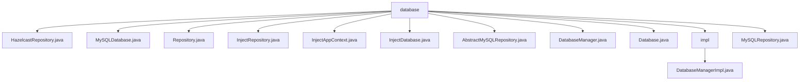

# 基础信息

|      |      |
|------|------|
| 名称 | database |
| 编码语言 | .java |
| 代码路径 | erp-backend/erp-library/src/main/java/com.jukusoft/erp/lib/database |
| 包名 | erp-backend.erp-library.src.main.java.com.jukusoft.erp.lib.database |
| 概述说明 | HazelcastRepository处理MySQL交互，支持查询、更新和事务管理。MySQLDatabase空内容无法总结。Repository空内容无法总结。InjectRepository空内容无法总结。InjectAppContext空内容无法总结。InjectDatabase抽象类实现MySQL接口，提供初始化和获取实例方法。AbstractMySQLRepository空内容无法总结。DatabaseManager空内容无法总结。Database管理MySQL和Hazelcast，支持仓库实例操作。MySQLRepository空内容无法总结。 |

# 说明

## 概述

该代码模块主要围绕企业资源规划（ERP）系统的后端数据库操作展开，提供了与MySQL和Hazelcast数据库的交互功能。模块包含多个类，分别负责数据库连接、仓库管理、事务处理以及依赖注入等功能。通过这些类，开发者可以高效地执行SQL查询、更新记录、管理事务，并确保数据的一致性和完整性。模块的设计旨在简化数据库操作的复杂性，提升开发效率和系统的可靠性。

## 主要业务场景

1. **数据库连接与操作**：`MySQLDatabase` 类负责处理与MySQL数据库的连接和操作，支持查询、更新、事务管理等基本数据库操作。
2. **仓库管理**：`DatabaseManager` 类用于管理MySQL和Hazelcast数据库的仓库实例，提供添加、删除和获取仓库实例的功能，确保数据的准确性和一致性。
3. **事务管理**：`MySQLRepository` 和 `AbstractMySQLRepository` 类封装了与MySQL数据库的交互，支持事务的提交和回滚，确保在复杂操作中数据的一致性和完整性。
4. **依赖注入**：`InjectDatabase` 和 `InjectRepository` 类提供了依赖注入功能，简化了数据库实例和仓库实例的获取和配置。
5. **Hazelcast集成**：`HazelcastRepository` 类专门用于处理与Hazelcast数据库的交互，支持分布式缓存和数据存储操作。

通过这些功能，该模块能够满足ERP系统中复杂的数据库操作需求，提升系统的性能和开发效率。

### 包内部结构视图

该流程图展示了ERP后端库中数据库模块的层级结构。`database`作为根节点，包含了多个数据库相关的类和接口，如`HazelcastRepository.java`、`MySQLDatabase.java`等。`impl`文件夹作为子节点，包含了`DatabaseManagerImpl.java`的实现类。整体结构清晰地展示了数据库模块的组成及其依赖关系。

# 文件列表 File List

| 名称   | 类型  | 说明 |
|-------|------|-------------|
| [MySQLRepository.java](MySQLRepository.md) | file | 信息为空，无法生成概要描述。 |
| [Database.java](Database.md) | file | 信息为空，无法生成概要描述。 |
| [DatabaseManager.java](DatabaseManager.md) | file | 信息为空，无法生成概要描述。 |
| [AbstractMySQLRepository.java](AbstractMySQLRepository.md) | file | 抽象MySQL仓库类实现MySQL接口，提供初始化和获取数据库实例功能。 |
| [InjectDatabase.java](InjectDatabase.md) | file | 无内容可总结。 |
| [InjectAppContext.java](InjectAppContext.md) | file | 内容为空，无法生成概要描述。 |
| [InjectRepository.java](InjectRepository.md) | file | 信息为空，无法生成概要描述。 |
| [Repository.java](Repository.md) | file | 信息为空，无法生成概要描述。 |
| [MySQLDatabase.java](MySQLDatabase.md) | file | MySQL连接操作类，支持查询、更新和事务管理。 |
| [HazelcastRepository.java](HazelcastRepository.md) | file | 信息为空，无法生成概要描述。 |
| [impl](impl/_module.md) | package | DatabaseManagerImpl管理MySQL和Hazelcast，支持仓库实例的增删查。 |

