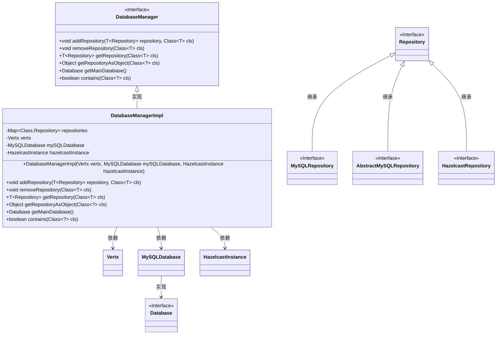
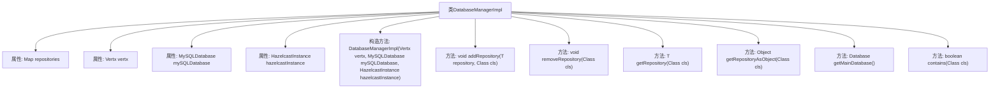

# 基础信息

|      |      |
|------|------|
| 名称 | DatabaseManagerImpl |
| 编码语言 | .java |
| 代码路径 | erp-backend/erp-library/src/main/java/com.jukusoft/erp/lib/database/impl/DatabaseManagerImpl.java |
| 包名 | com.jukusoft.erp.lib.database.impl |
| 依赖项 | ['com.hazelcast.core.HazelcastInstance', 'com.jukusoft.erp.lib.database', 'io.vertx.core.Vertx', 'java.util.Map', 'java.util.concurrent.ConcurrentHashMap'] |
| 概述说明 | DatabaseManagerImpl管理MySQL和Hazelcast，支持仓库实例的增删查。 |

# 说明

DatabaseManagerImpl是一个用于管理MySQL和Hazelcast数据库的工具，提供了对仓库实例的添加、删除和获取功能。它能够有效地处理这两种数据库的操作，确保数据的准确性和一致性。通过该工具，用户可以方便地进行仓库实例的管理，简化了数据库操作的复杂性，提升了系统的整体性能和可靠性。

# 类列表 Class Summary

| 名称   | 类型  | 说明 |
|-------|------|-------------|
| DatabaseManagerImpl | class | DatabaseManagerImpl管理MySQL和Hazelcast数据库，支持添加、删除和获取仓库实例。 |

## 类 DatabaseManagerImpl

|      |      |
|------|------|
| 访问范围 | public |
| 类型 | class |
| 名称 | DatabaseManagerImpl |
| 说明 | DatabaseManagerImpl管理MySQL和Hazelcast数据库，支持添加、删除和获取仓库实例。 |

### UML类图

这段代码描述了一个数据库管理器 `DatabaseManagerImpl`，它实现了 `DatabaseManager` 接口。`DatabaseManagerImpl` 负责管理多个仓库（`Repository`），包括 `MySQLRepository`、`AbstractMySQLRepository` 和 `HazelcastRepository`。它依赖于 `Vertx`、`MySQLDatabase` 和 `HazelcastInstance` 来初始化和管理这些仓库。代码通过泛型和类型检查确保仓库的正确添加、移除和获取，并提供了对主数据库的访问和仓库存在性的检查功能。

### 内部方法调用关系图

这段代码定义了一个`DatabaseManagerImpl`类，该类实现了`DatabaseManager`接口，用于管理不同类型的数据库仓库（Repository）。类中包含多个属性，如`repositories`、`vertx`、`mySQLDatabase`和`hazelcastInstance`，分别用于存储仓库实例、Vertx实例、MySQL数据库实例和Hazelcast实例。类中的构造方法用于初始化这些属性，并进行空值检查。此外，类中还提供了多个方法，如`addRepository`、`removeRepository`、`getRepository`、`getRepositoryAsObject`、`getMainDatabase`和`contains`，用于管理仓库实例的添加、删除、获取和检查。这些方法通过操作`repositories`映射来实现仓库的管理功能。

### 字段列表 Field List

| 名称  | 类型  | 说明 |
|-------|-------|------|
| hazelcastInstance = null | HazelcastInstance | 保护类型的Hazelcast实例变量初始化为空。 |
| repositories = new ConcurrentHashMap<>() | Map<Class,Repository> | 使用ConcurrentHashMap存储类与仓库的映射关系。 |
| mySQLDatabase = null | MySQLDatabase | 声明一个受保护的MySQL数据库对象，初始值为空。 |
| vertx = null | Vertx | Vertx实例被声明为受保护类型且初始化为空。 |

### 方法列表 Method List

| 名称  | 类型  | 说明 |
|-------|-------|------|
| removeRepository | void | 该方法用于移除指定类型的仓库实例。 |
| getRepositoryAsObject | Object | 方法获取指定类的仓库对象，若不存在则返回空。 |
| getRepository | T | 该方法根据类获取对应仓库实例，若不存在则返回空。 |
| getMainDatabase | Database | 重写getMainDatabase方法，返回mySQLDatabase实例。 |
| contains | boolean | 检查类是否实现Repository接口，未实现则抛出异常，否则返回是否包含该类。 |
| addRepository | void | 方法检查并初始化仓库，防止重复添加。 |

