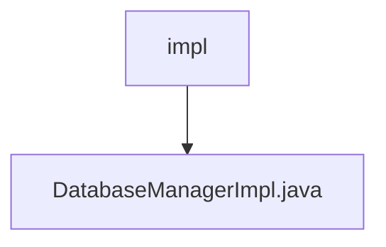

# 基础信息

|      |      |
|------|------|
| 名称 | impl |
| 编码语言 | .java |
| 代码路径 | erp-backend/erp-library/src/main/java/com.jukusoft/erp/lib/database/impl |
| 包名 | erp-backend.erp-library.src.main.java.com.jukusoft.erp.lib.database.impl |
| 概述说明 | DatabaseManagerImpl管理MySQL和Hazelcast，支持仓库实例的增删查。 |

# 说明

DatabaseManagerImpl是一个用于管理MySQL和Hazelcast数据库的工具，提供了对仓库实例的添加、删除和获取功能。它能够有效地处理这两种数据库的操作，确保数据的准确性和一致性。通过该工具，用户可以方便地进行仓库实例的管理，简化了数据库操作的复杂性，提升了系统的整体性能和可靠性。

### 包内部结构视图

该流程图展示了`erp-backend/erp-library`项目中的`impl`文件夹与`DatabaseManagerImpl.java`文件之间的层级关系。`impl`文件夹是`DatabaseManagerImpl.java`文件的父目录，文件位于该文件夹下。

# 文件列表 File List

| 名称   | 类型  | 说明 |
|-------|------|-------------|
| [DatabaseManagerImpl.java](DatabaseManagerImpl.md) | file | DatabaseManagerImpl管理MySQL和Hazelcast，支持仓库实例的增删查。 |

