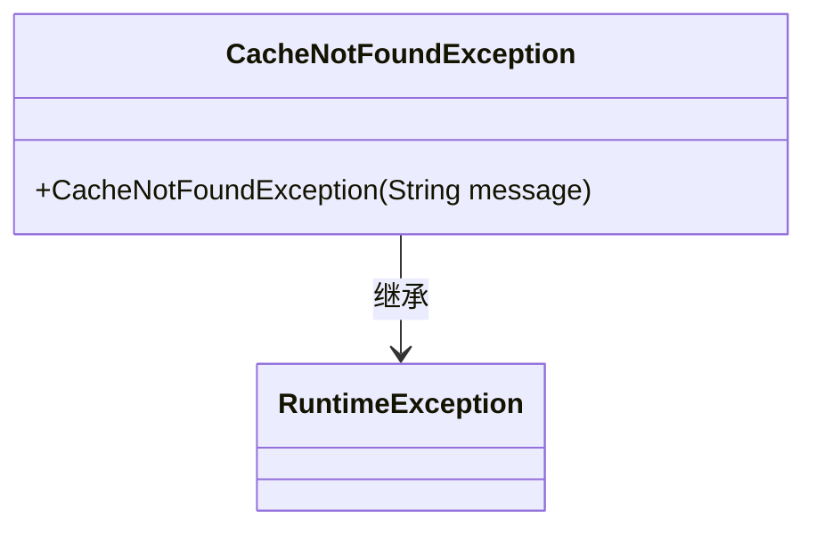
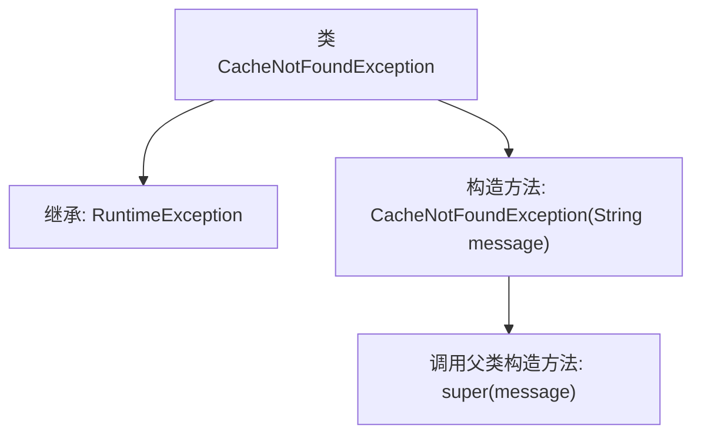

# 基础信息

|      |      |
|------|------|
| 名称 | CacheNotFoundException |
| 编码语言 | .java |
| 代码路径 | erp-backend/erp-library/src/main/java/com.jukusoft/erp/lib/exception/CacheNotFoundException.java |
| 包名 | com.jukusoft.erp.lib.exception |
| 依赖项 | [] |
| 概述说明 | CacheNotFoundException继承RuntimeException，支持带消息的构造函数。 |

# 说明

CacheNotFoundException类继承自RuntimeException类，提供了一个带有消息参数的构造函数。该构造函数允许在抛出异常时传递自定义的异常信息，以便在捕获和处理异常时能够获取更详细的上下文信息。这种设计使得异常处理更加灵活和具体，有助于开发者更好地理解和调试代码中的问题。

# 类列表 Class Summary

| 名称   | 类型  | 说明 |
|-------|------|-------------|
| CacheNotFoundException | class | CacheNotFoundException继承RuntimeException，带消息参数构造函数。 |

## 类 CacheNotFoundException

|      |      |
|------|------|
| 访问范围 | public |
| 类型 | class |
| 名称 | CacheNotFoundException |
| 说明 | CacheNotFoundException继承RuntimeException，带消息参数构造函数。 |

### UML类图

`CacheNotFoundException` 是一个自定义的运行时异常类，继承自 `RuntimeException`。它包含一个构造函数，接受一个字符串参数 `message`，并将其传递给父类的构造函数。该异常通常用于表示缓存未找到的情况，开发者可以通过抛出此异常来处理缓存缺失的逻辑。

### 内部方法调用关系图

这段代码定义了一个名为 `CacheNotFoundException` 的异常类，它继承自 `RuntimeException`。类中包含一个构造方法，该方法接受一个字符串参数 `message`，并通过 `super(message)` 调用父类的构造方法。这个异常类通常用于表示缓存未找到的情况，适用于需要处理缓存相关错误的场景。

### 字段列表 Field List

| 名称  | 类型  | 说明 |
|-------|-------|------|

### 方法列表 Method List

| 名称  | 类型  | 说明 |
|-------|-------|------|

