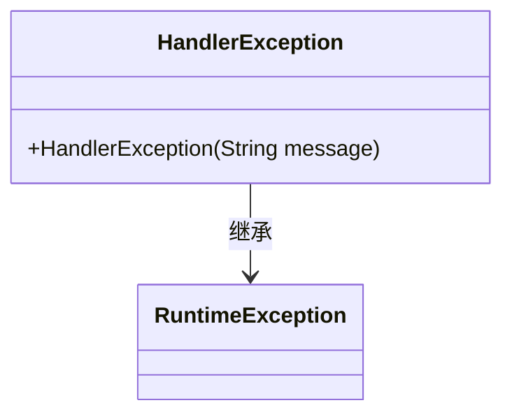
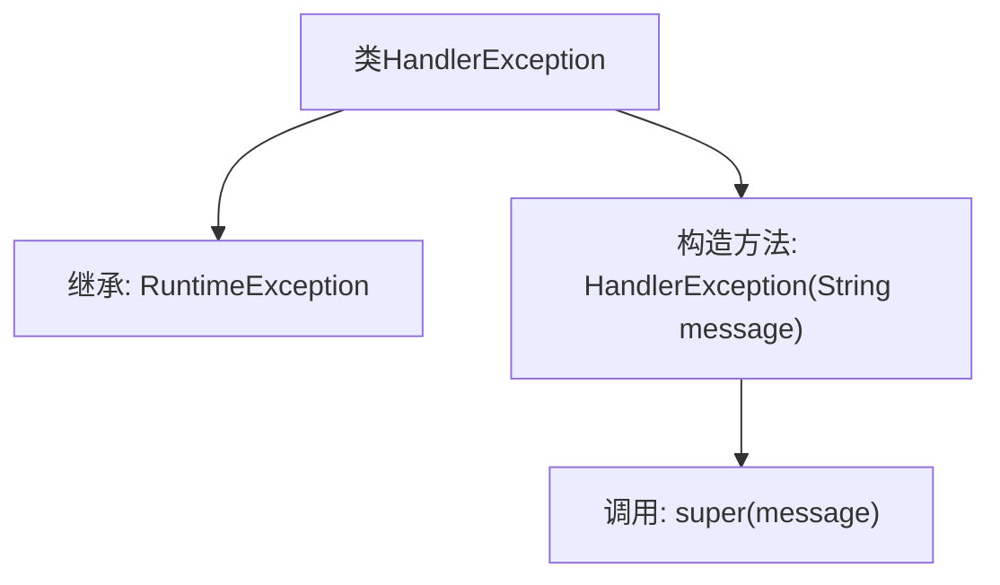

# 基础信息

|      |      |
|------|------|
| 名称 | HandlerException |
| 编码语言 | .java |
| 代码路径 | erp-backend/erp-library/src/main/java/com.jukusoft/erp/lib/exception/HandlerException.java |
| 包名 | com.jukusoft.erp.lib.exception |
| 依赖项 | [] |
| 概述说明 | HandlerException继承RuntimeException，用于处理异常信息。 |

# 说明

HandlerException继承自RuntimeException，主要用于处理异常信息。它作为一个运行时异常类，能够在程序运行过程中捕获和处理特定的错误情况，确保系统在遇到异常时能够进行适当的响应和处理。通过继承RuntimeException，HandlerException无需显式声明或捕获，简化了异常处理流程，适用于需要灵活处理异常的场景。

# 类列表 Class Summary

| 名称   | 类型  | 说明 |
|-------|------|-------------|
| HandlerException | class | HandlerException继承RuntimeException，用于处理异常信息。 |

## 类 HandlerException

|      |      |
|------|------|
| 访问范围 | public |
| 类型 | class |
| 名称 | HandlerException |
| 说明 | HandlerException继承RuntimeException，用于处理异常信息。 |

### UML类图

这段代码定义了一个名为 `HandlerException` 的类，它继承自 `RuntimeException`。`HandlerException` 类包含一个构造函数，该构造函数接受一个 `String` 类型的参数 `message`，并将其传递给父类 `RuntimeException` 的构造函数。这个类的主要作用是创建一个自定义的运行时异常，用于在程序中处理特定的错误情况。通过继承 `RuntimeException`，`HandlerException` 类可以用于表示那些不需要强制捕获的异常。

### 内部方法调用关系图

这段代码定义了一个名为 `HandlerException` 的类，该类继承自 `RuntimeException`。`HandlerException` 类包含一个构造方法，该构造方法接受一个 `String` 类型的参数 `message`，并通过 `super(message)` 调用父类 `RuntimeException` 的构造方法。这个类的目的是创建一个自定义的运行时异常，用于处理特定的错误情况。

### 字段列表 Field List

| 名称  | 类型  | 说明 |
|-------|-------|------|

### 方法列表 Method List

| 名称  | 类型  | 说明 |
|-------|-------|------|

