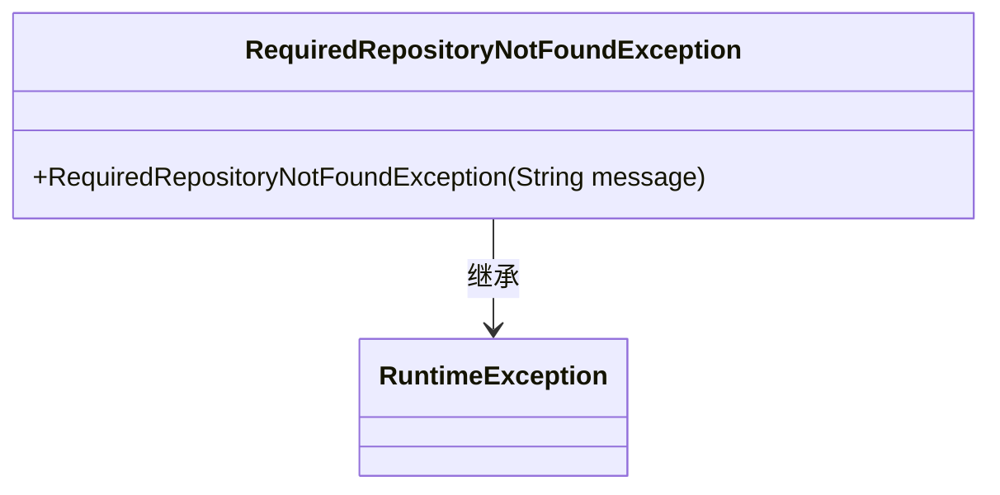
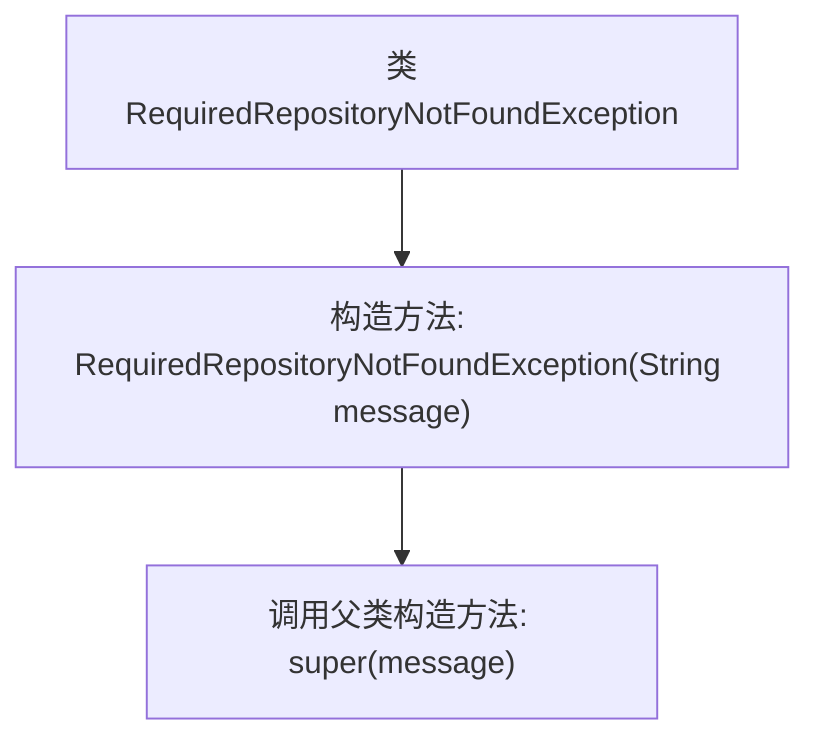

# 基础信息

|      |      |
|------|------|
| 名称 | RequiredRepositoryNotFoundException |
| 编码语言 | .java |
| 代码路径 | erp-backend/erp-library/src/main/java/com.jukusoft/erp/lib/exception/RequiredRepositoryNotFoundException.java |
| 包名 | com.jukusoft.erp.lib.exception |
| 依赖项 | [] |
| 概述说明 | 自定义异常类用于处理缺失必需仓库的情况。 |

# 说明

自定义异常类专门用于处理系统中找不到必需仓库的情况。该异常类旨在捕获并管理此类特定错误，确保程序在遇到仓库缺失时能够进行适当的错误处理。通过定义这一异常类，开发者可以更精确地识别和响应仓库缺失问题，从而提高系统的稳定性和可维护性。该异常类通常包含错误信息和相关上下文，以便在调试和日志记录中提供详细反馈。

# 类列表 Class Summary

| 名称   | 类型  | 说明 |
|-------|------|-------------|
| RequiredRepositoryNotFoundException | class | 自定义异常类，用于处理找不到必需仓库的情况。 |

## 类 RequiredRepositoryNotFoundException

|      |      |
|------|------|
| 访问范围 | public |
| 类型 | class |
| 名称 | RequiredRepositoryNotFoundException |
| 说明 | 自定义异常类，用于处理找不到必需仓库的情况。 |

### UML类图

这段代码定义了一个名为 `RequiredRepositoryNotFoundException` 的异常类，它继承自 `RuntimeException`。该类包含一个构造函数，接受一个 `String` 类型的参数 `message`，并将其传递给父类的构造函数。这个异常类通常用于在程序运行时，当所需的资源库（Repository）未找到时抛出异常，以便在系统中处理这种情况。通过继承 `RuntimeException`，该异常是一个未检查异常，意味着调用者可以选择捕获或不捕获它。

### 内部方法调用关系图

这段代码定义了一个名为 `RequiredRepositoryNotFoundException` 的异常类，它继承自 `RuntimeException`。类中包含一个构造方法，该方法接收一个字符串参数 `message`，并通过 `super(message)` 调用父类的构造方法，将异常信息传递给父类。这个类通常用于在程序运行时指示所需的资源库未找到的情况。

### 字段列表 Field List

| 名称  | 类型  | 说明 |
|-------|-------|------|

### 方法列表 Method List

| 名称  | 类型  | 说明 |
|-------|-------|------|

