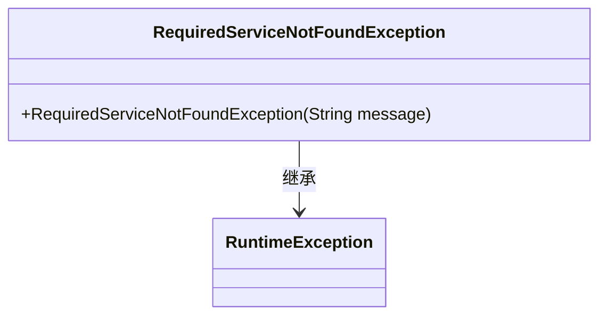
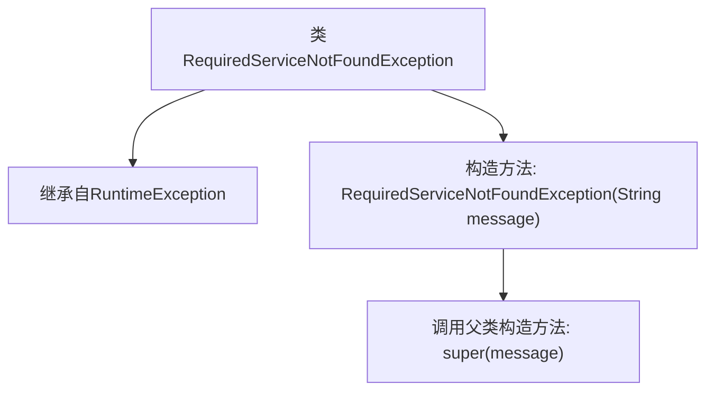

# 基础信息

|      |      |
|------|------|
| 名称 | RequiredServiceNotFoundException |
| 编码语言 | .java |
| 代码路径 | erp-backend/erp-library/src/main/java/com.jukusoft/erp/lib/exception/RequiredServiceNotFoundException.java |
| 包名 | com.jukusoft.erp.lib.exception |
| 依赖项 | [] |
| 概述说明 | 自定义异常类，处理服务未找到情况。 |

# 说明

自定义异常类用于处理在系统中未找到所需服务的情况。该异常类专门设计用于捕获和抛出与服务缺失相关的错误，确保程序在遇到此类问题时能够进行适当的处理。通过定义这种异常，开发者可以在服务不可用时采取特定的应对措施，如记录日志、返回错误信息或执行备用逻辑，从而提高系统的健壮性和用户体验。这种异常类的使用有助于明确错误来源，简化调试过程，并增强代码的可维护性。

# 类列表 Class Summary

| 名称   | 类型  | 说明 |
|-------|------|-------------|
| RequiredServiceNotFoundException | class | 自定义异常类，用于处理所需服务未找到的情况。 |

## 类 RequiredServiceNotFoundException

|      |      |
|------|------|
| 访问范围 | public |
| 类型 | class |
| 名称 | RequiredServiceNotFoundException |
| 说明 | 自定义异常类，用于处理所需服务未找到的情况。 |

### UML类图

这段代码定义了一个名为 `RequiredServiceNotFoundException` 的异常类，它继承自 `RuntimeException`。该异常类包含一个构造函数，用于接收一个字符串参数 `message`，并将其传递给父类的构造函数。这个异常类通常用于在应用程序中抛出，表示某个必需的服务未被找到。通过继承 `RuntimeException`，它属于非检查型异常，不需要在方法签名中显式声明或捕获。

### 内部方法调用关系图

这段代码定义了一个名为`RequiredServiceNotFoundException`的异常类，它继承自`RuntimeException`。该类包含一个构造方法，接受一个`String`类型的参数`message`，并在构造方法中调用父类的构造方法`super(message)`，将异常信息传递给父类。这个异常类通常用于表示所需服务未找到的情况，通过继承`RuntimeException`，它是一个未检查异常，可以在程序中抛出而不需要显式捕获或声明。

### 字段列表 Field List

| 名称  | 类型  | 说明 |
|-------|-------|------|

### 方法列表 Method List

| 名称  | 类型  | 说明 |
|-------|-------|------|

