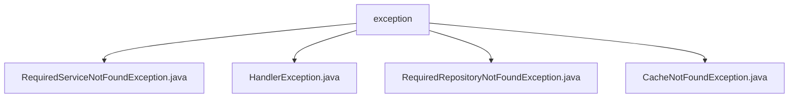

# 基础信息

|      |      |
|------|------|
| 名称 | exception |
| 编码语言 | .java |
| 代码路径 | erp-backend/erp-library/src/main/java/com.jukusoft/erp/lib/exception |
| 包名 | erp-backend.erp-library.src.main.java.com.jukusoft.erp.lib.exception |
| 概述说明 | 自定义异常类处理服务、仓库、缓存缺失，增强系统健壮性和可维护性。 |

# 说明

## 概述
该代码模块主要包含一系列自定义异常类，用于处理在系统中未找到所需服务、仓库或缓存的情况。这些异常类均继承自`RuntimeException`，旨在捕获和抛出特定的错误，确保程序在遇到这些问题时能够进行适当的处理。通过定义这些异常类，开发者可以更精确地识别和响应特定错误，从而提高系统的健壮性、稳定性和可维护性。此外，这些异常类通常包含错误信息和相关上下文，以便在调试和日志记录中提供详细反馈。

## 主要业务场景
1. **服务缺失处理**：`RequiredServiceNotFoundException`用于处理系统中未找到所需服务的情况。开发者可以在服务不可用时采取特定的应对措施，如记录日志、返回错误信息或执行备用逻辑。
2. **异常信息处理**：`HandlerException`继承自`RuntimeException`，主要用于捕获和处理特定的错误情况。它简化了异常处理流程，适用于需要灵活处理异常的场景。
3. **仓库缺失处理**：`RequiredRepositoryNotFoundException`专门用于处理系统中找不到必需仓库的情况。开发者可以更精确地识别和响应仓库缺失问题，从而提高系统的稳定性和可维护性。
4. **缓存缺失处理**：`CacheNotFoundException`用于处理缓存未找到的情况。它提供了一个带有消息参数的构造函数，允许在抛出异常时传递自定义的异常信息，使得异常处理更加灵活和具体。

### 包内部结构视图

该流程图展示了ERP库中异常处理模块的层级关系。`exception`文件夹作为根节点，包含了四个具体的异常类文件：`RequiredServiceNotFoundException.java`、`HandlerException.java`、`RequiredRepositoryNotFoundException.java`和`CacheNotFoundException.java`。这些异常类文件均位于`exception`文件夹下，反映了它们的功能和用途。

# 文件列表 File List

| 名称   | 类型  | 说明 |
|-------|------|-------------|
| [CacheNotFoundException.java](CacheNotFoundException.md) | file | CacheNotFoundException继承RuntimeException，支持带消息的构造函数。 |
| [RequiredRepositoryNotFoundException.java](RequiredRepositoryNotFoundException.md) | file | 自定义异常类用于处理缺失必需仓库的情况。 |
| [RequiredServiceNotFoundException.java](RequiredServiceNotFoundException.md) | file | 自定义异常类，处理服务未找到情况。 |
| [HandlerException.java](HandlerException.md) | file | HandlerException继承RuntimeException，用于处理异常信息。 |

