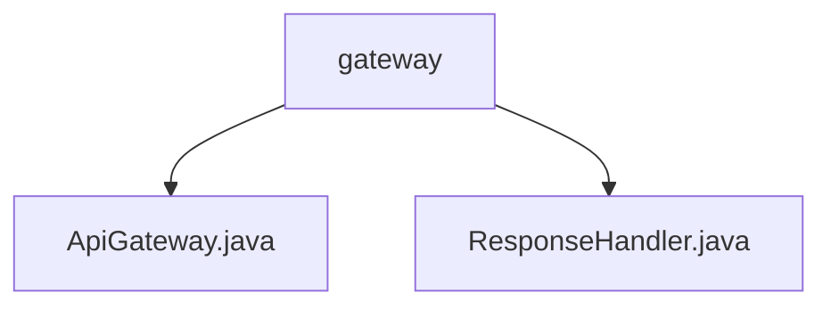

# 基础信息

|      |      |
|------|------|
| 名称 | gateway |
| 编码语言 | .java |
| 代码路径 | erp-backend/erp-library/src/main/java/com.jukusoft/erp/lib/gateway |
| 包名 | erp-backend.erp-library.src.main.java.com.jukusoft.erp.lib.gateway |
| 概述说明 | 输入内容为空，无法生成总结描述。 |

# 说明

## 概述
该代码模块是一个企业资源规划（ERP）系统的后端库，主要包含与API网关相关的功能。模块的核心组件包括`ApiGateway`和`ResponseHandler`，这些组件负责处理API请求和响应，确保系统的通信流程顺畅且高效。

## 主要业务场景
1. **API网关管理**：`ApiGateway`类作为系统的入口点，负责接收、路由和处理所有来自客户端的API请求。它确保请求能够正确地转发到相应的服务或模块，并处理跨域、认证等网关相关的逻辑。
2. **响应处理**：`ResponseHandler`类专注于处理API的响应。它负责将服务端返回的数据格式化为客户端所需的格式（如JSON），并处理错误响应，确保客户端能够接收到清晰且一致的信息。
3. **系统集成**：该模块通过API网关和响应处理器的协同工作，支持ERP系统与其他外部系统或服务的集成，提供统一的接口和通信标准。

通过上述功能，该模块为ERP系统提供了一个稳定、可扩展的通信基础，支持复杂的业务场景和高并发的请求处理。

### 包内部结构视图

该流程图展示了`erp-backend/erp-library`项目中的`gateway`目录及其包含的两个Java文件：`ApiGateway.java`和`ResponseHandler.java`。`gateway`作为父节点，直接连接了两个子节点，清晰地反映了文件的层级关系。

# 文件列表 File List

| 名称   | 类型  | 说明 |
|-------|------|-------------|
| [ApiGateway.java](ApiGateway.md) | file | 无内容提供，无法生成概要描述。 |
| [ResponseHandler.java](ResponseHandler.md) | file | 无内容提供，无法生成概要描述。 |

