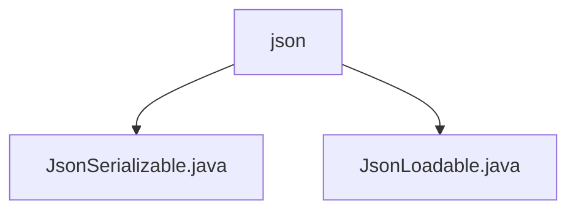

# 基础信息

|      |      |
|------|------|
| 名称 | json |
| 编码语言 | .java |
| 代码路径 | erp-backend/erp-library/src/main/java/com.jukusoft/erp/lib/json |
| 包名 | erp-backend.erp-library.src.main.java.com.jukusoft.erp.lib.json |
| 概述说明 | 无法生成描述，缺少具体内容。 |

# 说明

## 概述
该代码模块是一个用于处理JSON数据的Java库，属于ERP系统的后端部分。模块主要提供了JSON序列化和加载的功能，旨在简化JSON数据的处理流程，提升代码的可维护性和可扩展性。通过定义`JsonSerializable`和`JsonLoadable`接口，模块允许对象实现JSON数据的序列化和反序列化操作，从而方便地在系统中进行数据交换和持久化。

## 主要业务场景
1. **JSON序列化**：通过`JsonSerializable`接口，模块支持将Java对象序列化为JSON格式的字符串。这在需要将对象数据转换为JSON格式以便于网络传输或存储时非常有用。
2. **JSON加载**：通过`JsonLoadable`接口，模块支持从JSON字符串中加载数据并反序列化为Java对象。这在从外部系统接收JSON数据或从存储中读取JSON数据时非常有用。
3. **数据交换**：模块在ERP系统的不同模块之间进行数据交换时起到关键作用，确保数据能够以统一的JSON格式进行传输和解析。
4. **持久化**：模块支持将对象数据以JSON格式持久化到数据库或文件系统中，便于后续的读取和恢复。

该模块的设计使得JSON数据的处理更加高效和标准化，为ERP系统的数据处理提供了坚实的基础。

### 包内部结构视图

该流程图展示了 `erp-backend/erp-library` 项目中 `json` 目录下的两个文件 `JsonSerializable.java` 和 `JsonLoadable.java` 的层级关系。`json` 目录作为父节点，包含了两个子节点文件，分别表示 JSON 序列化和加载的功能实现。

# 文件列表 File List

| 名称   | 类型  | 说明 |
|-------|------|-------------|
| [JsonSerializable.java](JsonSerializable.md) | file | 无内容可总结。 |
| [JsonLoadable.java](JsonLoadable.md) | file | 信息为空，无法生成概要描述。 |

