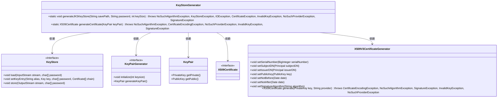
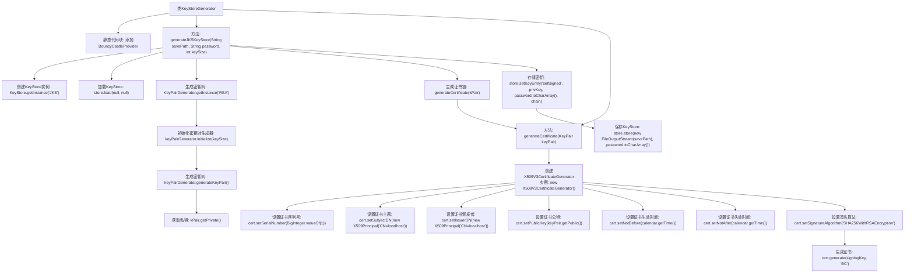

# 基础信息

|      |      |
|------|------|
| 名称 | KeyStoreGenerator |
| 编码语言 | .java |
| 代码路径 | erp-backend/erp-library/src/main/java/com.jukusoft/erp/lib/keystore/KeyStoreGenerator.java |
| 包名 | com.jukusoft.erp.lib.keystore |
| 依赖项 | ['org.bouncycastle.jce.X509Principal', 'org.bouncycastle.x509.X509V3CertificateGenerator', 'java.io.FileOutputStream', 'java.io.IOException', 'java.math.BigInteger', 'java.security', 'java.security.cert.CertificateEncodingException', 'java.security.cert.CertificateException', 'java.security.cert.CertificateFactory', 'java.security.cert.X509Certificate', 'java.util.Calendar'] |
| 概述说明 | 生成自签名X.509证书并保存为JKS格式密钥库。 |

# 说明

生成自签名X.509证书并将其保存为JKS格式的密钥库。该过程涉及创建X.509证书，该证书包含公钥和标识信息，并使用私钥进行签名。生成的证书和私钥随后被导入到JKS格式的密钥库中，以便在Java应用程序中使用。JKS密钥库是一种用于存储加密密钥和证书的Java标准格式，适用于安全通信和数据加密。

# 类列表 Class Summary

| 名称   | 类型  | 说明 |
|-------|------|-------------|
| KeyStoreGenerator | class | 生成自签名X.509证书并保存为JKS格式的密钥库。 |

## 类 KeyStoreGenerator

|      |      |
|------|------|
| 访问范围 | public |
| 类型 | class |
| 名称 | KeyStoreGenerator |
| 说明 | 生成自签名X.509证书并保存为JKS格式的密钥库。 |

### UML类图

### 描述
`KeyStoreGenerator`类用于生成Java密钥库（JKS）和自签名的X.509证书。它依赖于`KeyStore`、`KeyPairGenerator`、`KeyPair`、`X509Certificate`和`X509V3CertificateGenerator`等类。`generateJKSKeyStore`方法负责创建和保存密钥库，而`generateCertificate`方法则生成自签名的X.509证书。整个过程包括密钥对的生成、证书的生成以及密钥库的存储。

### 内部方法调用关系图

**描述：**
该流程图展示了`KeyStoreGenerator`类的结构和方法调用关系。静态代码块中添加了BouncyCastleProvider，`generateJKSKeyStore`方法负责生成并保存JKS密钥库，包括创建密钥对、生成证书链和存储密钥。`generateCertificate`方法用于生成自签名证书，设置证书的序列号、主题、颁发者、公钥、生效时间、失效时间和签名算法，并最终生成证书。整个流程展示了从密钥生成到证书存储的完整过程。

### 字段列表 Field List

| 名称  | 类型  | 说明 |
|-------|-------|------|

### 方法列表 Method List

| 名称  | 类型  | 说明 |
|-------|-------|------|
| generateCertificate | X509Certificate | 生成自签名X509证书，有效期6个月，使用SHA256WithRSA加密。 |
| generateJKSKeyStore | void | 生成JKS密钥库，包含自签名证书和私钥，并保存到指定路径。 |

