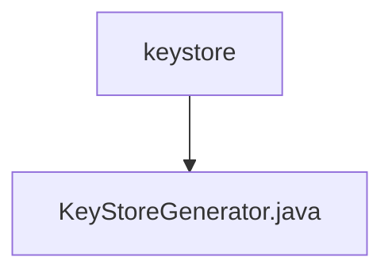

# 基础信息

|      |      |
|------|------|
| 名称 | keystore |
| 编码语言 | .java |
| 代码路径 | erp-backend/erp-library/src/main/java/com.jukusoft/erp/lib/keystore |
| 包名 | erp-backend.erp-library.src.main.java.com.jukusoft.erp.lib.keystore |
| 概述说明 | 生成自签名X.509证书并保存为JKS格式密钥库。 |

# 说明

生成自签名X.509证书并将其保存为JKS格式的密钥库。该过程涉及创建X.509证书，该证书包含公钥和标识信息，并使用私钥进行签名。生成的证书和私钥随后被导入到JKS格式的密钥库中，以便在Java应用程序中使用。JKS密钥库是一种用于存储加密密钥和证书的Java标准格式，适用于安全通信和数据加密。

### 包内部结构视图

该流程图展示了`keystore`文件夹与其包含的`KeyStoreGenerator.java`文件之间的层级关系。`keystore`作为父节点，`KeyStoreGenerator.java`作为其子节点，清晰地表示了两者之间的从属关系。

# 文件列表 File List

| 名称   | 类型  | 说明 |
|-------|------|-------------|
| [KeyStoreGenerator.java](KeyStoreGenerator.md) | file | 生成自签名X.509证书并保存为JKS格式密钥库。 |

