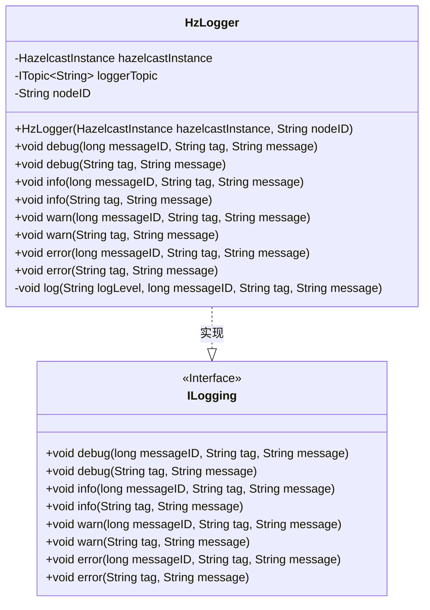

# 基础信息

|      |      |
|------|------|
| 名称 | HzLogger |
| 编码语言 | .java |
| 代码路径 | erp-backend/erp-library/src/main/java/com.jukusoft/erp/lib/logger/HzLogger.java |
| 包名 | com.jukusoft.erp.lib.logger |
| 依赖项 | ['com.hazelcast.core.HazelcastInstance', 'com.hazelcast.core.ITopic', 'com.jukusoft.erp.lib.logging.ILogging', 'org.json.JSONObject'] |
| 概述说明 | HzLogger类实现ILogging接口，支持多级日志，发布至Hazelcast主题并输出控制台。 |

# 说明

HzLogger类实现了ILogging接口，通过Hazelcast实例和节点ID进行初始化。该类支持多种日志级别，能够将日志信息发布到可靠主题，并同时输出到控制台，确保日志记录的全面性和可靠性。

# 类列表 Class Summary

| 名称   | 类型  | 说明 |
|-------|------|-------------|
| HzLogger | class | HzLogger类实现ILogging接口，通过Hazelcast实例和节点ID初始化，支持多种日志级别，并将日志发布到可靠主题和输出到控制台。 |

## 类 HzLogger

|      |      |
|------|------|
| 访问范围 | public |
| 类型 | class |
| 名称 | HzLogger |
| 说明 | HzLogger类实现ILogging接口，通过Hazelcast实例和节点ID初始化，支持多种日志级别，并将日志发布到可靠主题和输出到控制台。 |

### UML类图

这段代码定义了一个 `HzLogger` 类，该类实现了 `ILogging` 接口，用于日志记录。`HzLogger` 类通过 `HazelcastInstance` 实例与 `ITopic<String>` 通信，将日志消息发布到名为 "logger" 的主题中。类中的 `log` 方法负责构建日志消息的 JSON 格式，并将其发布到主题中，同时输出到控制台。`HzLogger` 提供了多种日志级别的方法（如 `debug`、`info`、`warn`、`error`），并支持带或不带 `messageID` 的日志记录。

### 内部方法调用关系图

```mermaid
graph TD
    A["类HzLogger"]
    B["属性: HazelcastInstance hazelcastInstance"]
    C["属性: ITopic<String> loggerTopic"]
    D["属性: String nodeID"]
    E["构造方法: HzLogger(HazelcastInstance hazelcastInstance, String nodeID)"]
    F["方法: void debug(long messageID, String tag, String message)"]
    G["方法: void debug(String tag, String message)"]
    H["方法: void info(long messageID, String tag, String message)"]
    I["方法: void info(String tag, String message)"]
    J["方法: void warn(long messageID, String tag, String message)"]
    K["方法: void warn(String tag, String message)"]
    L["方法: void error(long messageID, String tag, String message)"]
    M["方法: void error(String tag, String message)"]
    N["方法: void log(String logLevel, long messageID, String tag, String message)"]
    O["输出: System.out.println"]

    A --> B
    A --> C
    A --> D
    A --> E
    A --> F
    A --> G
    A --> H
    A --> I
    A --> J
    A --> K
    A --> L
    A --> M
    A --> N
    N --> O
```

这段代码定义了一个名为 `HzLogger` 的类，该类实现了 `ILogging` 接口。`HzLogger` 类主要用于日志记录，支持不同级别的日志输出（如 `debug`、`info`、`warn`、`error`）。日志信息会被发布到一个 Hazelcast 的可靠主题（`loggerTopic`），同时也会输出到控制台。代码通过 `log` 方法统一处理日志的格式化和输出，确保日志信息包含时间戳、节点ID、日志级别、消息ID、标签和消息内容。

### 字段列表 Field List

| 名称  | 类型  | 说明 |
|-------|-------|------|
| hazelcastInstance = null | HazelcastInstance | 保护Hazelcast实例变量初始化为空。 |
| loggerTopic = null | ITopic<String> | 声明一个受保护的空日志主题变量。 |
| nodeID = "" | String | 定义一个受保护的字符串变量nodeID，初始值为空。 |

### 方法列表 Method List

| 名称  | 类型  | 说明 |
|-------|-------|------|
| warn | void | 重写warn方法，调用log记录警告信息。 |
| info | void | 重写info方法，调用log记录INFO级别日志。 |
| error | void | 重写error方法，调用log记录错误信息。 |
| debug | void | 重写debug方法，调用log输出调试信息。 |
| error | void | 重写error方法，调用log记录INFO级别信息。 |
| warn | void | 重写warn方法，调用log记录INFO级别日志。 |
| debug | void | 重写debug方法，调用log记录调试信息。 |
| info | void | 重写info方法，调用log记录INFO级别日志。 |
| log | void | 方法记录日志并发布JSON格式消息，包含时间戳、节点ID、日志级别、消息ID、标签和消息，同时输出到控制台。 |

