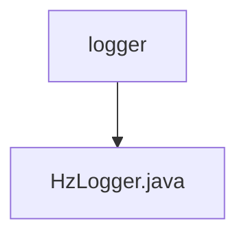

# 基础信息

|      |      |
|------|------|
| 名称 | logger |
| 编码语言 | .java |
| 代码路径 | erp-backend/erp-library/src/main/java/com.jukusoft/erp/lib/logger |
| 包名 | erp-backend.erp-library.src.main.java.com.jukusoft.erp.lib.logger |
| 概述说明 | HzLogger类实现ILogging接口，支持多级日志，发布至Hazelcast主题并输出控制台。 |

# 说明

HzLogger类实现了ILogging接口，通过Hazelcast实例和节点ID进行初始化。该类支持多种日志级别，能够将日志信息发布到可靠主题，并同时输出到控制台，确保日志记录的全面性和可靠性。

### 包内部结构视图

流程图描述：该流程图展示了路径层级关系，根节点为`logger`，其下包含一个子节点`HzLogger.java`。`logger`表示日志模块的根目录，而`HzLogger.java`是该模块中的一个具体日志实现类。

# 文件列表 File List

| 名称   | 类型  | 说明 |
|-------|------|-------------|
| [HzLogger.java](HzLogger.md) | file | HzLogger类实现ILogging接口，支持多级日志，发布至Hazelcast主题并输出控制台。 |

