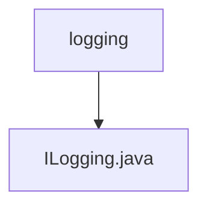

# 基础信息

|      |      |
|------|------|
| 名称 | logging |
| 编码语言 | .java |
| 代码路径 | erp-backend/erp-library/src/main/java/com.jukusoft/erp/lib/logging |
| 包名 | erp-backend.erp-library.src.main.java.com.jukusoft.erp.lib.logging |
| 概述说明 | 信息为空，无法生成概要描述。 |

# 说明

由于提供的内容为空，无法进行总结描述。请提供具体内容以便进行详细描述。

### 包内部结构视图

这段流程图展示了一个简单的层级关系，`logging` 文件夹包含一个文件 `ILogging.java`。路径结构清晰，`logging` 是父节点，`ILogging.java` 是其子节点。这种结构通常用于组织代码库中的日志相关功能。

# 文件列表 File List

| 名称   | 类型  | 说明 |
|-------|------|-------------|
| [ILogging.java](ILogging.md) | file | 信息为空，无法生成概要描述。 |

