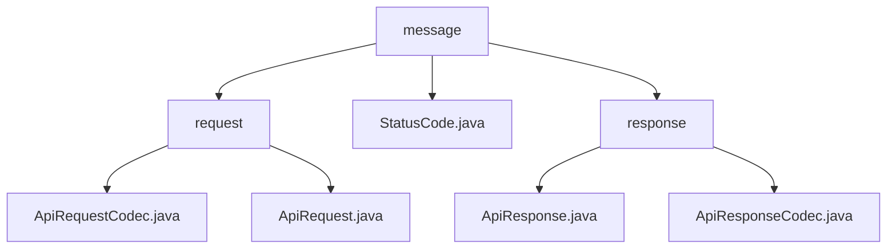

# 基础信息

|      |      |
|------|------|
| 名称 | message |
| 编码语言 | .java |
| 代码路径 | erp-backend/erp-library/src/main/java/com.jukusoft/erp/lib/message |
| 包名 | erp-backend.erp-library.src.main.java.com.jukusoft.erp.lib.message |
| 概述说明 | 模块处理API请求与响应的编码、解码及管理，确保数据完整性和安全性。 |

# 说明

## 概述

该代码模块主要处理API请求和响应的编码、解码以及请求管理功能，确保API交互过程中数据的完整性、安全性和高效性。模块分为两部分：API请求处理和API响应处理。核心类包括`ApiRequestCodec`、`ApiRequest`、`ApiResponse`和`ApiResponseCodec`，它们分别负责请求和响应的封装、编码与解码操作。

- **`ApiRequestCodec`类**：负责实现消息的编码与解码功能，主要处理`ApiRequest`对象与JSON格式之间的相互转换。该类确保数据在传输过程中能够正确编码为JSON格式，并在接收时准确解码为`ApiRequest`对象，从而实现高效的数据交换与通信。
  
- **`ApiRequest`类**：是一个用于处理API请求的工具，具备多项核心功能。它能够管理事件名称、传递数据、处理唯一标识符（ID）、维护会话信息，并进行权限检查。这些功能确保API请求的完整性和安全性，同时支持高效的数据交互和用户身份验证。

- **`ApiResponse`类**：用于封装API响应，包含事件名、数据、状态码、消息ID等关键属性。它支持JSON格式和多种内容类型，适用于各种API交互场景，确保响应数据的结构化和可扩展性。

- **`ApiResponseCodec`类**：实现了`MessageCodec`接口，主要负责`ApiResponse`对象的编码与解码。它将`ApiResponse`对象转换为适合传输的格式，并在接收时将其还原为原始对象，确保数据在通信过程中的完整性和正确性。

## 主要业务场景

1. **API请求的编码与解码**：`ApiRequestCodec`类在API请求的传输过程中，负责将`ApiRequest`对象编码为JSON格式，以便在网络中传输。同时，在接收端，它将JSON格式的数据解码为`ApiRequest`对象，以便后续处理。

2. **API请求的管理与处理**：`ApiRequest`类用于管理API请求的各个关键要素，包括事件名称、数据传递、唯一标识符（ID）、会话信息以及权限检查。这些功能确保了API请求的完整性和安全性，同时支持高效的数据交互和用户身份验证。

3. **API响应封装**：`ApiResponse`类用于封装API响应，包含事件名、数据、状态码、消息ID等关键属性。它支持JSON格式和多种内容类型，适用于各种API交互场景，确保响应数据的结构化和可扩展性。

4. **响应数据编码与解码**：`ApiResponseCodec`类实现了`MessageCodec`接口，主要负责`ApiResponse`对象的编码与解码。它将`ApiResponse`对象转换为适合传输的格式，并在接收时将其还原为原始对象，确保数据在通信过程中的完整性和正确性。

5. **数据交换与通信**：通过`ApiRequestCodec`、`ApiRequest`、`ApiResponse`和`ApiResponseCodec`类的协作，该模块实现了高效的数据交换与通信，确保了API请求和响应在传输和处理过程中的准确性和安全性。

该模块为API请求和响应处理提供了全面的解决方案，适用于需要高效、安全地处理API交互的业务场景。

### 包内部结构视图

该流程图展示了`erp-backend/erp-library`项目中`message`模块的层级结构。`message`模块包含`request`和`response`两个子模块，分别处理API请求和响应的相关逻辑。`request`模块中包含`ApiRequestCodec.java`和`ApiRequest.java`文件，用于编码和处理API请求。`response`模块中包含`ApiResponse.java`和`ApiResponseCodec.java`文件，用于编码和处理API响应。`StatusCode.java`文件则独立于这两个子模块，用于定义状态码。

# 文件列表 File List

| 名称   | 类型  | 说明 |
|-------|------|-------------|
| [StatusCode.java](StatusCode.md) | file | 无内容，无法生成概要描述。 |
| [response](response/_module.md) | package | ApiResponse类封装API响应，ApiResponseCodec处理其编码解码。 |
| [request](request/_module.md) | package | ApiRequestCodec类实现JSON与ApiRequest对象的编码解码，确保数据传输正确。ApiRequest类管理API请求的核心功能，确保完整性和安全性。 |

