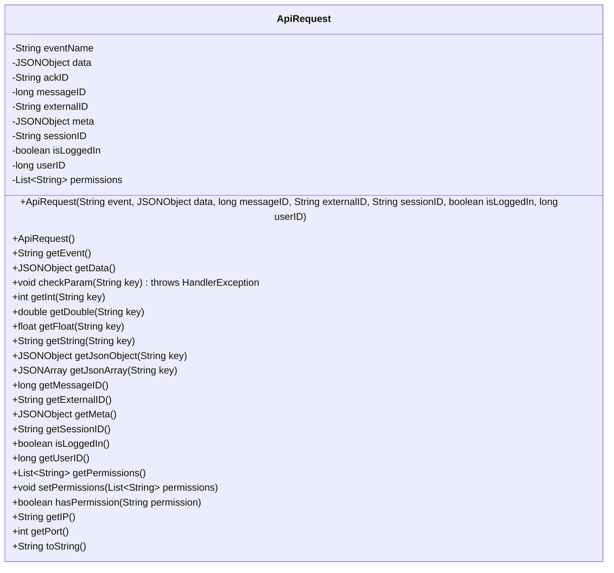

# 基础信息

|      |      |
|------|------|
| 名称 | ApiRequest |
| 编码语言 | .java |
| 代码路径 | erp-backend/erp-library/src/main/java/com.jukusoft/erp/lib/message/request/ApiRequest.java |
| 包名 | com.jukusoft.erp.lib.message.request |
| 依赖项 | ['com.jukusoft.erp.lib.exception.HandlerException', 'io.vertx.core.json.JsonObject', 'org.json.JSONArray', 'org.json.JSONException', 'org.json.JSONObject', 'java.util.ArrayList', 'java.util.List'] |
| 概述说明 | ApiRequest类管理API请求，含事件、数据、ID、会话及权限检查。 |

# 说明

ApiRequest类是一个用于处理API请求的工具，具备多项核心功能。它能够管理事件名称、传递数据、处理唯一标识符（ID）、维护会话信息，并进行权限检查。这些功能确保API请求的完整性和安全性，同时支持高效的数据交互和用户身份验证。通过集成这些关键特性，ApiRequest类为API请求处理提供了全面的解决方案。

# 类列表 Class Summary

| 名称   | 类型  | 说明 |
|-------|------|-------------|
| ApiRequest | class | ApiRequest类处理API请求，包含事件名、数据、ID、会话信息及权限检查等功能。 |

## 类 ApiRequest

|      |      |
|------|------|
| 访问范围 | public |
| 类型 | class |
| 名称 | ApiRequest |
| 说明 | ApiRequest类处理API请求，包含事件名、数据、ID、会话信息及权限检查等功能。 |

### UML类图

这段代码定义了一个 `ApiRequest` 类，用于封装和处理API请求的相关数据。类中包含多个字段，如事件名称、JSON数据、消息ID、外部ID、会话ID、用户ID等，并提供了对这些字段的访问和操作方法。`ApiRequest` 类还包含一些用于检查参数是否存在、获取不同类型的参数值以及权限管理的功能。该类的主要作用是处理API请求的数据，并提供了一系列方法来安全地访问和操作这些数据。

### 内部方法调用关系图

```mermaid
graph TD
    A["类ApiRequest"]
    B["属性: String eventName"]
    C["属性: JSONObject data"]
    D["属性: String ackID"]
    E["属性: long messageID"]
    F["属性: String externalID"]
    G["属性: JSONObject meta"]
    H["属性: String sessionID"]
    I["属性: boolean isLoggedIn"]
    J["属性: long userID"]
    K["属性: List<String> permissions"]
    L["构造方法: ApiRequest(String event, JSONObject data, long messageID, String externalID, String sessionID, boolean isLoggedIn, long userID)"]
    M["构造方法: ApiRequest()"]
    N["方法: String getEvent()"]
    O["方法: JSONObject getData()"]
    P["方法: void checkParam(String key)"]
    Q["方法: int getInt(String key)"]
    R["方法: double getDouble(String key)"]
    S["方法: float getFloat(String key)"]
    T["方法: String getString(String key)"]
    U["方法: JSONObject getJsonObject(String key)"]
    V["方法: JSONArray getJsonArray(String key)"]
    W["方法: long getMessageID()"]
    X["方法: String getExternalID()"]
    Y["方法: JSONObject getMeta()"]
    Z["方法: String getSessionID()"]
    AA["方法: boolean isLoggedIn()"]
    AB["方法: long getUserID()"]
    AC["方法: List<String> getPermissions()"]
    AD["方法: void setPermissions(List<String> permissions)"]
    AE["方法: boolean hasPermission(String permission)"]
    AF["方法: String getIP()"]
    AG["方法: int getPort()"]
    AH["重写方法: String toString()"]

    A --> B
    A --> C
    A --> D
    A --> E
    A --> F
    A --> G
    A --> H
    A --> I
    A --> J
    A --> K
    A --> L
    A --> M
    A --> N
    A --> O
    A --> P
    A --> Q
    A --> R
    A --> S
    A --> T
    A --> U
    A --> V
    A --> W
    A --> X
    A --> Y
    A --> Z
    A --> AA
    A --> AB
    A --> AC
    A --> AD
    A --> AE
    A --> AF
    A --> AG
    A --> AH
```

这段代码定义了一个`ApiRequest`类，用于处理API请求。类中包含多个属性，如事件名称、JSON数据、消息ID、外部ID、会话ID等，并提供了多个方法来获取和设置这些属性。`checkParam`方法用于检查参数是否存在，若不存在则抛出异常。`toString`方法重写了默认的字符串表示，避免输出敏感信息如密码。该类还提供了获取IP地址和端口号的方法，以及检查用户权限的功能。

### 字段列表 Field List

| 名称  | 类型  | 说明 |
|-------|-------|------|
| eventName = "" | String | 定义受保护的字符串变量eventName，初始值为空。 |
| data = null | JSONObject | 声明一个受保护的JSONObject变量data并初始化为null。 |
| meta = new JSONObject() | JSONObject | 创建并初始化一个受保护的JSONObject对象meta。 |
| isLoggedIn = false | boolean | 保护布尔变量isLoggedIn，初始值为false。 |
| sessionID = "" | String | 定义了一个受保护的字符串变量sessionID，初始值为空。 |
| userID = -1 | long | 定义长整型变量userID，初始值为-1，用于存储用户ID。 |
| messageID = 0 | long | 定义了一个受保护的长整型变量messageID，初始值为0。 |
| permissions = new ArrayList<>() | List<String> | 定义了一个受保护的字符串列表变量permissions，初始化为空列表。 |
| ackID = "" | String | 定义了一个受保护的字符串变量ackID，初始值为空。 |
| externalID = "" | String | 定义了一个受保护的字符串变量externalID，初始值为空。 |

### 方法列表 Method List

| 名称  | 类型  | 说明 |
|-------|-------|------|
| getFloat | float | 该方法通过键获取浮点数，若类型不符则抛出异常。 |
| getSessionID | String | 获取当前会话ID的方法。 |
| getData | JSONObject | 获取当前对象的JSON数据。 |
| hasPermission | boolean | 该方法检查用户是否拥有指定权限。 |
| getUserID | long | 该方法返回当前对象的用户ID。 |
| getIP | String | 该方法返回主机IP地址。 |
| checkParam | void | 检查参数是否存在，若不存在则抛出异常。 |
| isLoggedIn | boolean | 检查用户是否已登录。 |
| getPermissions | List<String> | 该方法返回权限列表。 |
| getPort | int | 该方法返回配置中指定的端口号。 |
| getMessageID | long | 获取消息ID的方法，返回长整型值。 |
| getExternalID | String | 获取外部ID的公共方法。 |
| getJsonArray | JSONArray | 方法获取指定键的JSON数组，异常时抛出错误。 |
| getDouble | double | 方法getDouble通过key获取double值，若key无效则抛出异常。 |
| getMeta | JSONObject | 获取当前对象的meta信息并返回。 |
| getEvent | String | 该方法返回当前对象的eventName属性值。 |
| setPermissions | void | 设置权限列表的方法。 |
| getJsonObject | JSONObject | 获取指定键的JSON对象，键无效时抛出异常。 |
| toString | String | 重写toString方法，隐藏密码数据，显示事件名和消息ID。 |
| getInt | int | 方法getInt通过key获取整数值，若异常则抛出非整数错误。 |
| getString | String | 该方法通过键获取字符串，检查参数并处理JSON异常。 |

