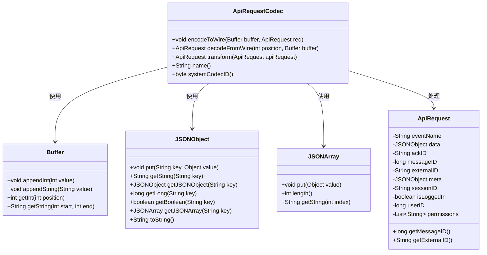
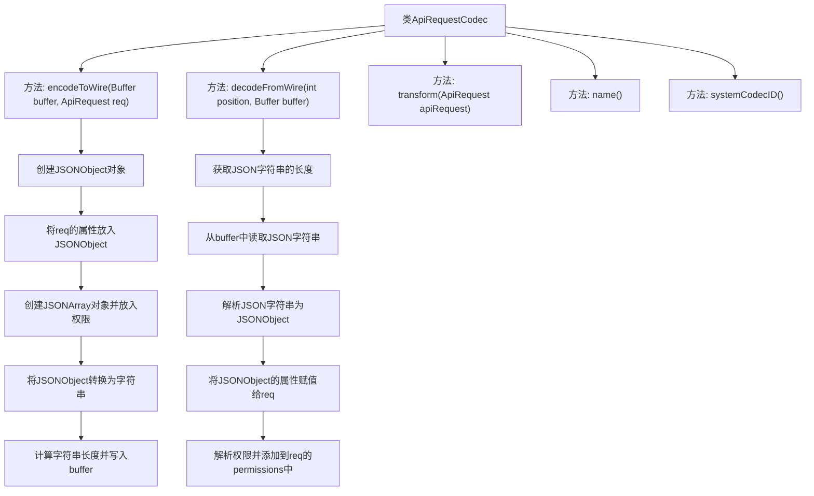

# 基础信息

|      |      |
|------|------|
| 名称 | ApiRequestCodec |
| 编码语言 | .java |
| 代码路径 | erp-backend/erp-library/src/main/java/com.jukusoft/erp/lib/message/request/ApiRequestCodec.java |
| 包名 | com.jukusoft.erp.lib.message.request |
| 依赖项 | ['io.vertx.core.buffer.Buffer', 'io.vertx.core.eventbus.MessageCodec', 'io.vertx.core.json.JsonArray', 'org.json.JSONArray', 'org.json.JSONObject', 'java.util.ArrayList'] |
| 概述说明 | ApiRequestCodec类负责ApiRequest对象与JSON间的编码解码。 |

# 说明

ApiRequestCodec类负责实现消息的编码与解码功能，主要处理ApiRequest对象与JSON格式之间的相互转换。该类确保数据在传输过程中能够正确编码为JSON格式，并在接收时准确解码为ApiRequest对象，从而实现高效的数据交换与通信。

# 类列表 Class Summary

| 名称   | 类型  | 说明 |
|-------|------|-------------|
| ApiRequestCodec | class | ApiRequestCodec类实现消息编码解码，处理ApiRequest对象与JSON转换。 |

## 类 ApiRequestCodec

|      |      |
|------|------|
| 访问范围 | public |
| 类型 | class |
| 名称 | ApiRequestCodec |
| 说明 | ApiRequestCodec类实现消息编码解码，处理ApiRequest对象与JSON转换。 |

### UML类图

这段代码定义了一个名为 `ApiRequestCodec` 的类，它实现了 `MessageCodec` 接口，用于对 `ApiRequest` 对象进行编码和解码。`encodeToWire` 方法将 `ApiRequest` 对象编码为 JSON 格式并写入 `Buffer`，而 `decodeFromWire` 方法则从 `Buffer` 中读取 JSON 数据并解码为 `ApiRequest` 对象。`transform` 方法直接返回传入的 `ApiRequest` 对象，`name` 方法返回类名，`systemCodecID` 方法返回系统编解码器的 ID。代码中使用了 `Buffer`、`JSONObject` 和 `JSONArray` 等辅助类来完成编码和解码操作。

### 内部方法调用关系图

这段代码定义了一个名为`ApiRequestCodec`的类，实现了`MessageCodec`接口，用于对`ApiRequest`对象进行编码和解码。`encodeToWire`方法将`ApiRequest`对象转换为JSON格式并写入缓冲区，而`decodeFromWire`方法则从缓冲区中读取JSON字符串并解析为`ApiRequest`对象。`transform`方法直接返回传入的`ApiRequest`对象，`name`方法返回类名，`systemCodecID`方法返回固定的编码ID。

### 字段列表 Field List

| 名称  | 类型  | 说明 |
|-------|-------|------|

### 方法列表 Method List

| 名称  | 类型  | 说明 |
|-------|-------|------|
| encodeToWire | void | 将ApiRequest对象编码为JSON并写入缓冲区。 |
| name | String | 重写name方法，返回当前类的简单名称。 |
| systemCodecID | byte | 重写systemCodecID方法，返回值为-1。 |
| decodeFromWire | ApiRequest | 从缓冲区解码JSON数据并构建ApiRequest对象。 |
| transform | ApiRequest | 重写transform方法，直接返回传入的ApiRequest对象。 |

