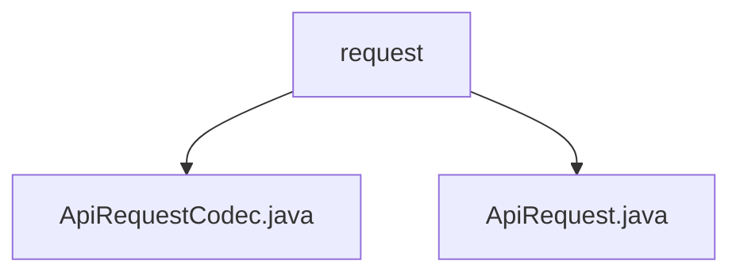

# 基础信息

|      |      |
|------|------|
| 名称 | request |
| 编码语言 | .java |
| 代码路径 | erp-backend/erp-library/src/main/java/com.jukusoft/erp/lib/message/request |
| 包名 | erp-backend.erp-library.src.main.java.com.jukusoft.erp.lib.message.request |
| 概述说明 | ApiRequestCodec类实现JSON与ApiRequest对象的编码解码，确保数据传输正确。ApiRequest类管理API请求的核心功能，确保完整性和安全性。 |

# 说明

## 概述

该代码模块主要处理API请求的编码、解码以及请求管理功能。核心类包括`ApiRequestCodec`和`ApiRequest`，它们共同协作以确保API请求的数据完整性、安全性以及高效的数据交换。

- **`ApiRequestCodec`类**：负责实现消息的编码与解码功能，主要处理`ApiRequest`对象与JSON格式之间的相互转换。该类确保数据在传输过程中能够正确编码为JSON格式，并在接收时准确解码为`ApiRequest`对象，从而实现高效的数据交换与通信。
  
- **`ApiRequest`类**：是一个用于处理API请求的工具，具备多项核心功能。它能够管理事件名称、传递数据、处理唯一标识符（ID）、维护会话信息，并进行权限检查。这些功能确保API请求的完整性和安全性，同时支持高效的数据交互和用户身份验证。

## 主要业务场景

1. **API请求的编码与解码**：`ApiRequestCodec`类在API请求的传输过程中，负责将`ApiRequest`对象编码为JSON格式，以便在网络中传输。同时，在接收端，它将JSON格式的数据解码为`ApiRequest`对象，以便后续处理。

2. **API请求的管理与处理**：`ApiRequest`类用于管理API请求的各个关键要素，包括事件名称、数据传递、唯一标识符（ID）、会话信息以及权限检查。这些功能确保了API请求的完整性和安全性，同时支持高效的数据交互和用户身份验证。

3. **数据交换与通信**：通过`ApiRequestCodec`和`ApiRequest`类的协作，该模块实现了高效的数据交换与通信，确保了API请求在传输和处理过程中的准确性和安全性。

该模块为API请求处理提供了全面的解决方案，适用于需要高效、安全地处理API请求的业务场景。

### 包内部结构视图

该流程图展示了 `erp-backend/erp-library` 项目中 `message/request` 目录下的文件层级关系。`request` 文件夹包含两个文件：`ApiRequestCodec.java` 和 `ApiRequest.java`。这些文件用于处理API请求的编码和解码操作，是ERP系统中消息处理模块的重要组成部分。

# 文件列表 File List

| 名称   | 类型  | 说明 |
|-------|------|-------------|
| [ApiRequest.java](ApiRequest.md) | file | ApiRequest类管理API请求，含事件、数据、ID、会话及权限检查。 |
| [ApiRequestCodec.java](ApiRequestCodec.md) | file | ApiRequestCodec类负责ApiRequest对象与JSON间的编码解码。 |

