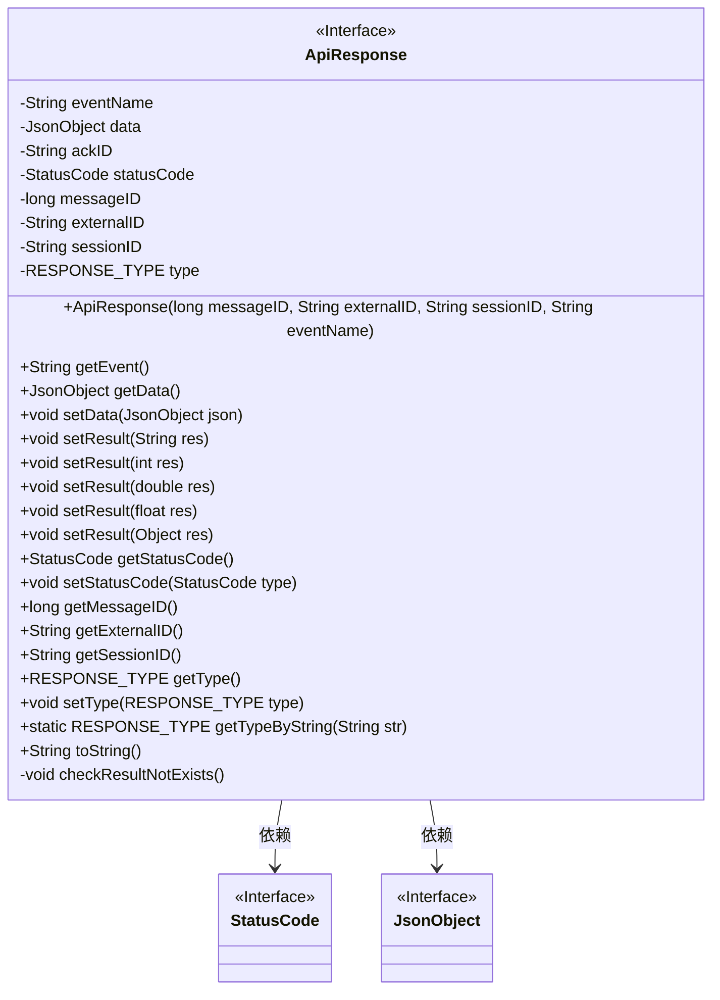

# 基础信息

|      |      |
|------|------|
| 名称 | ApiResponse |
| 编码语言 | .java |
| 代码路径 | erp-backend/erp-library/src/main/java/com.jukusoft/erp/lib/message/response/ApiResponse.java |
| 包名 | com.jukusoft.erp.lib.message.response |
| 依赖项 | ['com.jukusoft.erp.lib.message.StatusCode', 'io.vertx.core.json.JsonObject'] |
| 概述说明 | ApiResponse类封装API响应，含事件名、数据、状态码、消息ID，支持JSON和内容类型。 |

# 说明

ApiResponse类用于封装API响应，包含事件名、数据、状态码、消息ID等关键属性。该类支持JSON格式和多种内容类型，确保响应数据的结构化和可扩展性，适用于各种API交互场景。

# 类列表 Class Summary

| 名称   | 类型  | 说明 |
|-------|------|-------------|
| ApiResponse | class | ApiResponse类用于封装API响应，包含事件名、数据、状态码、消息ID等属性，支持JSON和内容类型。 |

## 类 ApiResponse

|      |      |
|------|------|
| 访问范围 | public |
| 类型 | class |
| 名称 | ApiResponse |
| 说明 | ApiResponse类用于封装API响应，包含事件名、数据、状态码、消息ID等属性，支持JSON和内容类型。 |

### UML类图

这段代码定义了一个 `ApiResponse` 类，用于表示 API 响应。该类包含多个属性，如事件名称、JSON 数据、状态码、消息 ID 等，并提供了对这些属性的访问和修改方法。`ApiResponse` 类还包含一个枚举类型 `RESPONSE_TYPE`，用于表示响应类型。类中的 `setResult` 方法用于设置响应结果，并确保结果未被重复设置。`ApiResponse` 类依赖于 `StatusCode` 和 `JsonObject` 接口。

### 内部方法调用关系图

```mermaid
graph TD
    A["类ApiResponse"]
    B["属性: String eventName"]
    C["属性: JsonObject data"]
    D["属性: String ackID"]
    E["属性: StatusCode statusCode"]
    F["属性: long messageID"]
    G["属性: String externalID"]
    H["属性: String sessionID"]
    I["枚举: RESPONSE_TYPE"]
    J["属性: RESPONSE_TYPE type"]
    K["构造方法: ApiResponse(long messageID, String externalID, String sessionID, String eventName)"]
    L["方法: String getEvent()"]
    M["方法: JsonObject getData()"]
    N["方法: void setData(JsonObject json)"]
    O["方法: void setResult(String res)"]
    P["方法: void setResult(int res)"]
    Q["方法: void setResult(double res)"]
    R["方法: void setResult(float res)"]
    S["方法: void setResult(Object res)"]
    T["方法: void checkResultNotExists()"]
    U["方法: StatusCode getStatusCode()"]
    V["方法: void setStatusCode(StatusCode type)"]
    W["方法: long getMessageID()"]
    X["方法: String getExternalID()"]
    Y["方法: String getSessionID()"]
    Z["方法: RESPONSE_TYPE getType()"]
    AA["方法: void setType(RESPONSE_TYPE type)"]
    AB["方法: static RESPONSE_TYPE getTypeByString(String str)"]
    AC["重写方法: String toString()"]

    A --> B
    A --> C
    A --> D
    A --> E
    A --> F
    A --> G
    A --> H
    A --> I
    A --> J
    A --> K
    A --> L
    A --> M
    A --> N
    A --> O
    A --> P
    A --> Q
    A --> R
    A --> S
    A --> T
    A --> U
    A --> V
    A --> W
    A --> X
    A --> Y
    A --> Z
    A --> AA
    A --> AB
    A --> AC
```

这段代码定义了一个名为 `ApiResponse` 的类，用于表示API响应。类中包含多个属性，如事件名称、JSON数据、状态码、消息ID等，并提供了对这些属性的访问和修改方法。类中还定义了一个枚举类型 `RESPONSE_TYPE`，用于表示响应类型。代码通过多个 `setResult` 方法支持不同类型的结果设置，并在设置结果前检查是否已存在结果。此外，代码还提供了一个静态方法 `getTypeByString`，用于根据字符串获取响应类型。最后，类重写了 `toString` 方法，以便返回格式化的API响应信息。

### 字段列表 Field List

| 名称  | 类型  | 说明 |
|-------|-------|------|
| eventName = "" | String | 定义一个受保护的字符串变量eventName，初始值为空。 |
| statusCode = StatusCode.OK | StatusCode | 保护状态码变量statusCode初始化为OK。 |
| type = RESPONSE_TYPE.JSON | RESPONSE_TYPE | 定义保护类型为JSON的响应类型。 |
| ackID = "" | String | 定义了一个受保护的字符串变量ackID，初始值为空。 |
| data = new JsonObject() | JsonObject | 创建并初始化一个受保护的JsonObject对象data。 |
| messageID = 0 | long | 保护长整型变量messageID，初始值为0。 |
| externalID = "" | String | 定义了一个受保护的字符串变量externalID，初始值为空。 |
| sessionID = "" | String | 定义了一个受保护的字符串变量sessionID，初始值为空。 |

### 方法列表 Method List

| 名称  | 类型  | 说明 |
|-------|-------|------|
| getEvent | String | 获取事件名称的方法。 |
| getStatusCode | StatusCode | 该方法返回当前对象的`statusCode`状态码。 |
| getSessionID | String | 获取当前会话ID的方法。 |
| setType | void | 设置响应类型的方法。 |
| setResult | void | 方法设置结果并更新状态码为OK。 |
| getTypeByString | RESPONSE_TYPE | 静态方法通过字符串返回响应类型，未知类型抛出异常。 |
| getType | RESPONSE_TYPE | 获取对象类型的公共方法。 |
| setData | void | 该方法用于设置对象的JSON数据。 |
| setResult | void | 设置结果并更新状态码为OK。 |
| getExternalID | String | 获取外部ID的公共方法。 |
| setResult | void | 设置结果并更新状态码为OK。 |
| getData | JsonObject | 获取并返回当前对象的JSON数据。 |
| getMessageID | long | 获取消息ID的公共方法，返回长整型值。 |
| setStatusCode | void | 设置状态码的方法，将传入类型赋值给类成员变量。 |
| checkResultNotExists | void | 检查结果是否存在，若存在则抛出异常。 |
| setResult | void | 方法设置结果对象，检查结果不存在后设置状态码为OK，并将结果存入数据中。 |
| setResult | void | 该方法设置结果值，检查结果不存在后，设置状态码为OK，并将结果存入数据中。 |
| toString | String | 重写toString方法，返回API响应的事件名、消息ID、状态码和数据。 |

