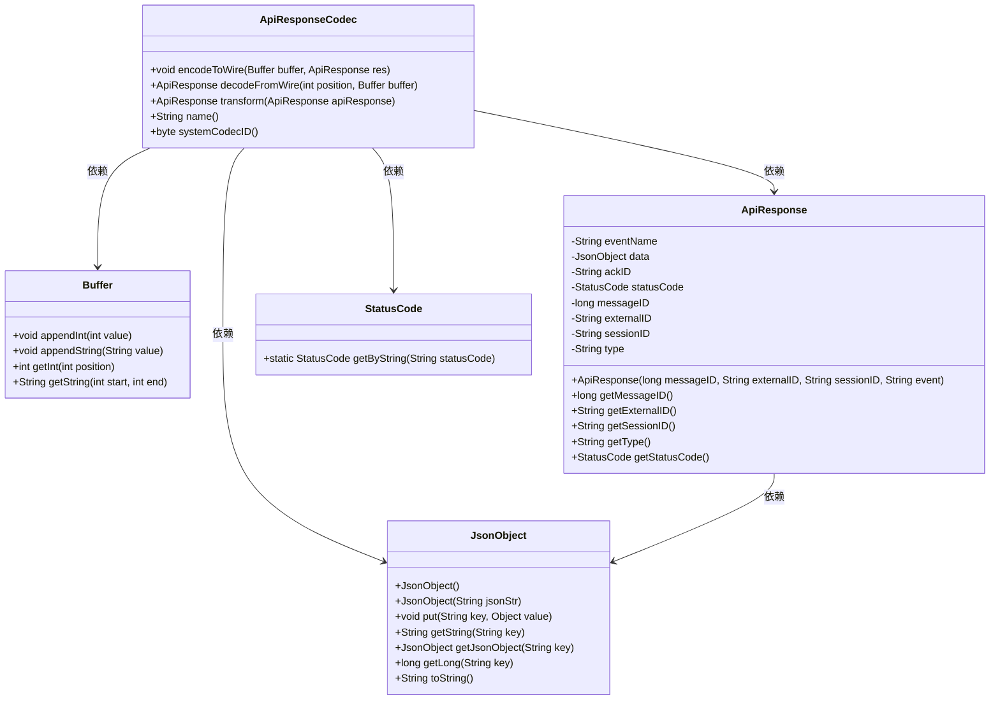
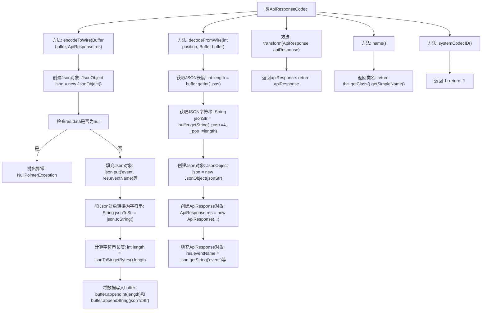

# 基础信息

|      |      |
|------|------|
| 名称 | ApiResponseCodec |
| 编码语言 | .java |
| 代码路径 | erp-backend/erp-library/src/main/java/com.jukusoft/erp/lib/message/response/ApiResponseCodec.java |
| 包名 | com.jukusoft.erp.lib.message.response |
| 依赖项 | ['com.jukusoft.erp.lib.message.StatusCode', 'io.vertx.core.buffer.Buffer', 'io.vertx.core.eventbus.MessageCodec', 'io.vertx.core.json.JsonObject'] |
| 概述说明 | ApiResponseCodec实现MessageCodec接口，处理ApiResponse的编码与解码。 |

# 说明

ApiResponseCodec是一个实现了MessageCodec接口的类，其主要职责是处理ApiResponse的编码与解码工作。它负责将ApiResponse对象转换为适合传输的格式，并在接收时将其还原为原始对象，确保数据在通信过程中的完整性和正确性。

# 类列表 Class Summary

| 名称   | 类型  | 说明 |
|-------|------|-------------|
| ApiResponseCodec | class | ApiResponseCodec实现MessageCodec接口，负责ApiResponse的编码与解码。 |

## 类 ApiResponseCodec

|      |      |
|------|------|
| 访问范围 | public |
| 类型 | class |
| 名称 | ApiResponseCodec |
| 说明 | ApiResponseCodec实现MessageCodec接口，负责ApiResponse的编码与解码。 |

### UML类图

这段代码定义了一个 `ApiResponseCodec` 类，它实现了 `MessageCodec` 接口，用于将 `ApiResponse` 对象编码为 `Buffer` 中的字节流，以及从 `Buffer` 中解码为 `ApiResponse` 对象。`ApiResponse` 类包含了多个字段，如 `eventName`、`data`、`ackID` 等，`JsonObject` 类用于处理 JSON 数据的序列化和反序列化。`StatusCode` 类提供了根据字符串获取状态码的功能。整个代码结构清晰，职责分明，主要用于处理 API 响应的编码和解码操作。

### 内部方法调用关系图

这段代码定义了一个名为`ApiResponseCodec`的类，实现了`MessageCodec`接口，用于对`ApiResponse`对象进行编码和解码。`encodeToWire`方法将`ApiResponse`对象转换为JSON格式并写入缓冲区，而`decodeFromWire`方法则从缓冲区中读取JSON字符串并还原为`ApiResponse`对象。此外，`transform`方法直接返回传入的`ApiResponse`对象，`name`方法返回类名，`systemCodecID`方法返回固定值-1。

### 字段列表 Field List

| 名称  | 类型  | 说明 |
|-------|-------|------|

### 方法列表 Method List

| 名称  | 类型  | 说明 |
|-------|-------|------|
| systemCodecID | byte | 重写方法，返回系统编解码器ID为-1。 |
| encodeToWire | void | 将API响应编码为JSON并写入缓冲区。 |
| decodeFromWire | ApiResponse | 解码缓冲区的JSON数据并构建ApiResponse对象。 |
| name | String | 重写name方法，返回当前类名。 |
| transform | ApiResponse | 重写transform方法，直接返回ApiResponse对象。 |

