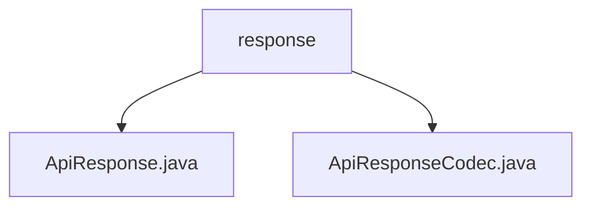

# 基础信息

|      |      |
|------|------|
| 名称 | response |
| 编码语言 | .java |
| 代码路径 | erp-backend/erp-library/src/main/java/com.jukusoft/erp/lib/message/response |
| 包名 | erp-backend.erp-library.src.main.java.com.jukusoft.erp.lib.message.response |
| 概述说明 | ApiResponse类封装API响应，ApiResponseCodec处理其编码解码。 |

# 说明

## 概述
该代码模块主要处理API响应的封装、编码与解码工作，确保API交互过程中数据的结构化和可扩展性。核心类包括`ApiResponse`和`ApiResponseCodec`，分别负责响应的封装和编码/解码操作。

## 主要业务场景
1. **API响应封装**：`ApiResponse`类用于封装API响应，包含事件名、数据、状态码、消息ID等关键属性。它支持JSON格式和多种内容类型，适用于各种API交互场景，确保响应数据的结构化和可扩展性。
2. **响应数据编码与解码**：`ApiResponseCodec`类实现了`MessageCodec`接口，主要负责`ApiResponse`对象的编码与解码。它将`ApiResponse`对象转换为适合传输的格式，并在接收时将其还原为原始对象，确保数据在通信过程中的完整性和正确性。

### 包内部结构视图

该流程图展示了`erp-backend`项目中`erp-library`模块下`response`文件夹的层级结构。`response`文件夹包含两个文件：`ApiResponse.java`和`ApiResponseCodec.java`。这两个文件直接位于`response`文件夹下，没有进一步的子文件夹或文件。

# 文件列表 File List

| 名称   | 类型  | 说明 |
|-------|------|-------------|
| [ApiResponseCodec.java](ApiResponseCodec.md) | file | ApiResponseCodec实现MessageCodec接口，处理ApiResponse的编码与解码。 |
| [ApiResponse.java](ApiResponse.md) | file | ApiResponse类封装API响应，含事件名、数据、状态码、消息ID，支持JSON和内容类型。 |

