# 基础信息

|      |      |
|------|------|
| 名称 | AbstractModule |
| 编码语言 | .java |
| 代码路径 | erp-backend/erp-library/src/main/java/com.jukusoft/erp/lib/module/AbstractModule.java |
| 包名 | com.jukusoft.erp.lib.module |
| 依赖项 | ['com.jukusoft.erp.lib.annotation.InjectLogger', 'com.jukusoft.erp.lib.annotation.LoginRequired', 'com.jukusoft.erp.lib.annotation.PermissionRequired', 'com.jukusoft.erp.lib.cache.CacheTypes', 'com.jukusoft.erp.lib.cache.ICache', 'com.jukusoft.erp.lib.cache.InjectCache', 'com.jukusoft.erp.lib.context.AppContext', 'com.jukusoft.erp.lib.database', 'com.jukusoft.erp.lib.exception.HandlerException', 'com.jukusoft.erp.lib.exception.RequiredRepositoryNotFoundException', 'com.jukusoft.erp.lib.exception.RequiredServiceNotFoundException', 'com.jukusoft.erp.lib.logging.ILogging', 'com.jukusoft.erp.lib.message.StatusCode', 'com.jukusoft.erp.lib.message.request.ApiRequest', 'com.jukusoft.erp.lib.message.response.ApiResponse', 'com.jukusoft.erp.lib.route.Route', 'com.jukusoft.erp.lib.route.RouteHandler', 'com.jukusoft.erp.lib.route.RouteHandlerWithoutReturn', 'com.jukusoft.erp.lib.controller.IController', 'com.jukusoft.erp.lib.service.IService', 'com.jukusoft.erp.lib.service.InjectService', 'io.vertx.core.AsyncResult', 'io.vertx.core.Future', 'io.vertx.core.Handler', 'io.vertx.core.Vertx', 'io.vertx.core.eventbus.EventBus', 'io.vertx.core.eventbus.Message', 'io.vertx.ext.sync.Sync', 'java.lang.reflect.Field', 'java.lang.reflect.InvocationTargetException', 'java.lang.reflect.Method', 'java.util.Map', 'java.util.concurrent.ConcurrentHashMap'] |
| 概述说明 | AbstractModule实现IModule，管理Vertx、日志、服务和路由，支持依赖注入。 |

# 说明

AbstractModule是一个实现了IModule接口的模块，主要负责管理Vertx实例、日志系统、服务以及路由配置。它支持依赖注入机制，使得模块内的组件能够通过依赖注入进行管理和初始化。该模块的设计旨在提供一个统一的框架，方便开发者集成和管理Vertx应用中的各项功能，同时通过依赖注入机制增强了模块的灵活性和可扩展性。

# 类列表 Class Summary

| 名称   | 类型  | 说明 |
|-------|------|-------------|
| AbstractModule | class | AbstractModule实现IModule，管理Vertx、日志、服务和路由，支持依赖注入。 |

## 类 AbstractModule

|      |      |
|------|------|
| 访问范围 | public abstract |
| 类型 | class |
| 名称 | AbstractModule |
| 说明 | AbstractModule实现IModule，管理Vertx、日志、服务和路由，支持依赖注入。 |

### UML类图

```mermaid
classDiagram
    class AbstractModule {
        <<Abstract>>
        -Vertx vertx
        -AppContext context
        -ILogging logger
        -Map~Class<?>, IService~ serviceMap
        +Vertx getVertx()
        +EventBus getEventBus()
        +ILogging getLogger()
        +void init(Vertx vertx, AppContext context, ILogging logger)
        +void addRepository~T~(T repository, Class~T~ cls)
        +T getRepository~T~(Class~T~ cls)
        +void addController~T~(T page)
        +void addService~T~(T service, Class~T~ cls)
        +T getService~T~(Class~T~ cls)
        +void injectRepositories~T~(T target)
        +void injectServices~T~(T target)
        +void injectAppContext(Object target)
        +void injectLogger(Object target)
        +void injectDatabase(Object target)
        +void injectCaches(Object target)
        +void addRoute(String eventName, RouteHandler handler)
        +void addRoute(String eventName, RouteHandlerWithoutReturn handler)
        +ApiResponse generateInternalServerError(ApiRequest req)
        +void start(Handler~Future~IModule~~ handler)
        +void stop(Handler~Future~Void~~ handler)
        #void start() throws Exception
        #void stop() throws Exception
    }

    class IModule {
        <<Interface>>
        +Vertx getVertx()
        +ILogging getLogger()
        +void init(Vertx vertx, AppContext context, ILogging logger)
        +void start(Handler~Future~IModule~~ handler)
        +void stop(Handler~Future~Void~~ handler)
    }

    class Vertx {
        +EventBus eventBus()
    }

    class AppContext {
        +DatabaseManager getDatabaseManager()
        +CacheManager getCacheManager()
        +boolean checkPermission(ApiRequest req, String permissionName)
    }

    class ILogging {
        <<Interface>>
        +void debug(String messageID, String event, String message)
        +void warn(String messageID, String event, String message)
    }

    class IService {
        <<Interface>>
        +void start()
    }

    class Repository {
        <<Abstract>>
    }

    class IController {
        <<Interface>>
        +void init(Vertx vertx, AppContext context, ILogging logger)
    }

    class RouteHandler {
        <<Interface>>
        +ApiResponse handle(ApiRequest req, ApiResponse res)
    }

    class RouteHandlerWithoutReturn {
        <<Interface>>
        +void handle(ApiRequest req, ApiResponse res)
    }

    class ApiRequest {
        +String getMessageID()
        +String getExternalID()
        +String getSessionID()
        +String getEvent()
        +boolean isLoggedIn()
    }

    class ApiResponse {
        +void setStatusCode(StatusCode statusCode)
    }

    class DatabaseManager {
        +void addRepository(Repository repository, Class~?~ cls)
        +Repository getRepository(Class~?~ cls)
        +boolean contains(Class~?~ cls)
        +Object getRepositoryAsObject(Class~?~ cls)
    }

    class CacheManager {
        +ICache getCache(String cacheName)
        +ICache createCache(String cacheName, CacheTypes cacheType)
        +boolean containsCache(String cacheName)
    }

    class ICache {
        <<Interface>>
    }

    AbstractModule --|> IModule : 实现
    AbstractModule --> Vertx : 依赖
    AbstractModule --> AppContext : 依赖
    AbstractModule --> ILogging : 依赖
    AbstractModule --> IService : 依赖
    AbstractModule --> Repository : 依赖
    AbstractModule --> IController : 依赖
    AbstractModule --> RouteHandler : 依赖
    AbstractModule --> RouteHandlerWithoutReturn : 依赖
    AbstractModule --> ApiRequest : 依赖
    AbstractModule --> ApiResponse : 依赖
    AbstractModule --> DatabaseManager : 依赖
    AbstractModule --> CacheManager : 依赖
    AbstractModule --> ICache : 依赖
```

### 描述
`AbstractModule` 是一个抽象类，实现了 `IModule` 接口，用于管理模块的初始化、启动和停止操作。它依赖于 `Vertx`、`AppContext`、`ILogging` 等类，并通过注入机制将依赖项注入到 `Repository`、`IService`、`IController` 等对象中。`AbstractModule` 提供了路由注册、服务管理、日志记录等功能，并通过泛型方法支持多种类型的依赖注入。

### 内部方法调用关系图

```mermaid
graph TD
    A["类AbstractModule"]
    B["属性: Vertx vertx"]
    C["属性: AppContext context"]
    D["属性: ILogging logger"]
    E["属性: Map<Class<?>, IService> serviceMap"]
    F["方法: Vertx getVertx()"]
    G["方法: EventBus getEventBus()"]
    H["方法: ILogging getLogger()"]
    I["方法: void init(Vertx vertx, AppContext context, ILogging logger)"]
    J["方法: void addRepository(T repository, Class<T> cls)"]
    K["方法: T getRepository(Class<T> cls)"]
    L["方法: void addController(T page)"]
    M["方法: void addService(T service, Class<T> cls)"]
    N["方法: T getService(Class<T> cls)"]
    O["方法: void injectRepositories(T target)"]
    P["方法: void injectServices(T target)"]
    Q["方法: void injectAppContext(Object target)"]
    R["方法: void injectLogger(Object target)"]
    S["方法: void injectDatabase(Object target)"]
    T["方法: void injectCaches(Object target)"]
    U["方法: void injectRepositoryField(Object target, Field field, boolean nullable)"]
    V["方法: void injectServiceField(Object target, Field field, boolean nullable)"]
    W["方法: void injectCacheField(Object target, Field field, String cacheName, CacheTypes cacheType, boolean nullable)"]
    X["方法: void registerHandler(String eventName, T page, Method method)"]
    Y["方法: void addRoute(String eventName, RouteHandler handler)"]
    Z["方法: void addRoute(String eventName, RouteHandlerWithoutReturn handler)"]
    AA["方法: ApiResponse generateInternalServerError(ApiRequest req)"]
    AB["方法: void start(Handler<Future<IModule>> handler)"]
    AC["方法: void stop(Handler<Future<Void>> handler)"]
    AD["抽象方法: void start()"]
    AE["抽象方法: void stop()"]

    A --> B
    A --> C
    A --> D
    A --> E
    A --> F
    A --> G
    A --> H
    A --> I
    A --> J
    A --> K
    A --> L
    A --> M
    A --> N
    A --> O
    A --> P
    A --> Q
    A --> R
    A --> S
    A --> T
    A --> U
    A --> V
    A --> W
    A --> X
    A --> Y
    A --> Z
    A --> AA
    A --> AB
    A --> AC
    A -.-> AD
    A -.-> AE
```

**描述：**
`AbstractModule` 是一个抽象类，实现了 `IModule` 接口，主要用于管理模块的初始化、服务注入、路由注册等操作。它包含了多个方法用于处理依赖注入、控制器和服务的管理，以及路由的注册和处理。类中的方法通过 `Vertx`、`AppContext` 和 `ILogging` 等实例来执行各种操作，确保模块的正确初始化和运行。

### 字段列表 Field List

| 名称  | 类型  | 说明 |
|-------|-------|------|
| vertx = null | Vertx | 保护类型的Vertx实例变量初始化为空。 |
| serviceMap = new ConcurrentHashMap<>() | Map<Class<?>,IService> | 使用ConcurrentHashMap存储类与服务的映射关系。 |
| logger = null | ILogging | 定义受保护的日志记录器变量，初始值为空。 |
| context = null | AppContext | 保护类型AppContext变量context初始化为null。 |

### 方法列表 Method List

| 名称  | 类型  | 说明 |
|-------|-------|------|
| getRepository | T | 获取指定类型的数据库仓库实例。 |
| stop | void | 抽象方法stop，可能抛出异常。 |
| start | void | 抽象方法start，可能抛出异常。 |
| getVertx | Vertx | 该方法返回当前Vertx实例。 |
| init | void | 初始化方法检查vertx、context和logger非空并赋值。 |
| getService | T | 从服务映射中获取指定类型的服务，未注册则抛出异常。 |
| stop | void | 重写stop方法，处理成功或异常情况。 |
| injectDatabase | void | 通过反射为目标类注入数据库实例，处理异常并记录日志。 |
| addController | void | 初始化控制器并注册路由，注入日志、数据库、仓库、服务和缓存。 |
| registerHandler | void | 注册事件处理器，检查登录和权限，返回API响应。 |
| start | void | 检查handler非空后启动模块，捕获异常并返回失败或成功结果。 |
| injectAppContext | void | 方法`injectAppContext`通过反射将`AppContext`注入目标对象的注解字段。 |
| injectRepositories | void | 该方法遍历目标类的所有字段，检查InjectRepository注解并注入符合条件的Repository实例。 |
| injectServiceField | void | 方法注入服务字段，检查服务是否存在，设置字段值，处理异常和日志记录。 |
| generateInternalServerError | ApiResponse | 生成内部服务器错误的API响应，包含请求信息和错误状态码。 |
| getEventBus | EventBus | 获取当前Vertx实例的事件总线对象。 |
| addRoute | void | 添加路由方法，验证事件名和处理程序，处理请求并返回响应，捕获异常并记录日志。 |
| addRoute | void | 该方法为指定事件添加路由处理程序，调用处理程序并返回响应。 |
| addService | void | 该方法为服务注入上下文、日志、数据库等资源后启动并存储。 |
| addRepository | void | 为指定仓库注入应用上下文、日志、数据库、仓库和缓存。 |
| getLogger | ILogging | 重写getLogger方法，返回当前logger实例。 |
| injectLogger | void | 方法注入日志对象，遍历目标类字段，检查InjectLogger注解并注入日志实例。 |
| injectCaches | void | 方法遍历目标类字段，注入带有InjectCache注解的ICache类型字段。 |
| injectServices | void | 该方法通过反射遍历目标类的字段，查找带有InjectService注解的IService类型字段并注入服务。 |
| injectCacheField | void | 方法注入缓存字段，检查缓存存在性，设置字段值，处理异常。 |
| injectRepositoryField | void | 方法注入仓库字段，检查类型存在性，处理空值异常，设置字段值并记录日志。 |

