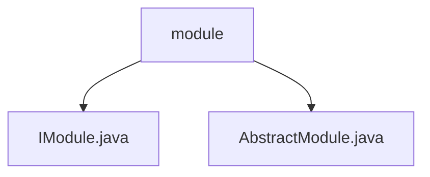

# 基础信息

|      |      |
|------|------|
| 名称 | module |
| 编码语言 | .java |
| 代码路径 | erp-backend/erp-library/src/main/java/com.jukusoft/erp/lib/module |
| 包名 | erp-backend.erp-library.src.main.java.com.jukusoft.erp.lib.module |
| 概述说明 | AbstractModule实现IModule，管理Vertx、日志、服务和路由，支持依赖注入，增强灵活性和扩展性。 |

# 说明

## 概述

该代码模块是一个基于Vertx框架的后端模块管理系统，主要用于管理和集成Vertx应用中的各项功能。模块的核心设计围绕`IModule`接口和`AbstractModule`抽象类展开，旨在提供一个统一的框架，方便开发者进行模块的集成、管理和初始化。通过依赖注入机制，模块内的组件能够灵活地进行管理和扩展，增强了系统的可维护性和可扩展性。

## 主要业务场景

1. **模块管理**：`AbstractModule`实现了`IModule`接口，负责管理Vertx实例、日志系统、服务以及路由配置。开发者可以通过继承`AbstractModule`来创建自定义模块，并在模块中集成所需的功能。

2. **依赖注入**：模块支持依赖注入机制，使得模块内的组件能够通过依赖注入进行管理和初始化。这种机制提高了代码的灵活性和可扩展性，减少了模块之间的耦合。

3. **统一框架**：模块的设计旨在提供一个统一的框架，方便开发者在Vertx应用中集成和管理各项功能。通过模块化的设计，开发者可以更轻松地构建和维护复杂的后端系统。

4. **路由配置**：模块支持路由配置，开发者可以在模块中定义和管理HTTP路由，从而实现对不同请求的处理和响应。

5. **日志系统**：模块集成了日志系统，方便开发者在模块中进行日志记录和监控，提高系统的可观察性和调试效率。

### 包内部结构视图

该流程图展示了`erp-library`项目中`module`目录下的文件层级关系。`module`作为根节点，包含两个子节点：`IModule.java`和`AbstractModule.java`，分别表示模块接口和抽象模块类。这种结构清晰地反映了模块设计中的核心类和接口的依赖关系。

# 文件列表 File List

| 名称   | 类型  | 说明 |
|-------|------|-------------|
| [AbstractModule.java](AbstractModule.md) | file | AbstractModule实现IModule，管理Vertx、日志、服务和路由，支持依赖注入。 |
| [IModule.java](IModule.md) | file | 信息为空，无法生成概要描述。 |

