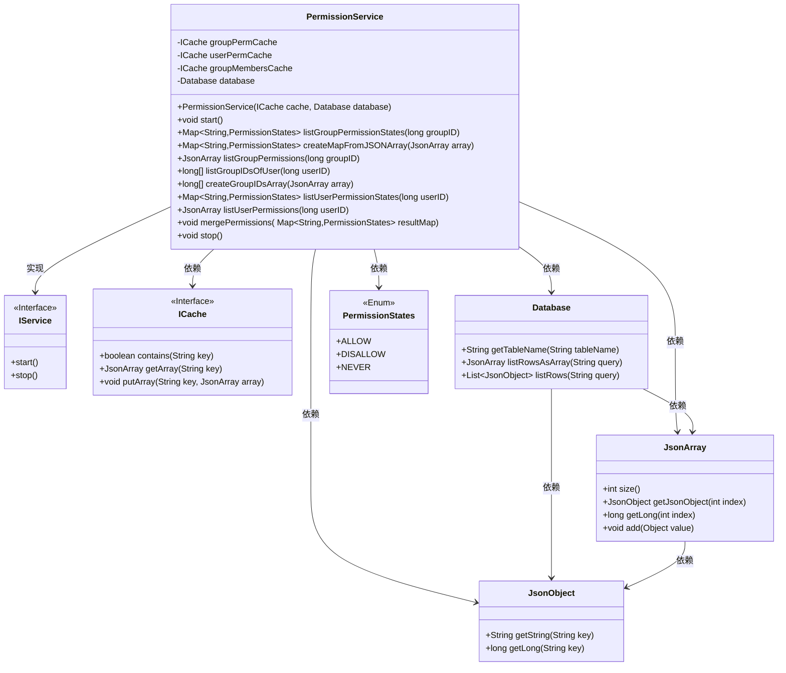

# 基础信息

|      |      |
|------|------|
| 名称 | PermissionService |
| 编码语言 | .java |
| 代码路径 | erp-backend/erp-library/src/main/java/com.jukusoft/erp/lib/permission/PermissionService.java |
| 包名 | com.jukusoft.erp.lib.permission |
| 依赖项 | ['com.jukusoft.erp.lib.cache.CacheTypes', 'com.jukusoft.erp.lib.cache.ICache', 'com.jukusoft.erp.lib.cache.InjectCache', 'com.jukusoft.erp.lib.database.Database', 'com.jukusoft.erp.lib.database.InjectDatabase', 'com.jukusoft.erp.lib.service.IService', 'com.jukusoft.erp.lib.utils.JsonUtils', 'io.vertx.core.CompositeFuture', 'io.vertx.core.Future', 'io.vertx.core.json.JsonArray', 'io.vertx.core.json.JsonObject', 'java.util.ArrayList', 'java.util.HashMap', 'java.util.List', 'java.util.Map'] |
| 概述说明 | 权限服务管理用户和组权限，通过缓存和数据库存储权限状态。 |

# 说明

权限服务类负责管理用户和组的权限，通过结合缓存和数据库来存储和更新权限状态。缓存用于快速访问常用权限信息，减少数据库查询压力，提高系统响应速度。数据库则作为持久化存储，确保权限数据的长期保存和一致性。这种双重存储机制在保障数据可靠性的同时，优化了系统的性能表现。

# 类列表 Class Summary

| 名称   | 类型  | 说明 |
|-------|------|-------------|
| PermissionService | class | 权限服务类管理用户和组的权限，使用缓存和数据库存储权限状态。 |

## 类 PermissionService

|      |      |
|------|------|
| 访问范围 | public |
| 类型 | class |
| 名称 | PermissionService |
| 说明 | 权限服务类管理用户和组的权限，使用缓存和数据库存储权限状态。 |

### UML类图

### 描述
该代码实现了一个权限服务类 `PermissionService`，它通过缓存和数据库来管理用户和组的权限状态。`PermissionService` 实现了 `IService` 接口，提供了启动和停止服务的方法。类中使用了多个缓存实例（`groupPermCache`、`userPermCache`、`groupMembersCache`）来存储权限和组成员信息，并通过 `Database` 类与数据库进行交互。`PermissionService` 提供了多种方法来查询和合并权限状态，并将结果转换为 `JsonArray` 或 `Map` 格式返回。

### 内部方法调用关系图

```mermaid
graph TD
    A["类PermissionService"]
    B["属性: ICache groupPermCache"]
    C["属性: ICache userPermCache"]
    D["属性: ICache groupMembersCache"]
    E["属性: Database database"]
    F["构造方法: PermissionService(ICache cache, Database database)"]
    G["方法: void start()"]
    H["方法: Map<String,PermissionStates> listGroupPermissionStates(long groupID)"]
    I["方法: Map<String,PermissionStates> createMapFromJSONArray(JsonArray array)"]
    J["方法: JsonArray listGroupPermissions(long groupID)"]
    K["方法: long[] listGroupIDsOfUser(long userID)"]
    L["方法: long[] createGroupIDsArray(JsonArray array)"]
    M["方法: Map<String,PermissionStates> listUserPermissionStates(long userID)"]
    N["方法: JsonArray listUserPermissions(long userID)"]
    O["方法: void mergePermissions(Map<String,PermissionStates> permMap, Map<String,PermissionStates> resultMap)"]
    P["方法: void stop()"]

    A --> B
    A --> C
    A --> D
    A --> E
    A --> F
    A --> G
    A --> H
    A --> I
    A --> J
    A --> K
    A --> L
    A --> M
    A --> N
    A --> O
    A --> P

    H -->|"检查groupID是否有效"| H1["抛出IllegalArgumentException"]
    H -->|"检查groupPermCache是否为空"| H2["抛出NullPointerException"]
    H -->|"检查缓存中是否存在结果"| H3["从缓存中获取JsonArray"]
    H3 -->|"转换为Map"| I
    H -->|"从数据库中加载权限"| H4["执行SQL查询"]
    H4 -->|"缓存结果"| H5["将结果存入缓存"]
    H5 -->|"转换为Map"| I

    J -->|"检查groupID是否有效"| J1["抛出IllegalArgumentException"]
    J -->|"检查groupPermCache是否为空"| J2["抛出NullPointerException"]
    J -->|"检查缓存中是否存在结果"| J3["从缓存中获取JsonArray"]
    J -->|"调用listGroupPermissionStates"| H
    J -->|"将Map转换为JsonArray"| J4["创建JsonArray"]
    J4 -->|"将结果存入缓存"| J5["将JsonArray存入缓存"]

    K -->|"检查缓存中是否存在结果"| K1["从缓存中获取JsonArray"]
    K1 -->|"转换为long数组"| L
    K -->|"执行SQL查询"| K2["从数据库中获取结果"]
    K2 -->|"创建JsonArray"| K3["将结果存入缓存"]
    K3 -->|"转换为long数组"| L

    M -->|"调用listGroupIDsOfUser"| K
    M -->|"调用listGroupPermissionStates"| H
    M -->|"合并权限"| O

    N -->|"检查缓存中是否存在结果"| N1["从缓存中获取JsonArray"]
    N -->|"调用listUserPermissionStates"| M
    N -->|"将Map转换为JsonArray"| N2["创建JsonArray"]
    N2 -->|"将结果存入缓存"| N3["将JsonArray存入缓存"]

    O -->|"遍历permMap"| O1["合并权限"]
```

该流程图展示了`PermissionService`类的主要方法和属性之间的关系。从构造方法到各个功能方法，如`listGroupPermissionStates`、`listGroupPermissions`、`listGroupIDsOfUser`等，详细描述了它们之间的调用关系和数据处理流程。每个方法都包含了必要的检查步骤，如参数验证和缓存检查，确保代码的健壮性和可靠性。

### 字段列表 Field List

| 名称  | 类型  | 说明 |
|-------|-------|------|
| database | Database | 注入数据库实例以便访问数据。 |
| groupMembersCache | ICache | 使用Hazelcast缓存注入名为group-members-cache的群组成员缓存。 |
| groupPermCache | ICache | 使用Hazelcast缓存注入名为group-perm-cache的缓存实例。 |
| userPermCache | ICache | 使用Hazelcast缓存注入用户权限缓存实例。 |

### 方法列表 Method List

| 名称  | 类型  | 说明 |
|-------|-------|------|
| createGroupIDsArray | long[] | 将JsonArray转换为long数组并返回。 |
| start | void | 重写start方法，无具体实现。 |
| listGroupIDsOfUser | long[] | 方法通过缓存或数据库查询获取用户所属群组ID列表。 |
| stop | void | 重写stop方法，未实现具体功能。 |
| createMapFromJSONArray | Map<String,PermissionStates> | 将JSON数组转换为权限状态映射，检查非空并处理每个条目。 |
| mergePermissions | void | 合并权限映射，根据状态更新结果映射。 |
| listUserPermissionStates | Map<String,PermissionStates> | 方法列出用户权限状态，合并用户所属组的权限并返回。 |
| listGroupPermissionStates | Map<String,PermissionStates> | 根据groupID获取权限状态，优先从缓存读取，缓存未命中则查询数据库并缓存结果。 |
| listGroupPermissions | JsonArray | 方法检查groupID和缓存，返回权限数组或从状态映射生成并缓存。 |
| listUserPermissions | JsonArray | 方法根据用户ID获取权限列表，优先从缓存读取，否则生成并缓存新权限数组。 |

