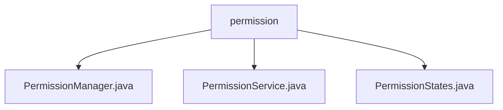

# 基础信息

|      |      |
|------|------|
| 名称 | permission |
| 编码语言 | .java |
| 代码路径 | erp-backend/erp-library/src/main/java/com.jukusoft/erp/lib/permission |
| 包名 | erp-backend.erp-library.src.main.java.com.jukusoft.erp.lib.permission |
| 概述说明 | 权限服务类管理用户和组权限，结合缓存和数据库优化性能与数据可靠性。 |

# 说明

## 概述

该代码模块主要涉及权限管理功能，旨在通过结合缓存和数据库的双重存储机制来管理用户和组的权限。模块的核心目标是优化系统性能，减少数据库查询压力，同时确保权限数据的长期保存和一致性。通过缓存常用权限信息，系统能够快速响应权限查询请求，从而提高整体效率。

## 主要业务场景

1. **权限管理**：模块负责管理用户和组的权限，包括权限的存储、更新和查询。通过缓存机制，系统能够快速访问常用权限信息，减少对数据库的直接查询，从而提升响应速度。
2. **性能优化**：通过使用缓存，模块有效减少了数据库的查询压力，优化了系统的性能表现。缓存机制使得权限信息的访问更加高效，特别是在高并发场景下，能够显著降低系统负载。
3. **数据一致性**：数据库作为持久化存储，确保权限数据的长期保存和一致性。即使缓存中的数据发生变化，数据库中的权限信息也能保持一致，从而保障系统的可靠性。
4. **权限状态管理**：模块可能还涉及权限状态的管理，确保权限在不同状态下的正确性和有效性。权限状态的管理有助于系统在权限变更时保持一致性，避免因权限状态错误导致的系统异常。

### 包内部结构视图

该流程图展示了 `permission` 目录下的文件结构。`permission` 是根节点，包含了三个子节点：`PermissionManager.java`、`PermissionService.java` 和 `PermissionStates.java`。这些文件都属于权限管理模块，分别负责权限管理、权限服务和权限状态的处理。

# 文件列表 File List

| 名称   | 类型  | 说明 |
|-------|------|-------------|
| [PermissionService.java](PermissionService.md) | file | 权限服务管理用户和组权限，通过缓存和数据库存储权限状态。 |
| [PermissionStates.java](PermissionStates.md) | file | 输入内容为空，无法生成概要描述。 |
| [PermissionManager.java](PermissionManager.md) | file | 无内容提供，无法生成概要描述。 |

