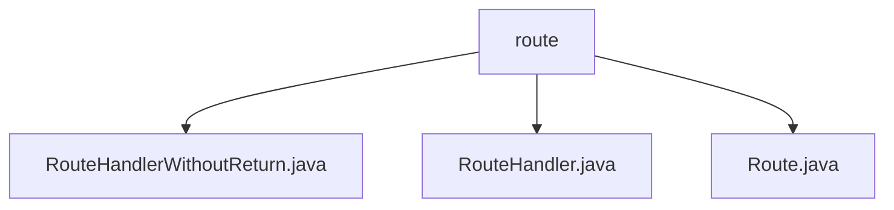

# 基础信息

|      |      |
|------|------|
| 名称 | route |
| 编码语言 | .java |
| 代码路径 | erp-backend/erp-library/src/main/java/com.jukusoft/erp/lib/route |
| 包名 | erp-backend.erp-library.src.main.java.com.jukusoft.erp.lib.route |
| 概述说明 | 输入内容为空，无法生成总结描述。 |

# 说明

## 概述
该代码模块是 `erp-backend` 项目中的 `erp-library` 子模块，主要处理路由相关的功能。模块的核心类包括 `RouteHandlerWithoutReturn`、`RouteHandler` 和 `Route`，这些类可能用于定义和处理不同路由的行为。模块的代码位于 `com.jukusoft.erp.lib.route` 包下，表明这是一个与路由处理相关的库。

## 主要业务场景
1. **路由处理**：`RouteHandler` 和 `RouteHandlerWithoutReturn` 类可能用于处理具体的路由请求，分别对应有返回值和无返回值的路由处理逻辑。
2. **路由定义**：`Route` 类可能用于定义路由的路径、方法（如 GET、POST 等）以及相关的处理逻辑。
3. **ERP 系统集成**：该模块可能被集成到 ERP 系统中，用于管理和处理系统的各种路由请求，确保请求能够正确地分发和处理。

由于缺乏具体代码内容，以上总结基于文件路径和类名的推测。如需更详细的描述，请提供具体的代码内容。

### 包内部结构视图

该流程图展示了 `erp-backend/erp-library` 项目中 `route` 目录下的文件层级关系。`route` 目录包含三个文件：`RouteHandlerWithoutReturn.java`、`RouteHandler.java` 和 `Route.java`。这些文件都与路由处理相关，分别实现了不同的路由功能。

# 文件列表 File List

| 名称   | 类型  | 说明 |
|-------|------|-------------|
| [Route.java](Route.md) | file | 信息为空，无法生成概要描述。 |
| [RouteHandler.java](RouteHandler.md) | file | 信息为空，无法生成概要描述。 |
| [RouteHandlerWithoutReturn.java](RouteHandlerWithoutReturn.md) | file | 内容为空，无法生成概要描述。 |

