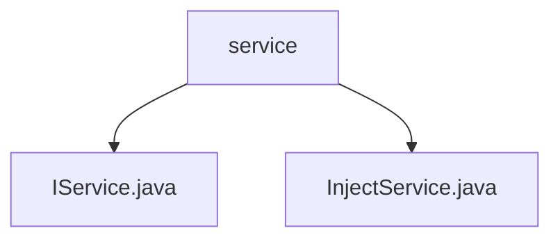

# 基础信息

|      |      |
|------|------|
| 名称 | service |
| 编码语言 | .java |
| 代码路径 | erp-backend/erp-library/src/main/java/com.jukusoft/erp/lib/service |
| 包名 | erp-backend.erp-library.src.main.java.com.jukusoft.erp.lib.service |
| 概述说明 | 输入内容为空，无法生成总结描述。 |

# 说明

## 概述
该代码模块是一个ERP（企业资源计划）系统的后端库，主要包含服务相关的接口和实现。模块的核心部分涉及到服务的定义和注入机制，旨在提供一种灵活且可扩展的方式来管理和使用服务。

## 主要业务场景
1. **服务定义**：通过`IService.java`接口，定义了服务的基本结构和行为，确保所有服务实现类遵循统一的规范。
2. **服务注入**：`InjectService.java`负责服务的注入机制，允许在运行时动态地将服务实例注入到需要它们的组件中，从而降低模块间的耦合度。
3. **服务管理**：该模块可能还包含服务的管理功能，如服务的注册、查找和生命周期管理，以确保服务在整个ERP系统中的高效运行和协同工作。

总结来说，该模块通过定义和注入服务，为ERP系统提供了一个灵活且可扩展的服务管理框架，支持复杂的业务逻辑和模块间的交互。

### 包内部结构视图

该流程图展示了ERP库中服务模块的层级关系。`service`文件夹包含两个文件：`IService.java`和`InjectService.java`。`IService.java`可能是一个接口文件，定义了服务的基本结构，而`InjectService.java`可能是一个实现类，用于依赖注入。这种结构有助于模块化设计和代码的可维护性。

# 文件列表 File List

| 名称   | 类型  | 说明 |
|-------|------|-------------|
| [IService.java](IService.md) | file | 无内容提供，无法生成概要描述。 |
| [InjectService.java](InjectService.md) | file | 信息为空，无法生成概要描述。 |

