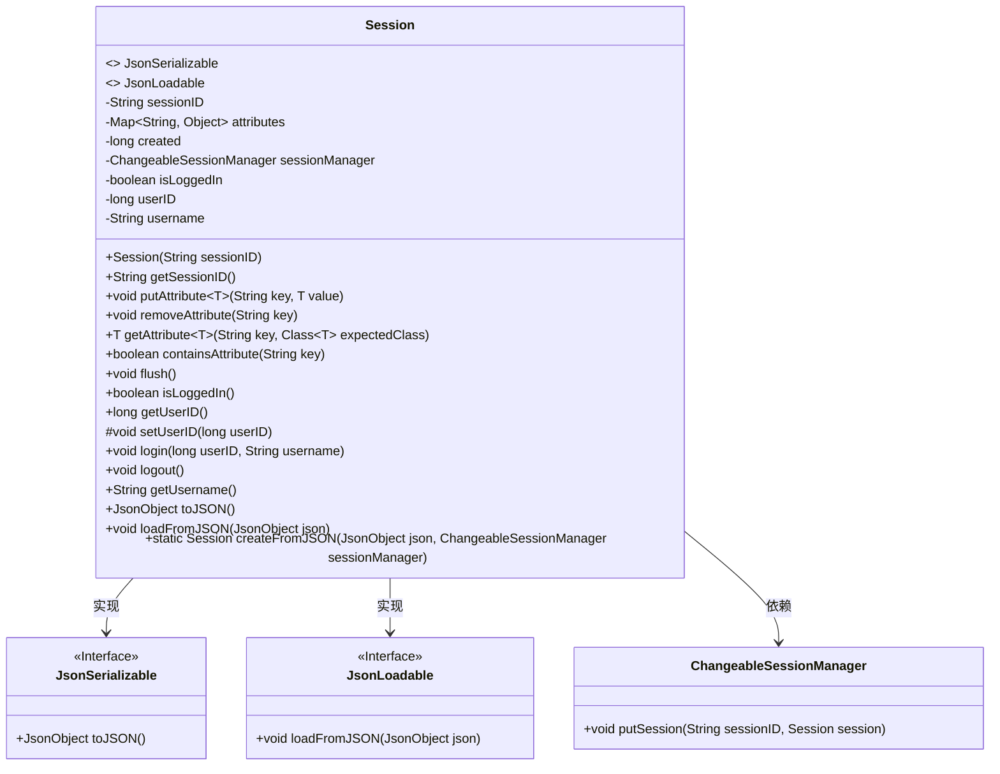

# 基础信息

|      |      |
|------|------|
| 名称 | Session |
| 编码语言 | .java |
| 代码路径 | erp-backend/erp-library/src/main/java/com.jukusoft/erp/lib/session/Session.java |
| 包名 | com.jukusoft.erp.lib.session |
| 依赖项 | ['com.jukusoft.erp.lib.json.JsonLoadable', 'com.jukusoft.erp.lib.json.JsonSerializable', 'io.vertx.core.json.JsonArray', 'io.vertx.core.json.JsonObject', 'java.util.HashMap', 'java.util.Map'] |
| 概述说明 | Session类负责会话ID、属性、登录状态管理及JSON序列化。 |

# 说明

Session类负责管理会话ID、会话属性、用户登录状态以及JSON序列化功能。它通过会话ID唯一标识每个会话，存储和操作会话相关属性，跟踪用户的登录状态，并提供将会话数据序列化为JSON格式的功能，便于数据存储和传输。

# 类列表 Class Summary

| 名称   | 类型  | 说明 |
|-------|------|-------------|
| Session | class | Session类管理会话ID、属性、用户登录状态及JSON序列化功能。 |

## 类 Session

|      |      |
|------|------|
| 访问范围 | public |
| 类型 | class |
| 名称 | Session |
| 说明 | Session类管理会话ID、属性、用户登录状态及JSON序列化功能。 |

### UML类图

### 描述
`Session`类实现了`JsonSerializable`和`JsonLoadable`接口，用于管理会话信息。它包含会话ID、属性映射、创建时间戳、会话管理器、登录状态、用户ID和用户名等属性。类提供了方法用于设置和获取会话属性、管理登录状态、序列化和反序列化会话信息。`Session`类依赖于`ChangeableSessionManager`来管理会话的存储和更新。

### 内部方法调用关系图

```mermaid
graph TD
    A["类Session"]
    B["属性: String sessionID"]
    C["属性: Map<String,Object> attributes"]
    D["属性: long created"]
    E["属性: ChangeableSessionManager sessionManager"]
    F["属性: boolean isLoggedIn"]
    G["属性: long userID"]
    H["属性: String username"]
    I["构造方法: Session(String sessionID)"]
    J["方法: String getSessionID()"]
    K["方法: <T> void putAttribute(String key, T value)"]
    L["方法: void removeAttribute(String key)"]
    M["方法: <T> T getAttribute(String key, Class<T> expectedClass)"]
    N["方法: boolean containsAttribute(String key)"]
    O["方法: void flush()"]
    P["方法: boolean isLoggedIn()"]
    Q["方法: long getUserID()"]
    R["方法: protected void setUserID(long userID)"]
    S["方法: void login(long userID, String username)"]
    T["方法: void logout()"]
    U["方法: String getUsername()"]
    V["重写方法: JsonObject toJSON()"]
    W["重写方法: void loadFromJSON(JsonObject json)"]
    X["静态方法: Session createFromJSON(JsonObject json, ChangeableSessionManager sessionManager)"]

    A --> B
    A --> C
    A --> D
    A --> E
    A --> F
    A --> G
    A --> H
    A --> I
    A --> J
    A --> K
    A --> L
    A --> M
    A --> N
    A --> O
    A --> P
    A --> Q
    A --> R
    A --> S
    A --> T
    A --> U
    A --> V
    A --> W
    A --> X
```

这段代码定义了一个`Session`类，用于管理会话信息。类中包含多个属性，如`sessionID`、`attributes`、`created`等，以及一系列方法用于操作这些属性。`Session`类实现了`JsonSerializable`和`JsonLoadable`接口，支持将对象序列化为JSON格式和从JSON格式加载数据。类中的方法包括获取会话ID、设置和删除属性、检查属性是否存在、刷新会话、登录和注销等操作。静态方法`createFromJSON`用于从JSON对象创建`Session`实例。

### 字段列表 Field List

| 名称  | 类型  | 说明 |
|-------|-------|------|
| attributes = new HashMap<>() | Map<String,Object> | 创建一个受保护的字符串到对象的哈希映射。 |
| created = 0 | long | 保护的长整型变量created初始化为0。 |
| sessionManager = null | ChangeableSessionManager | 私有可变的会话管理器变量初始化为空。 |
| isLoggedIn = false | boolean | 保护布尔变量isLoggedIn初始值为false。 |
| userID = -1 | long | 定义了一个长整型变量userID，初始值为-1。 |
| sessionID | String | 保护型不可变会话ID变量。 |
| username = "Guest" | String | 定义受保护字符串变量username，默认值为"Guest"。 |

### 方法列表 Method List

| 名称  | 类型  | 说明 |
|-------|-------|------|
| getUsername | String | 该方法返回当前对象的用户名。 |
| containsAttribute | boolean | 检查属性是否存在，返回布尔值。 |
| setUserID | void | 该方法用于设置用户ID属性值。 |
| isLoggedIn | boolean | 该方法返回用户登录状态。 |
| getSessionID | String | 获取当前会话ID的方法。 |
| removeAttribute | void | 该方法用于移除指定键的属性。 |
| login | void | 登录方法设置用户ID和用户名，并标记为已登录。 |
| getUserID | long | 该方法返回当前对象的用户ID。 |
| flush | void | flush方法将当前会话存入sessionManager。 |
| logout | void | logout方法将用户登录状态设为false并重置用户ID为-1。 |
| toJSON | JsonObject | 将对象转换为包含会话ID、创建时间、用户信息和元数据的JSON对象。 |
| createFromJSON | Session | 静态方法从JSON创建会话，加载元信息并关联会话管理器。 |
| putAttribute | void | Java方法：向属性映射中添加键值对。 |
| getAttribute | T | 获取指定键的属性值并转换为预期类型，若不存在则返回null。 |
| loadFromJSON | void | 从JSON加载会话信息，包括创建时间、登录状态、用户ID、用户名及元数据。 |

