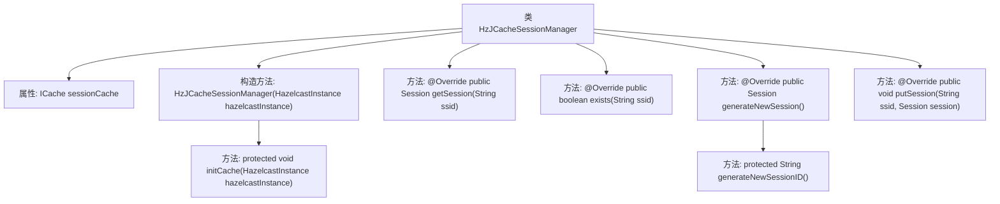
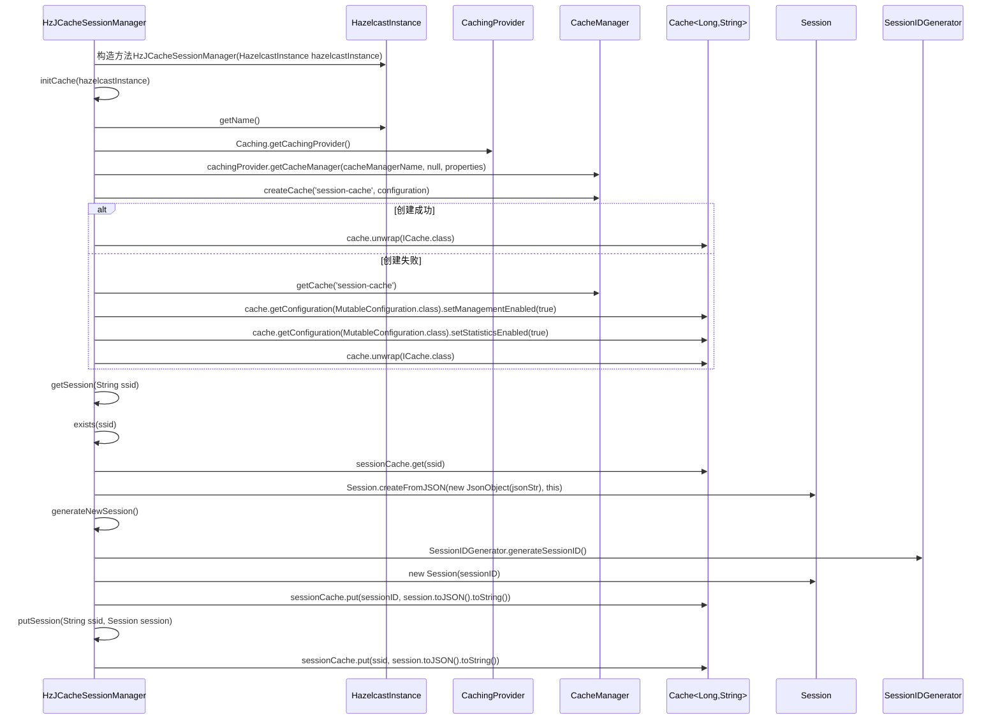

# 基础信息

|      |      |
|------|------|
| 名称 | HzJCacheSessionManager |
| 编码语言 | .java |
| 代码路径 | erp-backend/erp-library/src/main/java/com.jukusoft/erp/lib/session/impl/HzJCacheSessionManager.java |
| 包名 | com.jukusoft.erp.lib.session.impl |
| 依赖项 | ['com.hazelcast.cache.HazelcastCachingProvider', 'com.hazelcast.cache.ICache', 'com.hazelcast.core.HazelcastInstance', 'com.jukusoft.erp.lib.session.ChangeableSessionManager', 'com.jukusoft.erp.lib.session.Session', 'io.vertx.core.json.JsonObject', 'javax.cache.Cache', 'javax.cache.CacheManager', 'javax.cache.Caching', 'javax.cache.configuration.MutableConfiguration', 'javax.cache.expiry.AccessedExpiryPolicy', 'javax.cache.expiry.Duration', 'javax.cache.spi.CachingProvider', 'java.net.URI', 'java.net.URISyntaxException', 'java.util.Properties', 'java.util.concurrent.TimeUnit'] |
| 概述说明 | HzJCacheSessionManager利用Hazelcast管理会话，支持创建、获取和存储。 |

# 说明

HzJCacheSessionManager是一个会话管理工具，利用Hazelcast分布式缓存技术实现高效的会话管理。它支持会话的创建、获取和存储操作，确保在分布式环境中会话数据的一致性和可靠性。通过集成Hazelcast，该管理器能够处理高并发场景，提供稳定的会话管理服务，适用于需要分布式会话管理的应用场景。

# 类列表 Class Summary

| 名称   | 类型  | 说明 |
|-------|------|-------------|
| HzJCacheSessionManager | class | HzJCacheSessionManager实现会话管理，使用Hazelcast分布式缓存，支持会话创建、获取和存储。 |


## 类 HzJCacheSessionManager

|      |      |
|------|------|
| 访问范围 | public |
| 类型 | class |
| 名称 | HzJCacheSessionManager |
| 说明 | HzJCacheSessionManager实现会话管理，使用Hazelcast分布式缓存，支持会话创建、获取和存储。 |


### UML类图

```mermaid
classDiagram
    class HzJCacheSessionManager {
        -ICache~String, String~ sessionCache
        +HzJCacheSessionManager(HazelcastInstance hazelcastInstance)
        +Session getSession(String ssid)
        +boolean exists(String ssid)
        +Session generateNewSession()
        +void putSession(String ssid, Session session)
        #void initCache(HazelcastInstance hazelcastInstance)
        #String generateNewSessionID()
    }

    interface ChangeableSessionManager {
        <<Interface>>
        +Session getSession(String ssid)
        +boolean exists(String ssid)
        +Session generateNewSession()
        +void putSession(String ssid, Session session)
    }

    class ICache~K, V~ {
        <<Interface>>
        +V get(K key)
        +void put(K key, V value)
        +boolean containsKey(K key)
    }

    class Session {
        +Session(String sessionID)
        +String toJSON()
        +static Session createFromJSON(JsonObject json, HzJCacheSessionManager manager)
    }

    class SessionIDGenerator {
        +static String generateSessionID()
    }

    HzJCacheSessionManager --> ChangeableSessionManager : 实现
    HzJCacheSessionManager --> ICache~String, String~ : 依赖
    HzJCacheSessionManager --> Session : 依赖
    HzJCacheSessionManager --> SessionIDGenerator : 依赖
```

这段代码定义了一个`HzJCacheSessionManager`类，该类实现了`ChangeableSessionManager`接口，用于管理会话缓存。`HzJCacheSessionManager`通过`HazelcastInstance`初始化缓存，并提供了获取、生成、检查存在性以及存储会话的方法。`Session`类用于表示会话对象，`SessionIDGenerator`用于生成会话ID。`ICache`接口定义了缓存的基本操作。整个系统通过`HzJCacheSessionManager`类与缓存和会话对象进行交互，确保会话管理的分布式和高效性。


### 内部方法调用关系图





**描述：**
`HzJCacheSessionManager` 类管理会话缓存，通过Hazelcast实例初始化缓存，并提供了获取、生成、检查会话等功能。初始化缓存时，使用JCache API与Hazelcast集群进行交互，配置缓存的管理和统计功能。会话数据存储在分布式缓存中，支持从缓存中获取会话、生成新会话、检查会话是否存在以及保存会话等操作。

### 字段列表 Field List

| 名称  | 类型  | 说明 |
|-------|-------|------|
| sessionCache = null | ICache<String,String> | 私有字符串缓存实例未初始化。 |

### 方法列表 Method List

| 名称  | 类型  | 说明 |
|-------|-------|------|
| generateNewSessionID | String | 生成新会话ID的方法，调用SessionIDGenerator生成会话ID。 |
| exists | boolean | 检查SSID是否存在于会话缓存中。 |
| putSession | void | 重写putSession方法，将session转为JSON字符串存入sessionCache。 |
| getSession | Session | 方法通过缓存获取并返回Session实例，若不存在则返回null。 |
| generateNewSession | Session | 生成新会话ID，创建并保存会话对象，返回会话实例。 |
| initCache | void | 初始化Hazelcast缓存，使用JSR107标准API，配置缓存管理器，启用管理和统计功能，设置60分钟过期策略。 |


