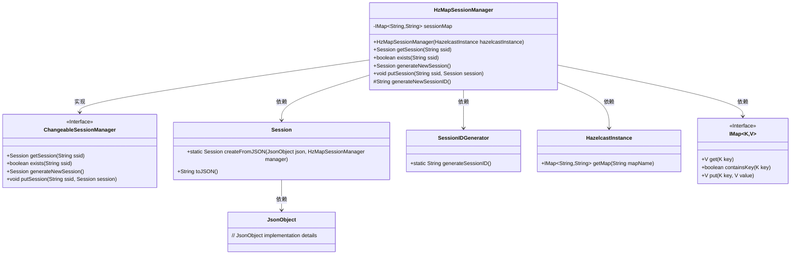
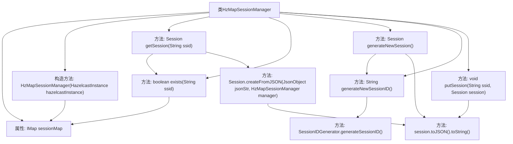

# 基础信息

|      |      |
|------|------|
| 名称 | HzMapSessionManager |
| 编码语言 | .java |
| 代码路径 | erp-backend/erp-library/src/main/java/com.jukusoft/erp/lib/session/impl/HzMapSessionManager.java |
| 包名 | com.jukusoft.erp.lib.session.impl |
| 依赖项 | ['com.hazelcast.core.HazelcastInstance', 'com.hazelcast.core.IMap', 'com.jukusoft.erp.lib.session.ChangeableSessionManager', 'com.jukusoft.erp.lib.session.Session', 'io.vertx.core.json.JsonObject'] |
| 概述说明 | HzMapSessionManager通过Hazelcast管理会话数据的存储与检索。 |

# 说明

HzMapSessionManager负责管理会话，利用Hazelcast进行会话数据的存储和检索。通过Hazelcast的分布式存储能力，确保会话数据的高可用性和一致性，支持在集群环境中高效管理用户会话。

# 类列表 Class Summary

| 名称   | 类型  | 说明 |
|-------|------|-------------|
| HzMapSessionManager | class | HzMapSessionManager管理会话，使用Hazelcast存储和检索会话数据。 |

## 类 HzMapSessionManager

|      |      |
|------|------|
| 访问范围 | public |
| 类型 | class |
| 名称 | HzMapSessionManager |
| 说明 | HzMapSessionManager管理会话，使用Hazelcast存储和检索会话数据。 |

### UML类图

**描述：**
`HzMapSessionManager` 类实现了 `ChangeableSessionManager` 接口，负责管理会话。它依赖于 `HazelcastInstance` 来获取会话缓存，使用 `IMap` 存储会话数据。通过 `Session` 类创建和解析会话对象，并使用 `SessionIDGenerator` 生成新的会话ID。该类提供了获取、检查、生成和存储会话的功能。

### 内部方法调用关系图

这段代码描述了一个`HzMapSessionManager`类，该类实现了`ChangeableSessionManager`接口，用于管理会话。通过Hazelcast实例获取会话映射，提供了获取会话、检查会话是否存在、生成新会话、生成会话ID以及存储会话的功能。流程图展示了类中各个方法的调用关系及其与属性的交互。

### 字段列表 Field List

| 名称  | 类型  | 说明 |
|-------|-------|------|
| sessionMap = null | IMap<String,String> | 声明一个受保护的会话映射变量，初始值为空。 |

### 方法列表 Method List

| 名称  | 类型  | 说明 |
|-------|-------|------|
| getSession | Session | 根据SSID从缓存获取并返回Session实例，若不存在则返回null。 |
| generateNewSession | Session | 生成新会话并保存至会话映射。 |
| putSession | void | 重写putSession方法，将Session对象转为JSON字符串存入sessionMap。 |
| generateNewSessionID | String | 生成新会话ID的方法，调用SessionIDGenerator生成。 |
| exists | boolean | 检查ssid是否存在于sessionMap中。 |

