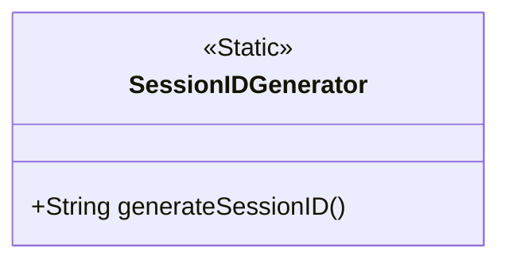
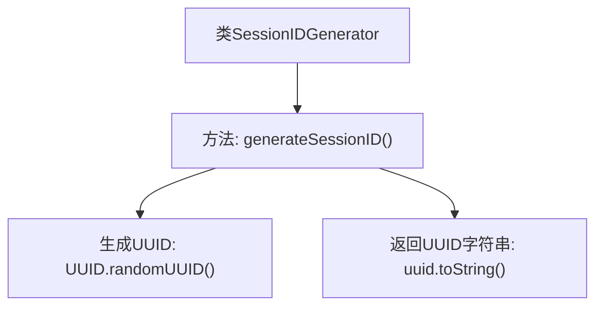

# 基础信息

|      |      |
|------|------|
| 名称 | SessionIDGenerator |
| 编码语言 | .java |
| 代码路径 | erp-backend/erp-library/src/main/java/com.jukusoft/erp/lib/session/impl/SessionIDGenerator.java |
| 包名 | com.jukusoft.erp.lib.session.impl |
| 依赖项 | ['java.util.UUID'] |
| 概述说明 | SessionIDGenerator类提供生成唯一会话ID的静态方法。 |

# 说明

SessionIDGenerator类是一个用于生成唯一会话ID的工具类。它提供了静态方法，这些方法可以直接通过类名调用，而无需实例化对象。生成会话ID的功能确保了每个会话都具有唯一标识，适用于需要区分不同会话的场景，如用户登录、会话管理等。通过静态方法的设计，该类简化了调用过程，提高了代码的简洁性和可维护性。

# 类列表 Class Summary

| 名称   | 类型  | 说明 |
|-------|------|-------------|
| SessionIDGenerator | class | SessionIDGenerator类提供生成唯一会话ID的静态方法。 |

## 类 SessionIDGenerator

|      |      |
|------|------|
| 访问范围 | public |
| 类型 | class |
| 名称 | SessionIDGenerator |
| 说明 | SessionIDGenerator类提供生成唯一会话ID的静态方法。 |

### UML类图

这段代码定义了一个名为 `SessionIDGenerator` 的类，其中包含一个静态方法 `generateSessionID`，用于生成唯一的会话ID。该方法通过调用 `UUID.randomUUID()` 生成一个随机的UUID，并将其转换为字符串形式返回。这个类主要用于生成唯一的标识符，通常用于会话管理或需要唯一标识的场景。由于 `generateSessionID` 是静态方法，因此可以在不实例化类的情况下直接调用。

### 内部方法调用关系图

这段代码定义了一个名为 `SessionIDGenerator` 的类，其中包含一个 `generateSessionID` 方法。该方法通过调用 `UUID.randomUUID()` 生成一个唯一的 UUID，并将其转换为字符串返回。流程图展示了类的结构以及方法内部的调用关系，清晰地描述了生成唯一会话 ID 的过程。

### 字段列表 Field List

| 名称  | 类型  | 说明 |
|-------|-------|------|

### 方法列表 Method List

| 名称  | 类型  | 说明 |
|-------|-------|------|
| generateSessionID | String | 生成唯一会话ID的静态方法，使用UUID确保唯一性。 |

