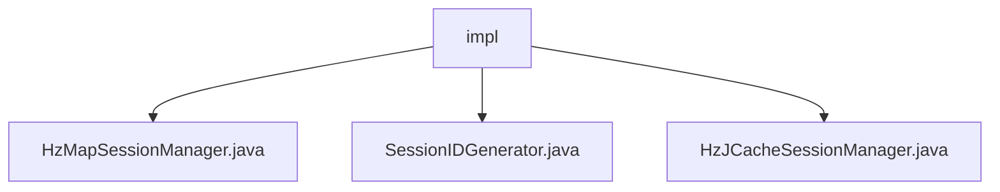

# 基础信息

|      |      |
|------|------|
| 名称 | impl |
| 编码语言 | .java |
| 代码路径 | erp-backend/erp-library/src/main/java/com.jukusoft/erp/lib/session/impl |
| 包名 | erp-backend.erp-library.src.main.java.com.jukusoft.erp.lib.session.impl |
| 概述说明 | HzMapSessionManager管理会话，Hazelcast确保数据高可用性。SessionIDGenerator生成唯一会话ID。HzJCacheSessionManager利用Hazelcast实现高效会话管理。 |

# 说明

## 概述
该代码模块主要围绕分布式会话管理展开，利用Hazelcast技术实现会话数据的高效存储、检索和管理。模块包含多个核心类，分别负责会话ID的生成、会话数据的存储与检索，以及分布式环境下的会话管理。通过Hazelcast的分布式存储和缓存能力，模块确保了会话数据的高可用性、一致性和并发处理能力，适用于需要分布式会话管理的业务场景。

## 主要业务场景
1. **用户会话管理**：在用户登录、会话跟踪等场景中，模块通过生成唯一会话ID（`SessionIDGenerator`）和高效的会话管理（`HzMapSessionManager`、`HzJCacheSessionManager`），确保每个会话的唯一性和数据一致性。
2. **分布式环境下的会话存储与检索**：在集群环境中，模块利用Hazelcast的分布式存储和缓存技术，支持会话数据的创建、获取和存储操作，确保数据的高可用性和可靠性。
3. **高并发场景的会话处理**：通过集成Hazelcast，模块能够处理高并发场景下的会话管理需求，提供稳定的会话管理服务，适用于需要分布式会话管理的应用场景。

### 包内部结构视图

该流程图展示了 `impl` 文件夹下的三个文件之间的层级关系。`impl` 是 `session` 模块的实现部分，包含了 `HzMapSessionManager.java`、`SessionIDGenerator.java` 和 `HzJCacheSessionManager.java` 三个文件。这些文件共同构成了 `session` 管理功能的核心实现。

# 文件列表 File List

| 名称   | 类型  | 说明 |
|-------|------|-------------|
| [SessionIDGenerator.java](SessionIDGenerator.md) | file | SessionIDGenerator类提供生成唯一会话ID的静态方法。 |
| [HzMapSessionManager.java](HzMapSessionManager.md) | file | HzMapSessionManager通过Hazelcast管理会话数据的存储与检索。 |
| [HzJCacheSessionManager.java](HzJCacheSessionManager.md) | file | HzJCacheSessionManager利用Hazelcast管理会话，支持创建、获取和存储。 |

