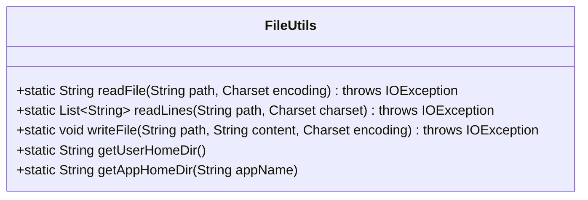
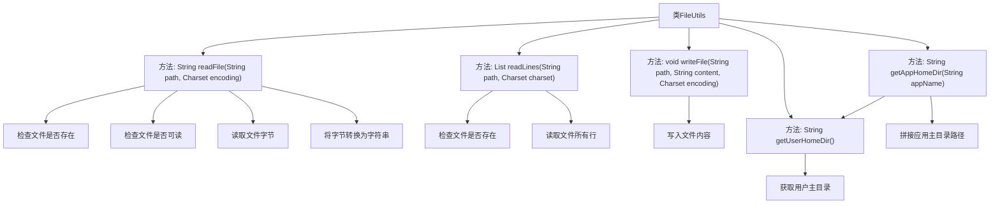

# 基础信息

|      |      |
|------|------|
| 名称 | FileUtils |
| 编码语言 | .java |
| 代码路径 | erp-backend/erp-library/src/main/java/com.jukusoft/erp/lib/utils/FileUtils.java |
| 包名 | com.jukusoft.erp.lib.utils |
| 依赖项 | ['java.io.File', 'java.io.FileNotFoundException', 'java.io.IOException', 'java.nio.charset.Charset', 'java.nio.file.Files', 'java.nio.file.Paths', 'java.nio.file.StandardOpenOption', 'java.util.List'] |
| 概述说明 | FileUtils类支持文件读写、获取用户目录，提供编码指定和异常处理功能。 |

# 说明

FileUtils类是一个功能丰富的工具类，主要用于文件的读取和写入操作。它支持指定文件编码，确保在处理不同格式的文件时能够正确解析和生成内容。此外，该类还提供了获取用户目录的功能，方便定位用户的默认文件存储位置。FileUtils类还内置了异常处理机制，能够在文件操作过程中捕获并处理可能出现的错误，确保程序的稳定性和可靠性。

# 类列表 Class Summary

| 名称   | 类型  | 说明 |
|-------|------|-------------|
| FileUtils | class | FileUtils类提供读取、写入文件及获取用户目录的功能，支持指定编码和异常处理。 |

## 类 FileUtils

|      |      |
|------|------|
| 访问范围 | public |
| 类型 | class |
| 名称 | FileUtils |
| 说明 | FileUtils类提供读取、写入文件及获取用户目录的功能，支持指定编码和异常处理。 |

### UML类图

### 描述
`FileUtils` 类提供了一系列静态方法，用于处理文件操作。它包含了读取文件内容、读取文件行、写入文件内容、获取用户主目录路径以及获取应用程序主目录路径的功能。这些方法在处理文件时，会检查文件是否存在、是否可读，并支持指定字符编码。该类的主要作用是简化文件操作，并提供统一的文件处理接口。

### 内部方法调用关系图

这段代码定义了一个名为 `FileUtils` 的工具类，提供了多个与文件操作相关的静态方法。`readFile` 方法用于读取文件内容并返回字符串，`readLines` 方法用于读取文件的所有行并返回字符串列表，`writeFile` 方法用于将字符串内容写入文件，`getUserHomeDir` 方法用于获取用户主目录路径，`getAppHomeDir` 方法用于拼接应用主目录路径。每个方法都包含必要的检查和异常处理，确保文件操作的健壮性和安全性。

### 字段列表 Field List

| 名称  | 类型  | 说明 |
|-------|-------|------|

### 方法列表 Method List

| 名称  | 类型  | 说明 |
|-------|-------|------|
| getUserHomeDir | String | 获取用户主目录路径的静态方法。 |
| getAppHomeDir | String | 该方法返回指定应用程序的主目录路径。 |
| readFile | String | 读取指定路径文件内容，检查文件存在性和可读性，按指定编码返回字符串。 |
| readLines | List<String> | 读取指定路径文件内容，返回字符串列表，若文件不存在则抛出异常。 |
| writeFile | void | 静态方法writeFile将内容以指定编码写入文件，路径存在则覆盖。 |

