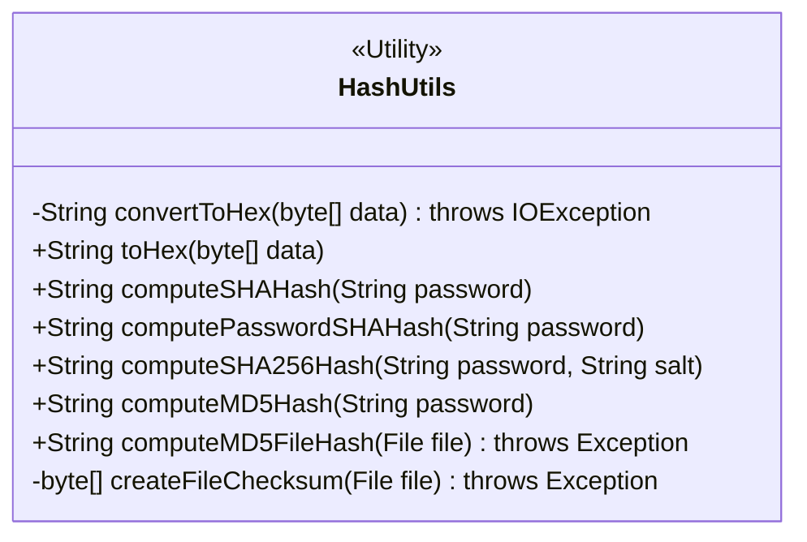
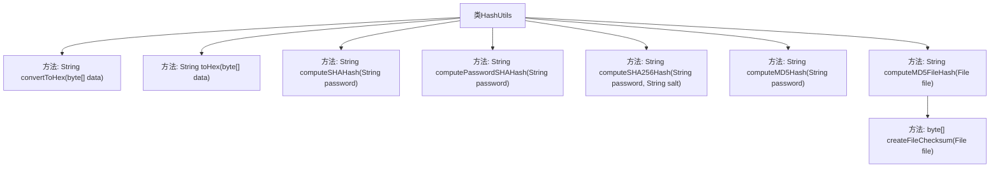

# 基础信息

|      |      |
|------|------|
| 名称 | HashUtils |
| 编码语言 | .java |
| 代码路径 | erp-backend/erp-library/src/main/java/com.jukusoft/erp/lib/utils/HashUtils.java |
| 包名 | com.jukusoft.erp.lib.utils |
| 依赖项 | ['java.io', 'java.nio.charset.StandardCharsets', 'java.security.MessageDigest', 'java.security.NoSuchAlgorithmException', 'java.util.Base64'] |
| 概述说明 | HashUtils类支持SHA-1、SHA-512、SHA-256、MD5及文件MD5校验。 |

# 说明

HashUtils类提供了多种哈希计算方法，支持SHA-1、SHA-512、SHA-256、MD5以及文件MD5校验功能。该类旨在为用户提供全面的哈希计算工具，适用于不同场景的哈希需求，确保数据的安全性和完整性。

# 类列表 Class Summary

| 名称   | 类型  | 说明 |
|-------|------|-------------|
| HashUtils | class | HashUtils类提供多种哈希计算方法，包括SHA-1、SHA-512、SHA-256、MD5及文件MD5校验。 |

## 类 HashUtils

|      |      |
|------|------|
| 访问范围 | public |
| 类型 | class |
| 名称 | HashUtils |
| 说明 | HashUtils类提供多种哈希计算方法，包括SHA-1、SHA-512、SHA-256、MD5及文件MD5校验。 |

### UML类图

**描述：**  
`HashUtils` 是一个工具类，提供了多种哈希计算方法，包括将字节数组转换为十六进制字符串、计算SHA-1、SHA-512、SHA-256、MD5哈希值以及文件MD5哈希值。类中包含公有和私有方法，公有方法用于外部调用，私有方法用于内部实现。该类主要用于处理密码和文件的哈希计算，确保数据的安全性和完整性。

### 内部方法调用关系图

这段代码定义了一个名为 `HashUtils` 的类，提供了多种哈希计算方法，包括将字节数组转换为十六进制字符串、生成SHA-1、SHA-512、SHA-256和MD5哈希值，以及计算文件的MD5哈希值。类中的方法主要通过 `MessageDigest` 类来实现哈希计算，并通过 `StringBuffer` 或直接返回字符串的形式输出结果。代码还包含了一些异常处理，以确保在算法不支持或编码错误时能够捕获并处理异常。

### 字段列表 Field List

| 名称  | 类型  | 说明 |
|-------|-------|------|

### 方法列表 Method List

| 名称  | 类型  | 说明 |
|-------|-------|------|
| toHex | String | 将字节数组转换为十六进制字符串。 |
| computeMD5FileHash | String | 计算文件MD5哈希值的Java方法。 |
| computeSHA256Hash | String | 计算密码和盐的SHA-256哈希值。 |
| computeMD5Hash | String | 计算字符串的MD5哈希值并返回结果。 |
| convertToHex | String | 已弃用方法：将字节数组转换为Base64编码的十六进制字符串。 |
| computePasswordSHAHash | String | 计算密码的SHA-512哈希值并返回十六进制字符串。 |
| computeSHAHash | String | 废弃方法：计算SHA-1哈希值，处理ASCII密码并返回十六进制字符串。 |
| createFileChecksum | byte[] | 该方法通过MD5算法生成文件校验和，读取文件内容并更新摘要，最后返回摘要结果。 |

