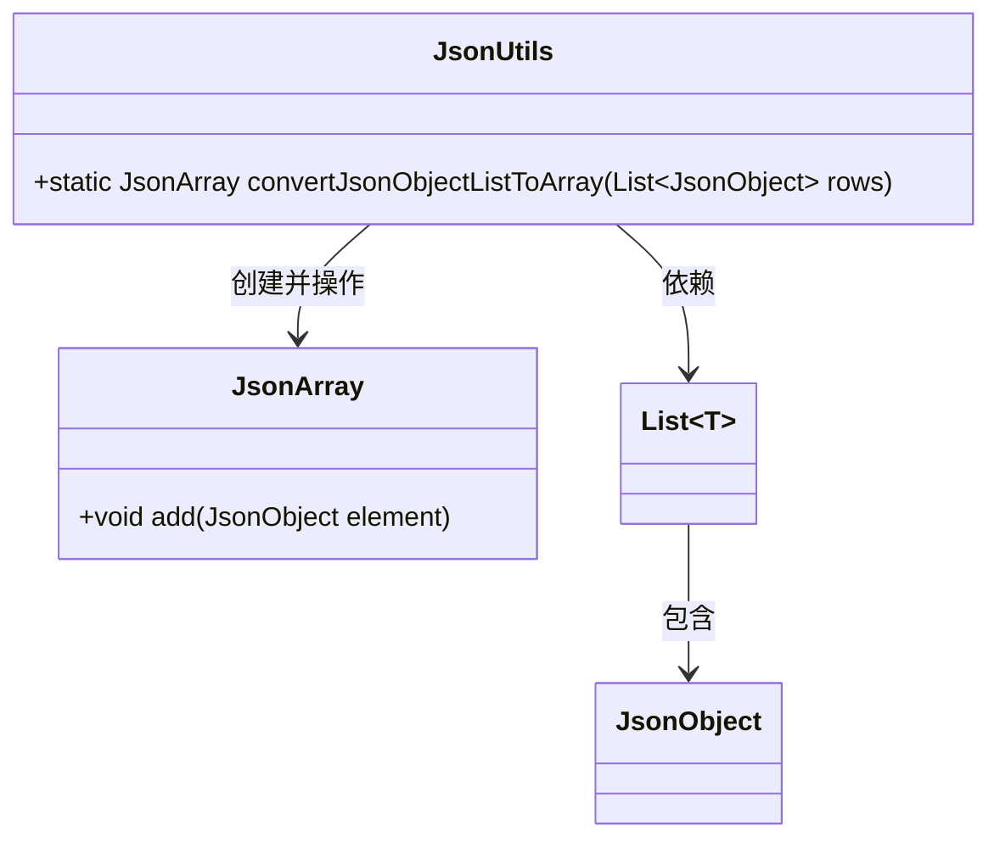
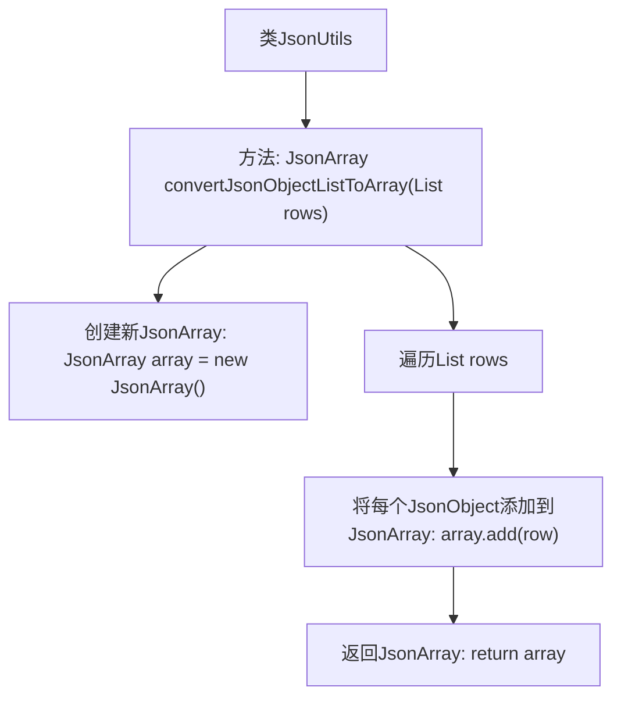

# 基础信息

|      |      |
|------|------|
| 名称 | JsonUtils |
| 编码语言 | .java |
| 代码路径 | erp-backend/erp-library/src/main/java/com.jukusoft/erp/lib/utils/JsonUtils.java |
| 包名 | com.jukusoft.erp.lib.utils |
| 依赖项 | ['io.vertx.core.json.JsonArray', 'io.vertx.core.json.JsonObject', 'java.util.List'] |
| 概述说明 | JsonUtils类可将JsonObject列表转为JsonArray。 |

# 说明

JsonUtils类提供了一个方法，用于将JsonObject列表转换为JsonArray。该方法的主要功能是处理多个JsonObject对象，并将它们整合成一个JsonArray，便于统一管理和操作。通过这种方式，可以简化对多个JsonObject的处理流程，提高代码的可读性和效率。

# 类列表 Class Summary

| 名称   | 类型  | 说明 |
|-------|------|-------------|
| JsonUtils | class | JsonUtils类包含将JsonObject列表转换为JsonArray的方法。 |

## 类 JsonUtils

|      |      |
|------|------|
| 访问范围 | public |
| 类型 | class |
| 名称 | JsonUtils |
| 说明 | JsonUtils类包含将JsonObject列表转换为JsonArray的方法。 |

### UML类图

这段代码定义了一个名为 `JsonUtils` 的工具类，其中包含一个静态方法 `convertJsonObjectListToArray`。该方法接收一个 `JsonObject` 类型的列表作为参数，并将其转换为 `JsonArray` 对象。通过遍历列表中的每个 `JsonObject` 元素，并将其添加到 `JsonArray` 中，最终返回生成的 `JsonArray`。类图展示了 `JsonUtils` 类与 `JsonArray`、`List~JsonObject~` 和 `JsonObject` 类之间的关系，清晰地描述了方法的依赖和操作流程。

### 内部方法调用关系图

这段代码定义了一个名为 `JsonUtils` 的类，其中包含一个静态方法 `convertJsonObjectListToArray`。该方法接收一个 `List<JsonObject>` 类型的参数 `rows`，并将其转换为 `JsonArray`。代码首先创建一个新的 `JsonArray` 对象，然后遍历 `rows` 列表中的每个 `JsonObject`，将其逐个添加到 `JsonArray` 中，最后返回该 `JsonArray`。流程图清晰地展示了这一过程，从方法调用到数组创建、遍历、添加元素，最终返回结果。

### 字段列表 Field List

| 名称  | 类型  | 说明 |
|-------|-------|------|

### 方法列表 Method List

| 名称  | 类型  | 说明 |
|-------|-------|------|
| convertJsonObjectListToArray | JsonArray | 将JsonObject列表转换为JsonArray。 |

