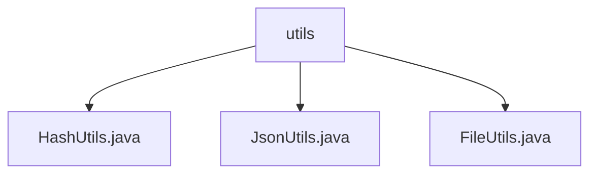

# 基础信息

|      |      |
|------|------|
| 名称 | utils |
| 编码语言 | .java |
| 代码路径 | erp-backend/erp-library/src/main/java/com.jukusoft/erp/lib/utils |
| 包名 | erp-backend.erp-library.src.main.java.com.jukusoft.erp.lib.utils |
| 概述说明 | HashUtils类提供多种哈希计算，JsonUtils类转换JsonObject为JsonArray，FileUtils类处理文件读写及异常。 |

# 说明

## 概述
该代码模块是一个工具类集合，主要用于处理哈希计算、JSON数据转换以及文件操作等常见任务。模块中的类提供了多种实用功能，旨在简化开发流程，提高代码的可读性和效率，同时确保数据的安全性和程序的稳定性。

## 主要业务场景
1. **哈希计算**：`HashUtils`类提供了多种哈希算法（如SHA-1、SHA-512、SHA-256、MD5）以及文件MD5校验功能，适用于需要确保数据完整性和安全性的场景，如密码存储、数据校验等。
2. **JSON数据处理**：`JsonUtils`类提供了将多个`JsonObject`对象转换为`JsonArray`的功能，适用于需要统一管理和操作多个JSON对象的场景，如API响应处理、数据整合等。
3. **文件操作**：`FileUtils`类支持文件的读取和写入操作，支持指定文件编码，并提供了获取用户目录的功能。适用于需要处理不同格式文件、定位用户文件存储位置以及确保文件操作稳定性的场景，如配置文件读取、日志文件写入等。

### 包内部结构视图

该流程图展示了 `utils` 文件夹与其内部三个文件之间的层级关系。`utils` 是父节点，包含了 `HashUtils.java`、`JsonUtils.java` 和 `FileUtils.java` 三个子节点。每个子节点都直接隶属于 `utils` 文件夹，没有进一步的嵌套层级。

# 文件列表 File List

| 名称   | 类型  | 说明 |
|-------|------|-------------|
| [FileUtils.java](FileUtils.md) | file | FileUtils类支持文件读写、获取用户目录，提供编码指定和异常处理功能。 |
| [HashUtils.java](HashUtils.md) | file | HashUtils类支持SHA-1、SHA-512、SHA-256、MD5及文件MD5校验。 |
| [JsonUtils.java](JsonUtils.md) | file | JsonUtils类可将JsonObject列表转为JsonArray。 |

