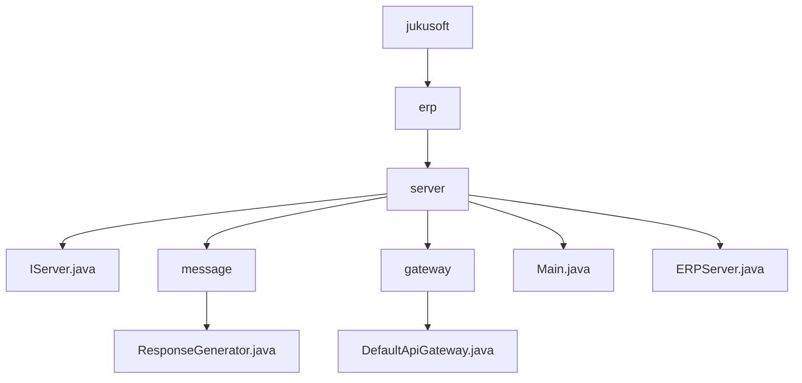

# 基础信息

|      |      |
|------|------|
| 名称 | jukusoft |
| 编码语言 | .java |
| 代码路径 | erp-backend/erp-server/src/main/java/com/jukusoft |
| 包名 | erp-backend.erp-server.src.main.java.com.jukusoft |
| 概述说明 | ResponseGenerator生成JSON响应，DefaultApiGateway管理请求流程，ERPServer集成多种技术支持集群部署。 |

# 说明

## 概述

该代码模块是一个企业资源规划（ERP）系统的后端服务器实现，主要基于Java语言开发，集成了Vert.x、Hazelcast和MySQL等技术。模块的核心功能包括API网关管理、会话管理、数据库连接、以及JSON响应的生成。服务器支持集群部署，旨在提供高性能、可扩展的企业级解决方案。

## 主要业务场景

1. **API网关管理**：通过`DefaultApiGateway`实现，负责初始化Vertx框架、配置日志系统以及事件总线。网关处理异步请求，并设置5秒的超时时间，确保在高并发场景下系统的性能和稳定性。

2. **会话管理**：`ERPServer`集成了Hazelcast技术，支持集群部署，能够有效管理会话，确保用户请求在分布式环境中的一致性。

3. **数据库连接**：通过`Main.java`启动MySQL驱动，建立与数据库的连接，确保ERP服务器能够正常访问和操作数据库中的数据，支持数据的存储、检索和管理。

4. **JSON响应生成**：`ResponseGenerator`类具备生成JSON响应的功能，支持通过事件、会话ID、外部ID和状态码等参数来定制响应内容，确保前后端交互的灵活性和可扩展性。

5. **集群部署与高可用性**：`ERPServer`通过整合Vert.x和Hazelcast技术，支持集群部署，确保系统在高负载和高并发情况下的高可用性和性能。

通过这些功能，该代码模块能够满足企业级ERP系统的核心需求，提供稳定、高效、可扩展的后端支持。

### 包内部结构视图

该流程图展示了 `erp-backend` 项目中的路径层级关系。从 `jukusoft` 开始，逐步深入到 `erp` 和 `server` 目录，并进一步展开到具体的文件和子目录，如 `message` 和 `gateway`。每个节点代表路径的最后一级元素，清晰地展示了文件与目录之间的从属关系。

# 文件列表 File List

| 名称   | 类型  | 说明 |
|-------|------|-------------|
| [erp](erp/_module.md) | package | ResponseGenerator生成JSON响应，DefaultApiGateway管理请求流程，ERPServer集成多种技术支持集群部署。 |

