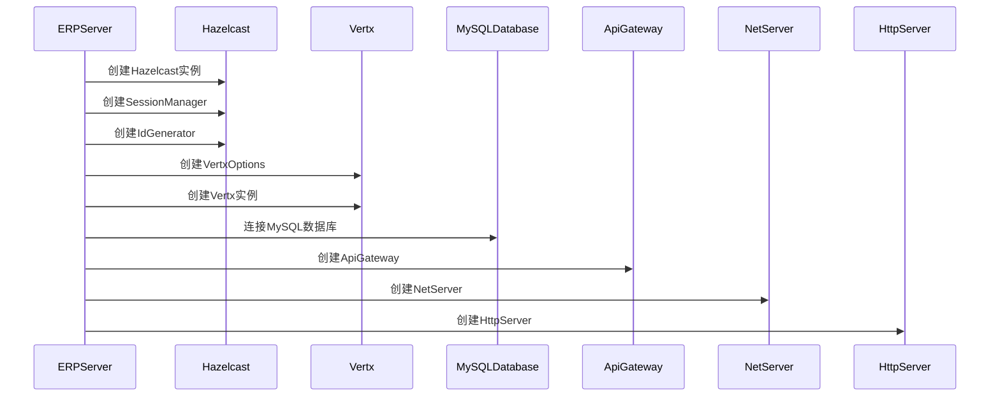

# 基础信息

|      |      |
|------|------|
| 名称 | ERPServer |
| 编码语言 | .java |
| 代码路径 | erp-backend/erp-server/src/main/java/com/jukusoft/erp/server/ERPServer.java |
| 包名 | com.jukusoft.erp.server |
| 依赖项 | ['com.hazelcast.config.CacheSimpleConfig', 'com.hazelcast.config.Config', 'com.hazelcast.core.Hazelcast', 'com.hazelcast.core.HazelcastInstance', 'com.hazelcast.core.IdGenerator', 'com.jukusoft.erp.lib.database.DatabaseManager', 'com.jukusoft.erp.lib.database.MySQLDatabase', 'com.jukusoft.erp.lib.database.impl.DatabaseManagerImpl', 'com.jukusoft.erp.lib.gateway.ApiGateway', 'com.jukusoft.erp.lib.gateway.ResponseHandler', 'com.jukusoft.erp.lib.keystore.KeyStoreGenerator', 'com.jukusoft.erp.lib.logging.ILogging', 'com.jukusoft.erp.lib.message.StatusCode', 'com.jukusoft.erp.lib.message.request.ApiRequest', 'com.jukusoft.erp.lib.message.response.ApiResponse', 'com.jukusoft.erp.lib.session.SessionManager', 'com.jukusoft.erp.lib.session.Session', 'com.jukusoft.erp.server.gateway.DefaultApiGateway', 'com.jukusoft.erp.lib.logger.HzLogger', 'com.jukusoft.erp.server.message.ResponseGenerator', 'io.vertx.core.Future', 'io.vertx.core.Handler', 'io.vertx.core.Vertx', 'io.vertx.core.VertxOptions', 'io.vertx.core.http.HttpMethod', 'io.vertx.core.http.HttpServer', 'io.vertx.core.http.HttpServerOptions', 'io.vertx.core.http.HttpServerResponse', 'io.vertx.core.net.NetServer', 'io.vertx.core.net.NetServerOptions', 'io.vertx.core.spi.cluster.ClusterManager', 'io.vertx.spi.cluster.hazelcast.HazelcastClusterManager', 'org.json.JSONObject', 'java.io.File', 'java.io.IOException', 'java.nio.charset.StandardCharsets', 'java.util.Map'] |
| 概述说明 | ERPServer集成Vert.x、Hazelcast、MySQL，支持集群、API网关和会话管理。 |

# 说明

ERPServer实现了IServer接口，集成了Vert.x、Hazelcast和MySQL技术。该服务器支持集群部署，具备API网关功能，并能有效管理会话。通过整合这些技术，ERPServer能够提供高性能、可扩展的解决方案，满足企业级应用的需求。

# 类列表 Class Summary

| 名称   | 类型  | 说明 |
|-------|------|-------------|
| ERPServer | class | ERPServer实现IServer，集成Vert.x、Hazelcast、MySQL，支持集群、API网关和会话管理。 |


## 类 ERPServer

|      |      |
|------|------|
| 访问范围 | public |
| 类型 | class |
| 名称 | ERPServer |
| 说明 | ERPServer实现IServer，集成Vert.x、Hazelcast、MySQL，支持集群、API网关和会话管理。 |


### UML类图

```mermaid
classDiagram
    class ERPServer {
        -VertxOptions vertxOptions
        -Vertx vertx
        -NetServer netServer
        -HazelcastInstance hazelcastInstance
        -ClusterManager clusterManager
        -ApiGateway gateway
        -ILogging logger
        -IdGenerator idGenerator
        -SessionManager sessionManager
        -MySQLDatabase database
        -DatabaseManager dbManager
        -int eventLoopPoolSize
        -int workerPoolSize
        +void start()
        +void setEventLoopPoolSize(int nOfThreads)
        +void setWorkerPoolSize(int nOfThreads)
        +void startHTTPServer(int port)
        +void stutdown()
        -void postStart()
        -long generateMessageID()
        -void connectToMySQL(Handler~Future~Void~~ handler)
    }

    class IServer {
        <<Interface>>
        +void start()
        +void setEventLoopPoolSize(int nOfThreads)
        +void setWorkerPoolSize(int nOfThreads)
    }

    class ApiGateway {
        <<Interface>>
        +void handleRequestAsync(ApiRequest req, ResponseHandler handler)
    }

    class ILogging {
        <<Interface>>
        +void info(String messageID, String event, String message)
        +void warn(String messageID, String event, String message)
        +void debug(String messageID, String event, String message)
        +void error(String messageID, String event, String message)
    }

    class SessionManager {
        <<Interface>>
        +Session generateNewSession()
        +Session getSession(String sessionID)
    }

    class DatabaseManager {
        <<Interface>>
    }

    class ApiRequest {
        +String event
        +JSONObject data
        +long messageID
        +String externalID
        +String sessionID
        +boolean isLoggedIn
        +String userID
        +Map~String, Object~ getMeta()
    }

    class ApiResponse {
        +String event
        +JSONObject data
        +String sessionID
        +String externalID
        +StatusCode statusCode
        +RESPONSE_TYPE getType()
    }

    class ResponseHandler {
        <<Interface>>
        +void handleResponse(ApiResponse res)
        +void responseFailed()
    }

    class ResponseGenerator {
        +static String generateResponse(String event, JSONObject data, String sessionID, String externalID, StatusCode statusCode)
    }

    class MySQLDatabase {
        +void connect(String configPath, Handler~Future~Void~~ handler)
    }

    class HazelcastInstance {
        +IdGenerator getIdGenerator(String name)
    }

    class ClusterManager {
        <<Interface>>
        +String getNodeID()
    }

    class IdGenerator {
        +long newId()
    }

    ERPServer --> IServer : 实现
    ERPServer --> ApiGateway : 依赖
    ERPServer --> ILogging : 依赖
    ERPServer --> SessionManager : 依赖
    ERPServer --> DatabaseManager : 依赖
    ERPServer --> MySQLDatabase : 依赖
    ERPServer --> HazelcastInstance : 依赖
    ERPServer --> ClusterManager : 依赖
    ERPServer --> IdGenerator : 依赖
    ApiGateway --> ApiRequest : 依赖
    ApiGateway --> ApiResponse : 依赖
    ApiGateway --> ResponseHandler : 依赖
    ResponseGenerator --> ApiResponse : 依赖
    MySQLDatabase --> Handler~Future~Void~~ : 依赖
    HazelcastInstance --> IdGenerator : 依赖
```

### 描述
该代码定义了一个ERP服务器类`ERPServer`，它实现了`IServer`接口，并依赖于多个组件如`ApiGateway`、`ILogging`、`SessionManager`等。`ERPServer`负责启动服务器、管理数据库连接、处理TCP和HTTP请求，并通过`ApiGateway`转发请求。代码中使用了Vert.x框架和Hazelcast进行集群管理，确保高可用性和分布式处理。`ERPServer`通过`start`方法初始化所有组件，并通过`postStart`方法完成启动后的配置。


### 内部方法调用关系图

```mermaid
graph TD
    A["类ERPServer"]
    B["属性: VertxOptions vertxOptions"]
    C["属性: Vertx vertx"]
    D["属性: NetServer netServer"]
    E["属性: HazelcastInstance hazelcastInstance"]
    F["属性: ClusterManager clusterManager"]
    G["属性: ApiGateway gateway"]
    H["属性: ILogging logger"]
    I["属性: IdGenerator idGenerator"]
    J["属性: SessionManager sessionManager"]
    K["属性: MySQLDatabase database"]
    L["属性: DatabaseManager dbManager"]
    M["属性: int eventLoopPoolSize"]
    N["属性: int workerPoolSize"]
    O["方法: void start()"]
    P["方法: void setEventLoopPoolSize(int nOfThreads)"]
    Q["方法: void setWorkerPoolSize(int nOfThreads)"]
    R["方法: protected void postStart()"]
    S["方法: public void startHTTPServer(int port)"]
    T["方法: protected long generateMessageID()"]
    U["方法: protected void connectToMySQL(Handler<Future<Void>> handler)"]
    V["方法: public void stutdown()"]

    A --> B
    A --> C
    A --> D
    A --> E
    A --> F
    A --> G
    A --> H
    A --> I
    A --> J
    A --> K
    A --> L
    A --> M
    A --> N
    A --> O
    A --> P
    A --> Q
    A --> R
    A --> S
    A --> T
    A --> U
    A --> V
```





这段代码描述了一个ERP服务器的启动过程，涉及多个组件的初始化和配置。首先，服务器通过Hazelcast创建集群管理器和会话管理器，然后配置Vert.x选项并启动Vert.x实例。接着，服务器连接到MySQL数据库，创建API网关和网络服务器，最后启动HTTP服务器。整个过程展示了服务器如何通过多个组件协同工作，以实现高可用性和分布式处理。

### 字段列表 Field List

| 名称  | 类型  | 说明 |
|-------|-------|------|
| vertxOptions = null | VertxOptions | VertxOptions对象被声明为受保护且初始化为null。 |
| logger = null | ILogging | 保护日志记录器变量初始化为空。 |
| netServer = null | NetServer | 声明一个受保护的空NetServer对象netServer。 |
| workerPoolSize = 1 | int | 保护型整型变量workerPoolSize初始值为1。 |
| sessionManager = null | SessionManager | 受保护的SessionManager对象初始化为空。 |
| vertx = null | Vertx | Vertx实例被声明为受保护的且初始化为null。 |
| eventLoopPoolSize = 1 | int | 事件循环池大小默认设置为1。 |
| gateway = null | ApiGateway | 保护类型ApiGateway变量gateway初始化为null。 |
| dbManager = null | DatabaseManager | 声明了一个受保护的DatabaseManager对象dbManager并初始化为null。 |
| clusterManager = null | ClusterManager | 声明并初始化受保护的ClusterManager对象为null。 |
| database = null | MySQLDatabase | 声明一个受保护的MySQL数据库对象，初始化为空。 |
| idGenerator = null | IdGenerator | 声明了一个受保护的IdGenerator类型变量idGenerator，初始值为null。 |
| hazelcastInstance = null | HazelcastInstance | Hazelcast实例初始化为空，受保护。 |

### 方法列表 Method List

| 名称  | 类型  | 说明 |
|-------|-------|------|
| postStart | void | 创建API网关和TCP服务器，处理连接、消息和会话，响应JSON请求。 |
| stutdown | void | 关闭网络服务器，成功则关闭vertx.io，失败提示无法关闭。 |
| generateMessageID | long | 生成唯一消息ID的方法，调用idGenerator的newId()。 |
| setWorkerPoolSize | void | 重写方法设置线程池大小为指定值。 |
| connectToMySQL | void | 连接MySQL数据库的异步方法，使用配置文件路径和处理程序。 |
| setEventLoopPoolSize | void | 重写方法设置事件循环池线程数为指定值。 |
| startHTTPServer | void | 创建HTTP服务器，设置SSL、压缩、请求处理和响应生成。 |
| start | void | 创建Hazelcast实例，配置缓存和集群管理器，初始化Vert.x集群并连接数据库。 |


