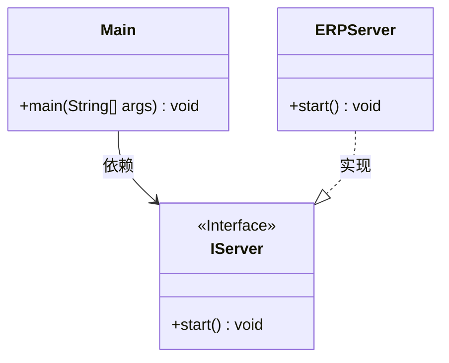
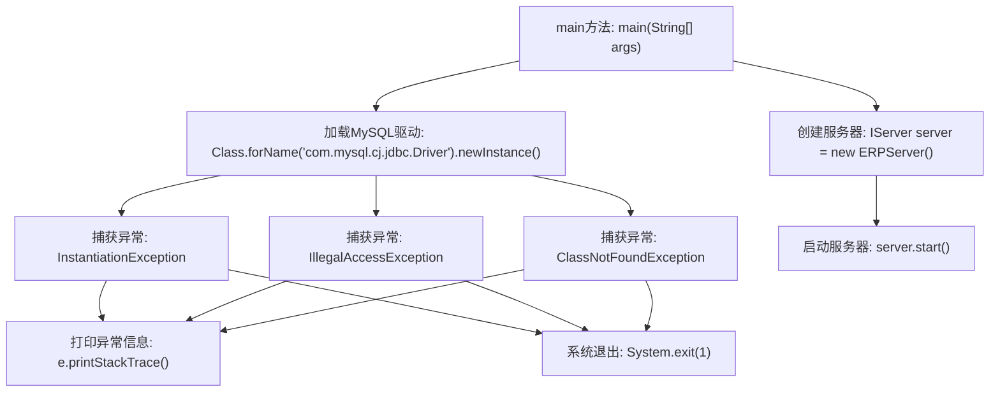

# 基础信息

|      |      |
|------|------|
| 名称 | Main |
| 编码语言 | .java |
| 代码路径 | erp-backend/erp-server/src/main/java/com/jukusoft/erp/server/Main.java |
| 包名 | com.jukusoft.erp.server |
| 依赖项 | [] |
| 概述说明 | Java启动MySQL驱动运行ERP服务器。 |

# 说明

该描述涉及一个Java程序，其主要功能是启动MySQL驱动并运行ERP服务器。程序通过调用MySQL驱动来建立与数据库的连接，确保ERP服务器能够正常访问和操作数据库中的数据。这一过程是实现ERP系统功能的基础，确保数据的存储、检索和管理能够高效进行。通过启动MySQL驱动，程序能够与数据库进行交互，支持ERP服务器的各项业务逻辑和数据处理需求。

# 类列表 Class Summary

| 名称   | 类型  | 说明 |
|-------|------|-------------|
| Main | class | Java程序启动MySQL驱动并运行ERP服务器。 |

## 类 Main

|      |      |
|------|------|
| 访问范围 | public |
| 类型 | class |
| 名称 | Main |
| 说明 | Java程序启动MySQL驱动并运行ERP服务器。 |

### UML类图

**描述：**  
`Main` 类是程序的入口，负责加载 MySQL 驱动并启动服务器。`IServer` 是一个接口，定义了 `start` 方法，`ERPServer` 类实现了 `IServer` 接口，并提供了具体的 `start` 方法实现。`Main` 类依赖于 `IServer` 接口，而 `ERPServer` 类则实现了该接口，负责服务器的启动逻辑。

### 内部方法调用关系图

这段代码的流程图描述了应用程序的启动过程。首先，程序尝试加载MySQL驱动，如果加载过程中出现异常（如InstantiationException、IllegalAccessException或ClassNotFoundException），则会打印异常信息并退出系统。如果驱动加载成功，程序将创建一个新的ERP服务器实例，并启动该服务器。流程图清晰地展示了各个步骤之间的逻辑关系和异常处理流程。

### 字段列表 Field List

| 名称  | 类型  | 说明 |
|-------|-------|------|

### 方法列表 Method List

| 名称  | 类型  | 说明 |
|-------|-------|------|
| main | void | 加载MySQL驱动并启动ERP服务器。 |

