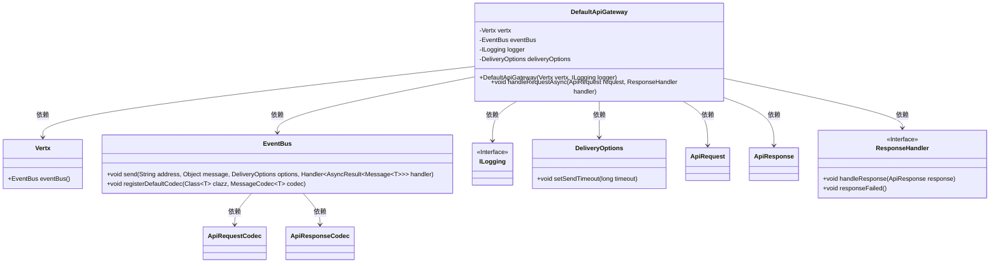
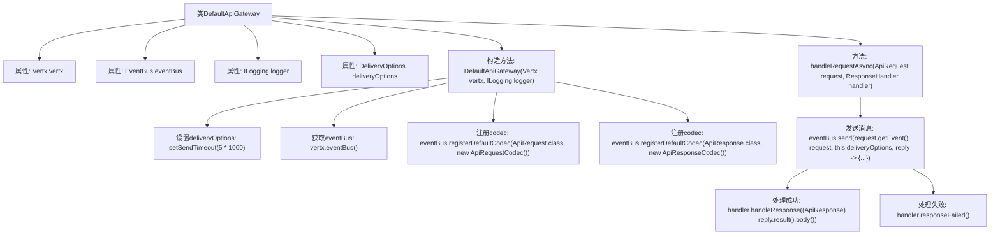

# 基础信息

|      |      |
|------|------|
| 名称 | DefaultApiGateway |
| 编码语言 | .java |
| 代码路径 | erp-backend/erp-server/src/main/java/com/jukusoft/erp/server/gateway/DefaultApiGateway.java |
| 包名 | com.jukusoft.erp.server.gateway |
| 依赖项 | ['com.jukusoft.erp.lib.gateway.ApiGateway', 'com.jukusoft.erp.lib.gateway.ResponseHandler', 'com.jukusoft.erp.lib.logging.ILogging', 'com.jukusoft.erp.lib.message.request.ApiRequest', 'com.jukusoft.erp.lib.message.request.ApiRequestCodec', 'com.jukusoft.erp.lib.message.response.ApiResponse', 'com.jukusoft.erp.lib.message.response.ApiResponseCodec', 'io.vertx.core.Vertx', 'io.vertx.core.eventbus.DeliveryOptions', 'io.vertx.core.eventbus.EventBus', 'org.json.JSONObject'] |
| 概述说明 | DefaultApiGateway初始化Vertx、日志和事件总线，设置5秒超时，处理异步请求。 |

# 说明

DefaultApiGateway实现了ApiGateway接口，主要负责初始化Vertx框架、配置日志系统以及事件总线。在初始化过程中，设置了5秒的超时时间，以确保请求在指定时间内得到响应。该网关还专门处理异步请求，确保系统在高并发场景下的性能和稳定性。通过这种方式，DefaultApiGateway能够有效地管理请求流程，提升系统的整体响应速度和可靠性。

# 类列表 Class Summary

| 名称   | 类型  | 说明 |
|-------|------|-------------|
| DefaultApiGateway | class | DefaultApiGateway实现ApiGateway，初始化Vertx、日志、事件总线，设置5秒超时，处理异步请求。 |

## 类 DefaultApiGateway

|      |      |
|------|------|
| 访问范围 | public |
| 类型 | class |
| 名称 | DefaultApiGateway |
| 说明 | DefaultApiGateway实现ApiGateway，初始化Vertx、日志、事件总线，设置5秒超时，处理异步请求。 |

### UML类图

这段代码描述了一个名为 `DefaultApiGateway` 的类，它实现了 `ApiGateway` 接口，用于处理异步请求。`DefaultApiGateway` 依赖于 `Vertx`、`EventBus`、`ILogging` 和 `DeliveryOptions` 等类。`EventBus` 负责发送消息并注册默认的编解码器，`ResponseHandler` 接口用于处理请求的响应或失败情况。整体结构展示了类之间的依赖关系和功能划分。

### 内部方法调用关系图

这段代码定义了一个名为 `DefaultApiGateway` 的类，该类实现了 `ApiGateway` 接口。类中包含多个属性，如 `Vertx`、`EventBus`、`ILogging` 和 `DeliveryOptions`。构造方法 `DefaultApiGateway` 初始化这些属性，并设置 `DeliveryOptions` 的超时时间，获取 `EventBus` 实例，并注册默认的编解码器。`handleRequestAsync` 方法用于异步处理请求，通过 `EventBus` 发送消息，并根据响应结果调用相应的处理方法。流程图清晰地展示了类的属性和方法之间的调用关系。

### 字段列表 Field List

| 名称  | 类型  | 说明 |
|-------|-------|------|
| vertx = null | Vertx | 声明并初始化一个受保护的Vertx对象，初始值为null。 |
| logger = null | ILogging | 保护日志记录器初始化为空。 |
| eventBus = null | EventBus | 保护类型EventBus变量eventBus初始化为null。 |
| deliveryOptions = null | DeliveryOptions | 声明了一个受保护的DeliveryOptions类型变量deliveryOptions并初始化为null。 |

### 方法列表 Method List

| 名称  | 类型  | 说明 |
|-------|-------|------|
| handleRequestAsync | void | 异步处理请求，发送消息至集群，根据回复调用成功或失败处理。 |

