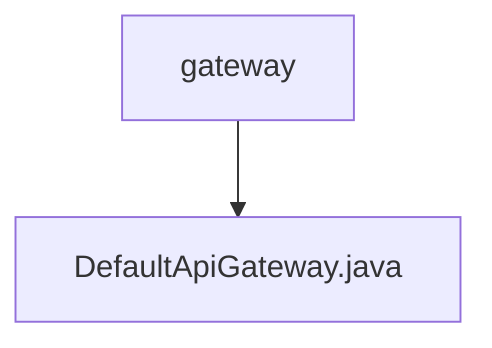

# 基础信息

|      |      |
|------|------|
| 名称 | gateway |
| 编码语言 | .java |
| 代码路径 | erp-backend/erp-server/src/main/java/com/jukusoft/erp/server/gateway |
| 包名 | erp-backend.erp-server.src.main.java.com.jukusoft.erp.server.gateway |
| 概述说明 | DefaultApiGateway初始化Vertx、日志和事件总线，设置5秒超时，处理异步请求。 |

# 说明

DefaultApiGateway实现了ApiGateway接口，主要负责初始化Vertx框架、配置日志系统以及事件总线。在初始化过程中，设置了5秒的超时时间，以确保请求在指定时间内得到响应。该网关还专门处理异步请求，确保系统在高并发场景下的性能和稳定性。通过这种方式，DefaultApiGateway能够有效地管理请求流程，提升系统的整体响应速度和可靠性。

### 包内部结构视图

该流程图展示了`erp-backend/erp-server/src/main/java/com/jukusoft/erp/server/gateway`路径下的层级关系。`gateway`是根节点，包含一个子节点`DefaultApiGateway.java`，表示`DefaultApiGateway.java`文件位于`gateway`目录下。

# 文件列表 File List

| 名称   | 类型  | 说明 |
|-------|------|-------------|
| [DefaultApiGateway.java](DefaultApiGateway.md) | file | DefaultApiGateway初始化Vertx、日志和事件总线，设置5秒超时，处理异步请求。 |

