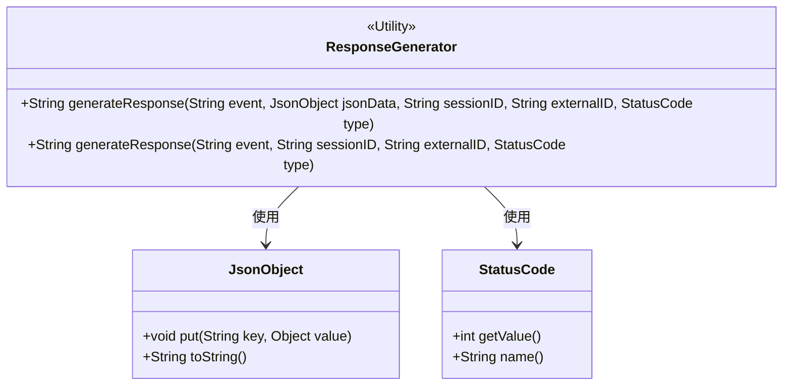
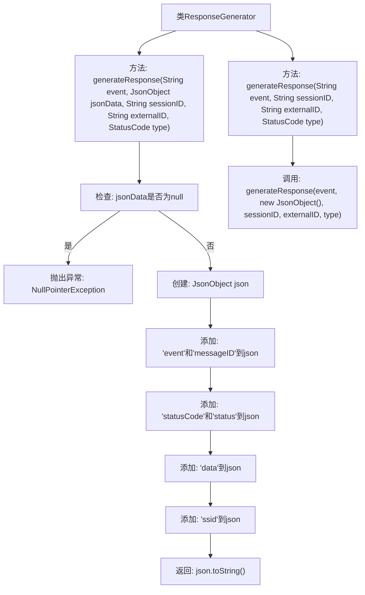

# 基础信息

|      |      |
|------|------|
| 名称 | ResponseGenerator |
| 编码语言 | .java |
| 代码路径 | erp-backend/erp-server/src/main/java/com/jukusoft/erp/server/message/ResponseGenerator.java |
| 包名 | com.jukusoft.erp.server.message |
| 依赖项 | ['com.jukusoft.erp.lib.message.StatusCode', 'io.vertx.core.json.JsonObject'] |
| 概述说明 | ResponseGenerator类生成JSON响应，支持事件、会话ID、外部ID和状态码。 |

# 说明

ResponseGenerator类具备生成JSON响应的功能，支持通过事件、会话ID、外部ID和状态码等参数来定制响应内容。

# 类列表 Class Summary

| 名称   | 类型  | 说明 |
|-------|------|-------------|
| ResponseGenerator | class | ResponseGenerator类提供生成JSON响应的方法，支持事件、会话ID、外部ID和状态码参数。 |

## 类 ResponseGenerator

|      |      |
|------|------|
| 访问范围 | public |
| 类型 | class |
| 名称 | ResponseGenerator |
| 说明 | ResponseGenerator类提供生成JSON响应的方法，支持事件、会话ID、外部ID和状态码参数。 |

### UML类图

类图描述：`ResponseGenerator` 是一个工具类，提供了两个静态方法用于生成响应数据。第一个方法接受事件名称、JSON 数据、会话 ID、外部 ID 和状态码作为参数，生成并返回 JSON 字符串。第二个方法在没有 JSON 数据的情况下调用第一个方法，传入一个空的 `JsonObject`。`ResponseGenerator` 依赖于 `JsonObject` 和 `StatusCode` 类来完成其功能。

### 内部方法调用关系图

这段代码定义了一个名为`ResponseGenerator`的类，其中包含两个重载的`generateResponse`方法。第一个方法接收事件名称、JSON数据、会话ID、外部ID和状态码作为参数，生成并返回一个包含这些信息的JSON字符串。如果传入的JSON数据为null，则抛出`NullPointerException`。第二个方法在第一个方法的基础上简化了参数，默认传入一个空的`JsonObject`。流程图展示了方法的调用顺序和数据处理步骤。

### 字段列表 Field List

| 名称  | 类型  | 说明 |
|-------|-------|------|

### 方法列表 Method List

| 名称  | 类型  | 说明 |
|-------|-------|------|
| generateResponse | String | 静态方法生成响应，接收事件、会话ID、外部ID和状态码参数。 |
| generateResponse | String | 生成响应方法，验证JSON数据非空，添加事件、消息ID、状态码、数据和会话ID，返回JSON字符串。 |

