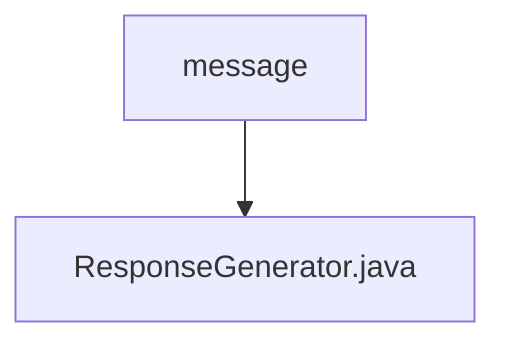

# 基础信息

|      |      |
|------|------|
| 名称 | message |
| 编码语言 | .java |
| 代码路径 | erp-backend/erp-server/src/main/java/com/jukusoft/erp/server/message |
| 包名 | erp-backend.erp-server.src.main.java.com.jukusoft.erp.server.message |
| 概述说明 | ResponseGenerator类生成JSON响应，支持事件、会话ID、外部ID和状态码。 |

# 说明

ResponseGenerator类具备生成JSON响应的功能，支持通过事件、会话ID、外部ID和状态码等参数来定制响应内容。

### 包内部结构视图

这段流程图展示了`erp-backend`项目中`message`目录与`ResponseGenerator.java`文件之间的层级关系。`message`是父目录，`ResponseGenerator.java`是其子文件，两者之间通过箭头连接，清晰地表示了文件的组织结构。

# 文件列表 File List

| 名称   | 类型  | 说明 |
|-------|------|-------------|
| [ResponseGenerator.java](ResponseGenerator.md) | file | ResponseGenerator类生成JSON响应，支持事件、会话ID、外部ID和状态码。 |

